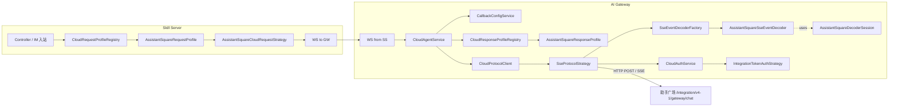

# gateway 助手广场非标协议适配器 - 详细设计方案

> 任务：`.trellis/tasks/05-12-gateway/`
> 创建日期：2026-05-12
> 设计人：Llllviaaaa

---

## 一、需求概述

### 【As】用户角色

- **助手广场云端业务方**：提供非标 SSE 对话协议（`POST /integration/v4-1/gateway/chat`）
- **接入助手广场作为后端的 skill 业务运维 / 开发**：通过 SS SysConfig 配 vendor profile 即可接入
- **使用 IM / 前端发起对话的最终用户**：通过 SS → GW → 助手广场链路收到流式响应

### 【I want】功能描述

GW 提供一个标准的"协议适配器"机制，能够：

1. 接受 SS 通过 invoke 消息发起的 chat 请求
2. 按助手广场协议格式构造请求体（**入参字段集与我方标准协议不同**）发送到助手广场 SSE 接口
3. 将助手广场返回的**非标 SSE 事件流**（混杂多业务源 messageType、无 .done 终态、无 partId）翻译成我方标准协议 `GatewayMessage` 流（含 `text.delta` / `text.done` 等细粒度事件）回流给 SS
4. **复用 SS 的入参协议策略工厂机制**（`CloudRequestStrategy` + `CloudRequestBuilder`），新增助手广场对应策略实现
5. 在 SS 和 GW 两端引入"协议簇（Profile）"概念作为顶层抽象，承载未来更多非标云端业务的接入

### 【So that】业务价值

- 让 IM / 前端用户能够通过统一入口（SS）调用包括助手广场在内的**多家第三方助手能力**，前端无须感知后端协议差异
- 为后续接入更多非标云端建立**对称、可扩展的两层架构**（Strategy + Profile），加新 vendor 时只需新增策略类 + profile 类 + SysConfig 一行配置
- **不破坏现有 OpenCode 标准协议路径**，回归零影响

### 业务功能逻辑交互说明

#### 业务流：chat 对话完整生命周期

```
[最终用户在 IM / 前端发送消息]
   ↓
[external / IM 入站到 SS]
   ↓
[SS 路由到 skill；查 AssistantInfo 拿到 businessTag；查 SysConfig cloud_protocol_profile:<businessTag> 拿到 profile 名 = "assistant_square"]
   ↓
[SS 通过 CloudRequestProfileRegistry 拿到 AssistantSquareRequestProfile]
   ↓
[profile.requestStrategy().build(ctx) 生成助手广场入参 JSON:
   {assistantAccount: long, sendW3Account, msgBody, clientLang, imGroupId, topicId: long}]
   ↓
[SS 构造 invoke 消息，payload 携带 cloudRequest + cloudProfile="assistant_square"，
 通过 WebSocket 发给 GW]
   ↓
[GW CloudAgentService.handleInvoke 接收]
   ↓
[GW 调 CallbackConfigService.getConfig(ak, scope="callback:weagent:chat")
 → v2 API 返回 channelType=sse, channelAddress=助手广场 URL, authType=...]
   ↓
[GW 调 CloudResponseProfileRegistry 拿到 AssistantSquareResponseProfile
 → cfg.authType="integration_token"（来自 callback API 返回的数字码 3）]
   ↓
[GW 构 CloudConnectionContext（含 cloudProfile, authType=integration_token, channelAddress, ...）]
   ↓
[GW CloudProtocolClient.connect("sse", ctx, lifecycle, onEvent, onError)]
   ↓
[SseProtocolStrategy.connect:
   1) decoderFactory.resolveDecoder("assistant_square") → AssistantSquareSseEventDecoder
   2) decoder.createSession() → AssistantSquareDecoderSession
   3) cloudAuthService.applyAuth → IntegrationTokenAuthStrategy 写 Authorization header
   4) HttpClient POST 助手广场 URL，开始读 SSE 流]
   ↓
[逐行读取 SSE data 行:
   - decoder.isTerminator(line) 判断是否终止
   - decoder.decode(line, session) → 0..N 条 GatewayMessage]
   ↓
[CloudAgentService 的 onEvent 回调注入 messageId / partId 兜底（现有逻辑）]
   ↓
[GatewayMessage 通过 SkillRelayService 转发到 SS]
   ↓
[SS CloudEventTranslator 把 GatewayMessage.event 翻译成 StreamMessage]
   ↓
[StreamMessageEmitter 推到前端]
   ↓
[前端逐增量渲染]
   ↓
[助手广场发 data:FINISH:
   - decoder.isTerminator("FINISH") = true
   - SseProtocolStrategy 调 decoder.flush(session) 补未关闭 part 的 .done
   - 然后发顶层 GatewayMessage(TOOL_DONE)]
   ↓
[SS 关闭流，前端结束渲染]
```

#### 预期结果

| 维度 | 预期 |
|---|---|
| **入参侧** | 助手广场云端收到字段对齐其协议文档的 POST JSON 请求 |
| **出参侧** | SS 和前端收到的事件流结构跟 OpenCode 路径**完全一致**（type / properties / messageId / partId 齐全）；前端无须区分来源 vendor |
| **流式粒度补齐** | 文本 / 思考 / 规划：前端拿到 `<type>.delta` 增量 + `<type>.done` 终态（带累积全文）；单次性事件：searching / search_result / reference / ask_more 各发一次 |
| **流终态** | `event:finish` / `data:FINISH` → flush 后顶层 `TOOL_DONE`；`event:error` → 顶层 `TOOL_ERROR` |
| **step 标记** | decoder 自动补齐：流首个事件前补 `step.start`；flush 时（part .done 之后、顶层 TOOL_DONE 之前）补 `step.done`（usage 留空）—— 让助手广场路径跟 OpenCode 路径**事件序列对称**，前端处理逻辑统一 |
| **多协议派系** | decoder 内部按事件 `protocolType` 字段二级分派子 handler；MVP 只实现 `standard` 派系（PLANNING/SEARCHING/SEARCH_RESULT/REFERENCE/ASK_MORE/TEXT），其他派系（athena/uniknow/agentmaker）走 fallback **丢弃** |
| **未支持类型** | MVP 丢弃：HTML / IMAGE-IM / FILE-IM / 卡片系列 / TEXT_LIST / processStep 等；handler 内部直接返回空列表，**不报错** |
| **回归** | 现有 OpenCode 路径行为零变化（同套接口走 `DefaultSseEventDecoder`） |

#### 助手广场协议要点（参考 `D:/04_Documents/助手广场提供给gateway的对话协议.md`）

**请求**
| 字段 | 类型 | 必填 | 备注 |
|---|---|---|---|
| `assistantAccount` | **String** | ✓ | 机器人账号（如 `"dig_30051824"`，**协议文档"long"是笔误**） |
| `sendW3Account` | String | ✓ | 用户 W3 账号 |
| `msgBody` | String | ✓ | 用户输入 |
| `clientLang` | String | ✓ | "zh" / "en" |
| `imGroupId` | String | 可选 | IM 群组 ID |
| `topicId` | long | 可选 | 会话主题 ID（由 SS 端业务助手 toolSessionId 经 `Long.parseLong` 得到——toolSessionId 改用 Snowflake 后是纯数字） |
| `extParameters` | Object | 可选 | 透传 SS `CloudRequestContext.extParameters`（**助手广场后续将支持该字段**） |

**响应**：SSE 流，每行 `event:<eventType>\ndata:<JSON>`；终止符 `data:FINISH`。

**事件 data 内部字段（助手广场后续将新增）**：
- `protocolType`：标识当前事件用的协议派系（`"standard"` / `"athena"` / `"uniknow"` / `"agentmaker"` / ...）。**字段未发布前 decoder 默认按 `"standard"` 处理**。

---

## 二、技术设计

### 【功能实现设计】

#### 2.1 总体架构（4+1 视图 - 逻辑视图）



#### 2.2 关键时序图（chat 全链路 + decoder 状态机）

```mermaid
sequenceDiagram
    autonumber
    participant U as 用户
    participant SS as Skill Server
    participant GW as AI Gateway
    participant AS as 助手广场

    U->>SS: 发消息
    SS->>SS: SysConfig cloud_protocol_profile:&lt;businessTag&gt; → "assistant_square"
    SS->>SS: profileRegistry.resolve → AssistantSquareRequestProfile
    SS->>SS: profile.requestStrategy().build → cloudRequest JSON
    SS->>GW: invoke(payload={cloudRequest, cloudProfile:"assistant_square"})
    GW->>GW: CallbackConfigService.getConfig → channelType=sse, channelAddress
    GW->>GW: CloudResponseProfileRegistry.resolve → profile
    GW->>GW: cfg.authType="integration_token"（来自 callback API authType=3 数字码映射）
    GW->>GW: 构 CloudConnectionContext(cloudProfile, ...)
    GW->>GW: SseProtocolStrategy.connect
    GW->>GW: decoder = factory.resolveDecoder("assistant_square")
    GW->>GW: session = decoder.createSession()
    GW->>GW: cloudAuthService.applyAuth → Authorization: &lt;token&gt;
    GW->>AS: POST + Accept: text/event-stream
    
    loop SSE 流
        AS-->>GW: event:planning {planning:"用"}
        GW->>GW: decode → 累积 openPartContent="用", emit planning.delta
        GW-->>SS: GatewayMessage(event.type=planning.delta, content="用")
        AS-->>GW: event:planning {planning:"户"}
        GW->>GW: 累积 openPartContent="用户", emit planning.delta
        GW-->>SS: planning.delta(content="户")
        AS-->>GW: event:searching {searching:[...]}
        GW->>GW: 切到单次性事件，先补 planning.done
        GW-->>SS: planning.done(content="用户")
        GW-->>SS: searching(keywords=[...])
        AS-->>GW: event:message TEXT {text:"迁"}
        GW-->>SS: text.delta(content="迁")
        AS-->>GW: event:askMore {askMore:[...]}
        GW->>GW: 切到单次性事件，补 text.done
        GW-->>SS: text.done(content="迁")
        GW-->>SS: ask_more(askMoreQuestions=[...])
    end
    
    AS-->>GW: event:finish data:FINISH
    GW->>GW: decoder.isTerminator("FINISH")=true
    GW->>GW: decoder.flush(session) (无未关闭 part)
    GW->>GW: emit GatewayMessage(type=TOOL_DONE)
    GW-->>SS: TOOL_DONE
    SS-->>U: 关闭流
```

#### 2.3 Decoder 三层结构与状态机

##### 三层结构
```
AssistantSquareSseEventDecoder（顶层 SseEventDecoder 实现）
  ├─ isTerminator(line):  "FINISH" / "[DONE]"
  ├─ createSession():     new AssistantSquareDecoderSession
  ├─ decode(line, session):
  │     1. 解析 data 行 JSON
  │     2. 读 data.protocolType（缺失默认 "standard"）
  │     3. 委托给对应 AssistantSquareProtocolHandler.handle(data, session)
  └─ flush(session):
        1. 委托 standard handler 补未关闭 part .done（如有）
        2. 补 step.done（如 stepStarted=true）
        （未来其他派系 handler 也可参与 flush，本 MVP 暂不需要）

AssistantSquareProtocolHandler（子 handler 接口）
  ├─ StandardProtocolHandler @Component         ← MVP 实现
  │     处理：planning / searching / search_result / reference / ask_more / text
  │     持有状态机 + step.start/done 补齐逻辑
  └─ UnknownProtocolFallbackHandler @Component  ← MVP 实现，丢弃
        protocolType="unknown"，handle 返回 List.of()

（未来按需添加，不影响 MVP）：
  AthenaProtocolHandler / UniknowProtocolHandler / AgentmakerProtocolHandler
```

##### Session 状态字段（per-connection）
```
class AssistantSquareDecoderSession:
  openPartType: null | "text" | "thinking" | "planning"
  openPartMessageId: String
  openPartContent: StringBuilder
  stepStarted: boolean          // 是否已发过 step.start
```

##### StandardProtocolHandler 核心算法伪代码

```
handle(data, session):
  out = []
  newEventType = data.eventType

  // 1) 顶层终态：error → TOOL_ERROR（流终止信号）
  if (newEventType == "error"):
    return [GatewayMessage(type=TOOL_ERROR, error=data.message)]

  // 2) 首事件前补 step.start（仅一次）
  if (!session.stepStarted):
    session.stepStarted = true
    out.add(GatewayMessage(event.type="step.start", messageId=data.messageId, role="assistant"))

  // 3) 映射 standard 派系下的 messageType / eventType
  newStreamType = 映射表(newEventType, data.messageType)
    // event:planning + PLANNING → "planning.delta"
    // event:think                → "thinking.delta"
    // event:message + TEXT       → "text.delta"
    // event:searching            → "searching"        (单次性)
    // event:searchResult         → "search_result"   (单次性)
    // event:reference            → "reference"       (单次性)
    // event:askMore              → "ask_more"        (单次性)
    // 其他 messageType（HTML / IMAGE-IM / 卡片 / TEXT_LIST / processStep / ...） → null

  // 4) 不支持的 messageType → 跳过（仍可能已发过 step.start）
  if (newStreamType == null):
    return out   // 仅包含 step.start（若刚发），否则空

  isStreaming = newStreamType ∈ {text.delta, thinking.delta, planning.delta}

  // 5) 判断要不要先补上一段的 done
  if (isStreaming):
    typeOnly = stripDelta(newStreamType)
    if (session.openPartType != null &&
        (session.openPartType != typeOnly || session.openPartMessageId != data.messageId)):
      out.add(GatewayMessage(event.type=session.openPartType + ".done",
                             content=session.openPartContent.toString(),
                             messageId=session.openPartMessageId))
      session.openPartType = null
      session.openPartContent = null
  else:
    // 单次性事件中断流式段
    if (session.openPartType != null):
      out.add(GatewayMessage(event.type=session.openPartType + ".done",
                             content=session.openPartContent.toString(),
                             messageId=session.openPartMessageId))
      session.openPartType = null
      session.openPartContent = null

  // 6) 发新事件
  if (isStreaming):
    typeOnly = stripDelta(newStreamType)
    if (session.openPartType == null):
      session.openPartType = typeOnly
      session.openPartMessageId = data.messageId
      session.openPartContent = new StringBuilder()
    delta = extractContent(data.messageBody, typeOnly)
    session.openPartContent.append(delta)
    out.add(GatewayMessage(event.type=newStreamType, content=delta, messageId=data.messageId))
  else:
    payload = extractSinglePayload(data.messageBody, newStreamType)
    out.add(GatewayMessage(event.type=newStreamType, ...payload, messageId=data.messageId))

  return out

// flush（在顶层 AssistantSquareSseEventDecoder.flush 委托调用）
StandardProtocolHandler.flush(session):
  out = []
  if (session.openPartType != null):
    out.add(GatewayMessage(event.type=session.openPartType + ".done",
                           content=session.openPartContent.toString(),
                           messageId=session.openPartMessageId))
  if (session.stepStarted):
    out.add(GatewayMessage(event.type="step.done",
                           messageId=session.openPartMessageId,
                           role="assistant"))
    // usage 留空（助手广场不返回 token 使用量）
  return out

// 顶层 decoder
AssistantSquareSseEventDecoder.isTerminator(line):
  return "FINISH".equals(line) || "[DONE]".equals(line)

AssistantSquareSseEventDecoder.flush(session):
  return standardHandler.flush(session)
  // 当前 MVP 只需 standard 参与 flush；未来若多 handler 都有状态，需扩展
```

#### 2.4 异常处理机制

| 异常场景 | 处理路径 |
|---|---|
| 助手广场 HTTP 非 200 | SseProtocolStrategy:86-90 现有逻辑：onError → `buildCloudError` → `TOOL_ERROR` |
| 流内 `event:error` | decoder 翻译为顶层 `GatewayMessage(type=TOOL_ERROR, error=云端 message)`，SseProtocolStrategy:160-164 识别终态自动关闭 |
| `assistantAccount` / `topicId` String→long 失败 | SS 端 `AssistantSquareCloudRequestStrategy.build` 抛 `IllegalArgumentException`，日志 `[ERROR]`，沿 SS 现有 error handler 路径返回前端 |
| invoke payload 缺 `cloudProfile` 字段 | GW 端默认 `"default"`（**向后兼容**老 SS） |
| profile name 不存在 | Registry fallback 到 default profile，`[WARN]` 日志 |
| 网络中断 / lifecycle 超时 | onError → `TOOL_ERROR`；finally 块调 `decoder.flush(session)` 补未关闭 done（带累积内容）让前端历史能定型 |
| 未知 / 不支持 messageType（HTML / 卡片 / processStep / TEXT_LIST 等） | handler 内部返回空列表，**不报错**；可选 `[DEBUG]` 日志计数 |
| 未知 protocolType（athena / uniknow / agentmaker / 其他） | 路由到 `UnknownProtocolFallbackHandler`，返回空列表，**不报错**；可选 `[DEBUG]` 日志计数 |
| `event:ping` 业务心跳 | `AssistantSquareSseEventDecoder.isHeartbeat` 在 SseProtocolStrategy 主循环识别 → 调 `lifecycle.onHeartbeat`（重置 idle 计时器）→ **不下发事件给 onEvent，不进 handler** |
| `Long.parseLong(toolSessionId)` 失败（旧 `cloud-xxx` 格式） | `AssistantSquareCloudRequestStrategy` 抛 `IllegalArgumentException` + `[ERROR]` 日志；业务助手 toolSessionId 已经改 Snowflake 后只在历史旧 session 出现 |
| decoder 内部解析异常 | catch + log，不中断整个流（同 SseProtocolStrategy:166-168 现有容错） |

---

### 【接口设计】

#### 2.5 内部 Java 接口

##### A. SS 端 - CloudRequestProfile（POJO，非接口）
```java
package com.opencode.cui.skill.service.cloud.profile;

/** 套餐 = 运行时数据，从 SysConfig 拼装。不再是 @Component 类。 */
public record CloudRequestProfile(String name, String requestStrategyName) {}
```

##### B. GW 端 - CloudResponseProfile（POJO，非接口）
```java
package com.opencode.cui.gateway.service.cloud.profile;

public record CloudResponseProfile(String name, String responseDecoderName) {}
```

> **职责说明**：profile 是数据（套餐定义），不是 @Component。它只声明"我用哪个 strategy / 哪个 decoder"。**authType 不属于 profile 职责** —— 它是 endpoint 元数据，由 v2 callback API 按 ak 返回，通过 `GatewayCallbackResolver.mapAuthType` 数字码字典扩展支持 `integration_token`。

##### B.1 Registry 运行时拼装套餐
```java
@Service
public class CloudRequestProfileRegistry {
    private final Map<String, CloudRequestStrategy> strategies;  // 按 getName() 自动注册
    private final SysConfigService sysConfig;
    private final ObjectMapper objectMapper;
    // in-memory cache (TTL 5min)，配置项：skill-server.cloud-protocol-profile.cache-ttl-ms

    /** 返回 (profileName, strategy) 二元组 */
    public ResolveResult resolve(String businessTag) {
        // 1. cloud_protocol_profile:<businessTag> → profile name (缺失走 "default")
        String profileName = sysConfig.getValue("cloud_protocol_profile", businessTag);
        if (profileName == null) profileName = "default";

        // 2. cloud_protocol_profile_def:<profileName> → JSON 定义
        String defJson = sysConfig.getValue("cloud_protocol_profile_def", profileName);
        String strategyName;
        if (defJson != null) {
            strategyName = objectMapper.readTree(defJson)
                    .path("request_strategy").asText(profileName);
        } else {
            // 约定 fallback：profile name == strategy name
            strategyName = profileName;
        }

        // 3. 按 strategy name 拿 bean (未注册兜底 default)
        CloudRequestStrategy s = strategies.getOrDefault(strategyName, strategies.get("default"));
        return new ResolveResult(profileName, s);
    }

    public record ResolveResult(String profileName, CloudRequestStrategy strategy) {}
}
```

GW 端 `CloudResponseProfileRegistry` 镜像实现，从 def JSON 读 `response_decoder` 字段；通过 `SkillServerConfigClient` 跨服务查 SS SysConfig（同 callback API 现有机制）。

##### C. GW 端 - SseEventDecoder
```java
package com.opencode.cui.gateway.service.cloud.decoder;

public interface SseEventDecoder {
    String getName();
    DecoderSession createSession();
    boolean isTerminator(String dataLine);
    /** 业务层心跳识别。default false（OpenCode 不发业务层心跳） */
    default boolean isHeartbeat(String dataLine) { return false; }
    List<GatewayMessage> decode(String dataLineJson, DecoderSession session);
    List<GatewayMessage> flush(DecoderSession session);
}

/** 标记接口，每个 decoder 自定义实现 */
public interface DecoderSession { }
```

##### C.1 GW 端 - AssistantSquareProtocolHandler（decoder 内部子 handler）
```java
package com.opencode.cui.gateway.service.cloud.decoder.assistantsquare;

public interface AssistantSquareProtocolHandler {
    String getProtocolType();   // "standard" / "athena" / "uniknow" / "agentmaker" / "unknown"
    List<GatewayMessage> handle(JsonNode data, AssistantSquareDecoderSession session);
}

// MVP 只需要 standard + unknown 两个实现
@Component class StandardProtocolHandler implements AssistantSquareProtocolHandler { ... }
@Component class UnknownProtocolFallbackHandler implements AssistantSquareProtocolHandler { ... }

// AssistantSquareSseEventDecoder 内部通过 Map<protocolType, handler> 二级分派
// 加新派系时只需新增 @Component 类，decoder 顶层零改动（开闭原则）
```

##### D. GW 端 - SseEventDecoderFactory
```java
package com.opencode.cui.gateway.service.cloud.decoder;

@Service
public class SseEventDecoderFactory {
    private final Map<String, SseEventDecoder> decoderMap;
    
    public SseEventDecoderFactory(List<SseEventDecoder> decoders) {
        this.decoderMap = decoders.stream()
            .collect(Collectors.toMap(SseEventDecoder::getName, Function.identity()));
        log.info("[SSE_DECODER] registered: {}", decoderMap.keySet());
    }
    
    public SseEventDecoder resolveDecoder(String cloudProfile) {
        SseEventDecoder d = decoderMap.get(cloudProfile);
        if (d == null) {
            log.warn("Unknown cloudProfile: {}, fallback to default", cloudProfile);
            d = decoderMap.get("default");
        }
        return d;
    }
}
```

##### E. GW 端 - CloudResponseProfileRegistry
```java
package com.opencode.cui.gateway.service.cloud.profile;

@Service
public class CloudResponseProfileRegistry {
    private final Map<String, CloudResponseProfile> profiles;
    public CloudResponseProfile resolve(String name) {
        return profiles.getOrDefault(name, profiles.get("default"));
    }
}
```

##### F. GW 端 - IntegrationTokenAuthStrategy
```java
package com.opencode.cui.gateway.service.cloud;

@Component
public class IntegrationTokenAuthStrategy implements CloudAuthStrategy {
    @Value("${gateway.cloud.assistant-square.integration-token:}")
    private String token;
    
    public String getAuthType() { return "integration_token"; }
    
    public void applyAuth(HttpRequest.Builder builder, String appId) {
        if (token == null || token.isBlank()) {
            throw new IllegalStateException("integration token not configured");
        }
        builder.header("Authorization", token);
    }
}
```

#### 2.6 协议字段

##### invoke payload（SS → GW，**新增字段**）
| 字段 | 类型 | 必填 | 备注 |
|---|---|---|---|
| `cloudRequest` | Object | ✓ | 已有，云端入参 JSON；助手广场场景内含 `extParameters` 透传 |
| `cloudProfile` | String | 可选 | **新增**。profile 名（"default" / "assistant_square"），缺失时 GW 默认 "default" |
| 其他字段 | - | - | 不变 |

##### 助手广场事件 data 内部新增字段（**助手广场后续将发布**）
| 字段 | 类型 | 备注 |
|---|---|---|
| `protocolType` | String | 标识当前事件协议派系（`"standard"` / `"athena"` / `"uniknow"` / `"agentmaker"` / ...）；字段未发布前 decoder 默认 `"standard"` |

##### 助手广场上游接口（GW → 助手广场，**外部协议**）
- POST `http://api-intranet.clink.local/assistant-api/integration/v4-1/gateway/chat`
- Header：
  - `Authorization: <integration token>`（必填）
  - `Content-Type: application/json`
  - `Accept: text/event-stream`
- Body：见第 1 章助手广场协议要点
- 响应：SSE 流，终止符 `data:FINISH`

---

### 【数据设计】

#### 2.7 SysConfig（持久化数据）

##### SS 端 SysConfig 新增 type（两个）

**1. `cloud_protocol_profile_def`** —— 套餐定义（一个套餐声明它用哪些 strategy / decoder）

| type | key | value (JSON) | 备注 |
|---|---|---|---|
| `cloud_protocol_profile_def` | `default` | `{"request_strategy":"default","response_decoder":"default"}` | 预置 |
| `cloud_protocol_profile_def` | `assistant_square` | `{"request_strategy":"assistant_square","response_decoder":"assistant_square"}` | 预置 |
| `cloud_protocol_profile_def` | `default_req_assistant_resp` | `{"request_strategy":"default","response_decoder":"assistant_square"}` | 运维自定义（交叉组合示例） |

**2. `cloud_protocol_profile`** —— 业务映射（哪个 businessTag 用哪个套餐）

| type | key | value | 备注 |
|---|---|---|---|
| `cloud_protocol_profile` | `<businessTag>` | profile name（如 `"default"` / `"assistant_square"` / `"default_req_assistant_resp"`） | 缺失→fallback "default" |

约束：
- key 维度是 `businessTag`（来自 `AssistantInfo.businessTag`），跟原 `cloud_request_strategy` 同维度（**注意**：`CloudRequestBuilder.buildCloudRequest` 方法签名里 "appId" 是历史命名 bug，实际传的是 businessTag）
- value 缺失或值未注册 → fallback 到 `"default"`
- **约定 fallback**：如果 profile_def 表里**没有**该 profile 的定义，按"profile name == strategy name == decoder name"对称约定查找——常见 vendor（如 `assistant_square`）不需要运维额外配 profile_def
- profile_def 与 profile 映射均带 **5 分钟 in-memory 缓存**（配置项 `skill-server.cloud-protocol-profile.cache-ttl-ms`，默认 300000）

##### 废弃配置（保留作为兜底）

| type | key | 状态 | 处理 |
|---|---|---|---|
| `cloud_request_strategy` | `<businessTag>` | **废弃**（dead config） | 新逻辑不再读取；保留旧数据作为回滚兜底；`CloudRequestBuilder` 类同步标 `@Deprecated` |

##### 已有 SysConfig（不动）
- `cloud_request_strategy:<appId>`：现有，可选保留向后兼容（implement 阶段决定是否废弃）
- `cloud_route.v2_enabled`：现有，控制 callback API 版本

#### 2.8 缓存数据
- **不新增 Redis key**
- 复用现有 `gw:cloud:route:v2:{ak}:{scope}` callback 缓存（TTL 300s）

#### 2.9 内存数据（per-connection 状态）

`AssistantSquareDecoderSession`（生命周期 = 单次 SSE 连接，连接关闭后被 GC）：
| 字段 | 类型 | 默认值 | 用途 |
|---|---|---|---|
| `openPartType` | String | null | 当前未关闭流式 part 的类型："text" / "thinking" / "planning" |
| `openPartMessageId` | String | null | 当前 part 所属 messageId（切换检测用） |
| `openPartContent` | StringBuilder | new | 累积内容（done 时一并发出） |
| `stepStarted` | boolean | false | 是否已发过 `step.start`（保证只发一次） |

#### 2.10 GW application.yml（应用配置）

| 配置项 | 类型 | 默认 | 备注 |
|---|---|---|---|
| `gateway.cloud.assistant-square.integration-token` | String | "" | 助手广场集成 token，**生产环境从 secret manager 注入** |

---

### 【集成设计】

#### 2.11 内部微服务集成

| 集成对端 | 通信方式 | 变更 |
|---|---|---|
| SS ↔ GW | WebSocket（现有 `SkillWebSocketHandler`） | invoke payload 增加 `cloudProfile` 字段（**向后兼容**） |
| GW ↔ api-server（v2 callback API） | HTTP POST | api-server 端 **endpoint 注册数据**给助手广场对应的 ak 配 `authType=3`（数据配置，**非代码变更**）；GW 端 `GatewayCallbackResolver.mapAuthType` 加 `case 3 -> "integration_token"` 映射 |
| GW ↔ Redis | 现有 | 不变 |
| GW ↔ MySQL | 现有 | 不变 |

#### 2.12 外部系统集成

| 外部系统 | 集成方式 | 备注 |
|---|---|---|
| **助手广场（新增）** | HTTP POST + SSE 流 | 鉴权 `Authorization: <token>`；URL 由 v2 callback API 下发 |

#### 2.13 周边依赖

- token 配置：GW application.yml 新增配置项
- 不引入新中间件、新依赖库
- 复用现有 Jackson / Spring WebSocket / Java HttpClient

---

### 【依赖项及影响面分析】

#### 2.14 直接依赖（修改 / 新增的直接调用方）

| 修改点 | 直接影响 |
|---|---|
| `SseProtocolStrategy.handleDataLine` 重构（逻辑迁移到 `DefaultSseEventDecoder`）+ 主循环加 `isTerminator` / `isHeartbeat` / `flush` 分支 | `SseProtocolStrategy.readSseStream` |
| `CloudConnectionContext` 加 `cloudProfile` 字段 | `CloudConnectionContext.Builder` 所有调用点（`CloudAgentService.handleInvoke:118`, `WebHookExecutor`） |
| `CloudAgentService.handleInvoke` 读 `payload.cloudProfile` 填进 ctx | `SkillWebSocketHandler`（invoke 路由入口），间接影响 invoke 消息整条链路 |
| `GatewayCallbackResolver.mapAuthType` 扩 `case 3 -> "integration_token"` | callback API 返回的 authType 数字码消费链路 |
| `BusinessScopeStrategy.generateToolSessionId` 从 UUID 改 Snowflake；增加 `SnowflakeIdGenerator` 构造器注入 | `BusinessScopeStrategy` 所有调用方（`SkillSessionController:117` / `ImSessionManager:143` / `InboundProcessingService` 自愈路径），**调用方无须改动**（通过 strategy 接口透明） |
| SS 端 invoke 构造点：从直接调 `CloudRequestBuilder` 改为先选 profile 再调 strategy + 塞 `payload.cloudProfile` | `BusinessScopeStrategy.buildInvoke` 主调用点 |

#### 2.15 间接依赖（影响传播）

- **OpenCode 路径**（现有 SSE 翻译逻辑）：迁移到 `DefaultSseEventDecoder`，**行为零变化**——回归测试 MUST 覆盖
- **WebSocket invoke 协议契约**：增加字段，**向后兼容**（旧 SS 不发 `cloudProfile` → GW 默认 "default"）
- **`CloudEventTranslator`（SS 侧）**：**无须改动**——decoder 输出的 GatewayMessage.event 已经匹配现有 `{type, properties:{...}}` schema
- **`CloudConnectionLifecycle` 三段超时**：复用，不动
- **CloudAgentService 的 messageId / partId fallback**（line 184-220）：复用，不动

#### 2.16 运行时影响监控

| 监控点 | 日志 / 指标 | 关注信号 |
|---|---|---|
| SSE 连接成功率 | `[SSE] Connecting` / 解析失败 warn | 异常突增 |
| Profile 命中率 | `[SSE_DECODER]` 新增日志 | profile 未命中 fallback 次数 |
| 鉴权应用 | `[CLOUD_AUTH] Applied integration_token` | 确认 token 注入路径正确 |
| Decoder 异常 | decoder 内部 catch 日志 | 单条事件解析失败计数（不致流中断） |
| 未支持 messageType 计数 | `[DEBUG]` 计数日志（可选） | 哪些类型实际频繁出现，作为后续纳入标准协议的依据 |
| TOOL_ERROR 路径 | `[CLOUD_AGENT] Cloud connection error` | 异常增长趋势 |
| 业务指标 | 助手广场调用 P50 / P95 延迟、TOOL_DONE / TOOL_ERROR 比 | 整体质量 |

---

## 三、DFX 设计

### 【性能设计】

#### 3.1 时延
- SSE data 行解析：每条事件 `decoder.decode` 是 O(1) 字段映射；累积内容 `StringBuilder.append` 摊销 O(1)
- **不引入额外远程调用、不引入额外锁**
- SS → GW WebSocket 已有，通信链路无变化

#### 3.2 内存
- `AssistantSquareDecoderSession` 每连接独立实例
- `StringBuilder` 最大 ≈ 单次流式响应总长（典型 < 10KB）
- 连接关闭后随 try-with-resources 释放 → GC

#### 3.3 并发
- `SseEventDecoder` / `CloudResponseProfile` / `CloudRequestProfile` / `IntegrationTokenAuthStrategy` 均为 stateless `@Component` 单例
- 状态全在 per-connection `DecoderSession`，并发连接互不影响
- `SseEventDecoderFactory.decoderMap` 启动时构建，运行时只读，无锁

---

### 【高可用设计】

#### 3.4 接入层
- 不涉及（GW 对外入口不变）

#### 3.5 应用层
| 失败模式 | 缓解 |
|---|---|
| profile / decoder 未命中 | Registry fallback 到 default，不致整体不可用，`[WARN]` 日志 |
| token 未配置 | IntegrationTokenAuthStrategy 抛清晰异常，**不静默 fallback**，触发 `TOOL_ERROR` |
| 单条事件解析失败 | catch + log，不中断整个流（同现有 SseProtocolStrategy:166-168） |
| 助手广场 HTTP 错误 / 超时 | onError → `TOOL_ERROR` |
| 网络中断 | finally 块 flush 保留累积内容 |

#### 3.6 数据层
- 不涉及（SysConfig 仅一行新增，不引入新表 / 新缓存）

#### 3.7 超时与重试
- 复用 `CloudConnectionLifecycle` 现有三段超时（first event / idle / max duration）
- 助手广场 **MVP 不重连**（流终止即 TOOL_DONE / TOOL_ERROR；重发由 SS 决策）
- 助手广场 `event:question` 不存在 → idle pause/resume 不会触发，但代码保持兼容

---

### 【安全设计】

#### 3.8 威胁分析

| 威胁 | 风险 | 缓解 |
|---|---|---|
| 集成 token 明文落盘到 application.yml | 中 | 生产环境从 secret manager 注入；本地 dev 文件 gitignore；标记为敏感配置 |
| 多租户 token 串用 | 低 | MVP 单 token 静态配置；后续多租户接入需扩展 token resolver |
| 助手广场返回 HTML 注入 / XSS | 中 | MVP HTML 类型 decoder 直接**丢弃**；TEXT 内容透传到前端，前端负责 XSS 防护（同现有 OpenCode 路径） |
| Authorization header 泄漏到 trace 日志 | 中 | 复用 `SensitiveDataMasker`，在日志输出前对 `Authorization` header 做脱敏 |
| token 抛进 GatewayMessage.error | 中 | IntegrationTokenAuthStrategy 异常消息**不能**包含 token 原文 |

#### 3.9 数据脱敏

- 日志中：`Authorization` header 值脱敏（复用 `SensitiveDataMasker` 现有规则；implement 阶段验证规则覆盖）
- 错误信息：避免把 token 抛到 `GatewayMessage.error`（IntegrationTokenAuthStrategy 异常 msg 用通用文案 "integration token not configured"）

---

### 【兼容性设计】

#### 3.10 协议向后兼容
- invoke payload `cloudProfile` 字段缺失 → GW 默认 "default"
- 老 SS（不发 `cloudProfile`）调用 → 原 OpenCode 路径行为不变（走 `DefaultSseEventDecoder`，逻辑等价 `SseProtocolStrategy.handleDataLine:154`）
- 既有 `CloudRequestStrategy` 接口签名不变（profile 内部引用 strategy）
- 既有 `CloudAuthStrategy` 接口签名不变（IntegrationTokenAuthStrategy 新加一个具体实现）

#### 3.11 扩展性
- **新增非标 vendor**：新增 `XxxCloudRequestStrategy` + `XxxSseEventDecoder` + `XxxRequestProfile` + `XxxResponseProfile`，配 SysConfig 一行；Spring `List<SseEventDecoder>` 自动收集
- **新增 profile 维度**（如 retry policy、event filter）：在 Profile 接口加方法，各 profile 类自然填充 / 默认实现
- **profile name 字符串契约**：SS 端 `CloudRequestProfile` 和 GW 端 `CloudResponseProfile` 两接口独立，通过同名 profile name（如 "assistant_square"）形成跨服务契约
- 未来用户提到的反例（default 入参 + 非标出参）：直接在 profile 类里组合 `requestStrategy = DefaultCloudRequestStrategy` + `responseDecoder = 新 decoder`，无需新增 strategy

#### 3.12 中间件兼容
- 不引入新中间件
- 复用现有 Jackson / Spring WebSocket / Java HttpClient / Lettuce / MyBatis

---

## 四、MVP 范围 / 联调验证 / TODO

### 4.1 MVP 范围（本次任务）

- **action**：只支持 `chat`；`question_reply` / `permission_reply` 沿用 `CloudAgentService:102-115` 现有 channel type mismatch 错误（助手广场只 SSE）
- **协议派系**：只实现 `standard` + `unknown` 两个 handler；其他派系（athena / uniknow / agentmaker）由 `UnknownProtocolFallbackHandler` 兜底丢弃；未来真要支持时新增 @Component 类即可
- **standard 派系事件**：保留 7 类映射 + 2 类终态：planning / think → thinking / message(TEXT) / searching / searchResult / reference / askMore / error / finish
- **standard 派系 messageType**：丢弃 HTML / IMAGE-IM / FILE-IM / 卡片系列 / TEXT_LIST / SLOT / processStep / WeLink-CARD 等
- **step.start / step.done**：decoder 补齐（首事件前 step.start；flush 时 step.done，usage 留空）
- **`event:ping` 业务心跳**：decoder 接口 `isHeartbeat` 识别，调 `lifecycle.onHeartbeat`，不下发事件
- **extParameters**：SS 端 strategy 透传 `CloudRequestContext.extParameters` 到助手广场入参
- **业务助手 toolSessionId 重构**：`BusinessScopeStrategy.generateToolSessionId` 从 `"cloud-" + UUID` 改为 `SnowflakeIdGenerator.nextId().toString()`，让 `topicId = Long.parseLong(toolSessionId)` 直接可成功
- **字段类型**：`assistantAccount` String 直传（如 `"dig_30051824"`，**协议文档"long"是笔误**）；`topicId` Long（parseLong from toolSessionId）；`imGroupId` String 透传
- **鉴权**：`IntegrationTokenAuthStrategy`，token 走 application.yml；通过 callback API 返回的 authType=3 数字码联动
- **重连**：不实现，流终止即 TOOL_DONE / TOOL_ERROR

### 4.2 联调待验证

| 项 | MVP 假设 | 验证方式 |
|---|---|---|
| `messageBody` 字段是 delta 还是全量 | **增量**（基于示例推断） | 抓 1 条真实 SSE 流 |
| 同一会话流是否有多个 messageId | 单个 | 抓流确认 |
| `event:think` 实际是否会到来 | 会 | 抓流确认 |
| `Authorization` header 是否需要 `Bearer` 前缀 | 不需要（文档示例无前缀） | 联调实测 |
| `processStep` 实际频率 | 罕见，丢弃可接受 | 联调统计 |

### 4.3 后续 TODO（不阻塞 MVP）

- 多 token / 多租户支持
- HTML / 卡片 / 多媒体类型是否纳入标准协议
- `event:question` 等其他云端事件类型若出现的接入
- `ATHENA-STREAM-CARD` 等流式卡片纳入 text.delta 兜底（如频率高）
- 废弃旧 SysConfig `cloud_request_strategy:<appId>`（若可统一）

---

## 五、文件改动清单

### GW 侧新增文件
1. `gateway/service/cloud/decoder/SseEventDecoder.java`（接口）
2. `gateway/service/cloud/decoder/DecoderSession.java`（标记接口）
3. `gateway/service/cloud/decoder/SseEventDecoderFactory.java`（@Service）
4. `gateway/service/cloud/decoder/DefaultSseEventDecoder.java`（@Component，封装现有逻辑）
5. `gateway/service/cloud/decoder/assistantsquare/AssistantSquareSseEventDecoder.java`（@Component，顶层 decoder，按 protocolType 分派子 handler）
6. `gateway/service/cloud/decoder/assistantsquare/AssistantSquareDecoderSession.java`（含 openPart* + stepStarted 字段）
7. `gateway/service/cloud/decoder/assistantsquare/AssistantSquareProtocolHandler.java`（子 handler 接口）
8. `gateway/service/cloud/decoder/assistantsquare/StandardProtocolHandler.java`（@Component，**MVP 主要工作**：状态机 + step.start/done 补齐）
9. `gateway/service/cloud/decoder/assistantsquare/UnknownProtocolFallbackHandler.java`（@Component，protocolType=unknown，丢弃）
10. `gateway/service/cloud/profile/CloudResponseProfile.java`（**record / POJO**，非接口）
11. `gateway/service/cloud/profile/CloudResponseProfileRegistry.java`（@Service，**运行时按 SysConfig 拼装** + 5min in-memory cache，通过 `SkillServerConfigClient` 跨服务查 SS）
12. `gateway/service/cloud/IntegrationTokenAuthStrategy.java`（@Component）

### GW 侧修改文件
1. `gateway/service/cloud/CloudConnectionContext.java`：加 `cloudProfile` 字段
2. `gateway/service/cloud/SseProtocolStrategy.java`：注入 `SseEventDecoderFactory`，第 154 行 readValue 逻辑迁移到 `DefaultSseEventDecoder.decode`；主循环增加 `decoder.isTerminator` + `decoder.isHeartbeat` + `decoder.flush` 分支
3. `gateway/service/CloudAgentService.java`：handleInvoke 读 `payload.cloudProfile` 填进 ctx；authType 仍走 `cfg.getAuthType()`（profile 不参与）
4. `gateway/service/GatewayCallbackResolver.java`：`mapAuthType` 加 `case 3 -> "integration_token"`
5. `gateway/src/main/resources/application.yml`：增加 `gateway.cloud.assistant-square.integration-token` 配置项 + `gateway.cloud-protocol-profile.cache-ttl-ms` 配置项（默认 300000，5 分钟）

### SS 侧新增文件（3 个，从原 5 个删 2）
1. `skill/service/cloud/profile/CloudRequestProfile.java`（**record / POJO**，非接口）
2. `skill/service/cloud/profile/CloudRequestProfileRegistry.java`（@Service，**运行时按 SysConfig 拼装** + 5min in-memory cache）
3. `skill/service/cloud/AssistantSquareCloudRequestStrategy.java`（@Component）

### SS 侧修改文件
1. `skill/service/scope/BusinessScopeStrategy.java`：
   - `buildInvoke`：从直接调 `CloudRequestBuilder.buildCloudRequest(businessTag, ctx)` 改为调用新 `CloudRequestProfileRegistry.resolve(businessTag)` 拿 `(profileName, strategy)` 二元组，再 `strategy.build(ctx)`；payload 增加 `cloudProfile = profileName` 字段
   - `generateToolSessionId`：从 `"cloud-" + UUID` 改为 `idGenerator.nextId().toString()`；构造器注入 `SnowflakeIdGenerator`
   - 注释 line 28 同步更新（从 "cloud- + UUID" 改为 "Snowflake long ID"）
2. `skill/service/cloud/CloudRequestBuilder.java`：加 `@Deprecated` 注解 + javadoc 说明"已由 `CloudRequestProfileRegistry` 替代，仅作为回滚兜底保留"
3. `skill/src/main/resources/db/migration/V11__init_cloud_protocol_profile.sql`（**新增迁移脚本**）：预置 `cloud_protocol_profile_def:default` + `cloud_protocol_profile_def:assistant_square` 两条记录

### 测试文件
1. `DefaultSseEventDecoderTest`：回归测试，确保 OpenCode 路径行为零变化
2. `AssistantSquareSseEventDecoderTest`：顶层 decoder 分派测试（protocolType 解析 + standard/unknown 路由 + isTerminator + isHeartbeat + flush 委托）
3. `StandardProtocolHandlerTest`：**MVP 核心测试** —— 7 类事件 + 状态机所有转移（type 切换 / messageId 切换 / 单次事件中断流式）+ step.start/done 补齐 + 累积内容在 done 正确填充 + 不支持 messageType 丢弃 + `event:error` 输出顶层 TOOL_ERROR
4. `UnknownProtocolFallbackHandlerTest`：所有输入返回空列表
5. `AssistantSquareCloudRequestStrategyTest`：字段映射 + extParameters 透传 + topicId parseLong + blank fast-fail
6. `IntegrationTokenAuthStrategyTest`：token 注入 + 缺失抛异常
7. `CloudAgentServiceTest`：扩展测试 cloudProfile 读取 + 缺失默认值
8. `SseProtocolStrategyTest`：扩展测试 decoder dispatch + terminator + isHeartbeat + flush
9. `CloudRequestProfileRegistryTest`（SS）：profile 解析 + 约定 fallback（profile_def 缺失时 name == strategy name）+ 自定义组合（profile_def 显式声明）+ cache 命中
10. `CloudResponseProfileRegistryTest`（GW）：同上，跨服务查 SS SysConfig + cache 命中
11. `GatewayCallbackResolverTest`：扩展 `mapAuthType` 加 `case 3 -> "integration_token"` 验证
12. `BusinessScopeStrategyTest`：`generateToolSessionId` 返回纯数字 + `buildInvoke` payload 含 `cloudProfile` 字段
