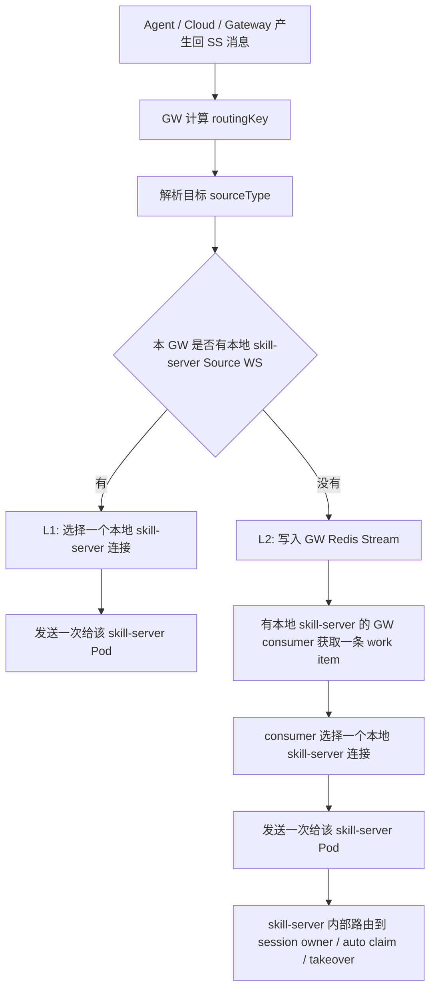
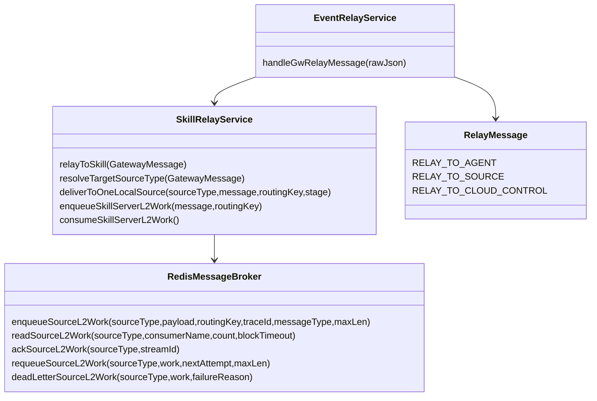
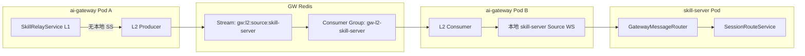
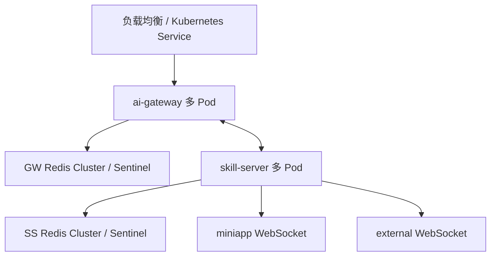
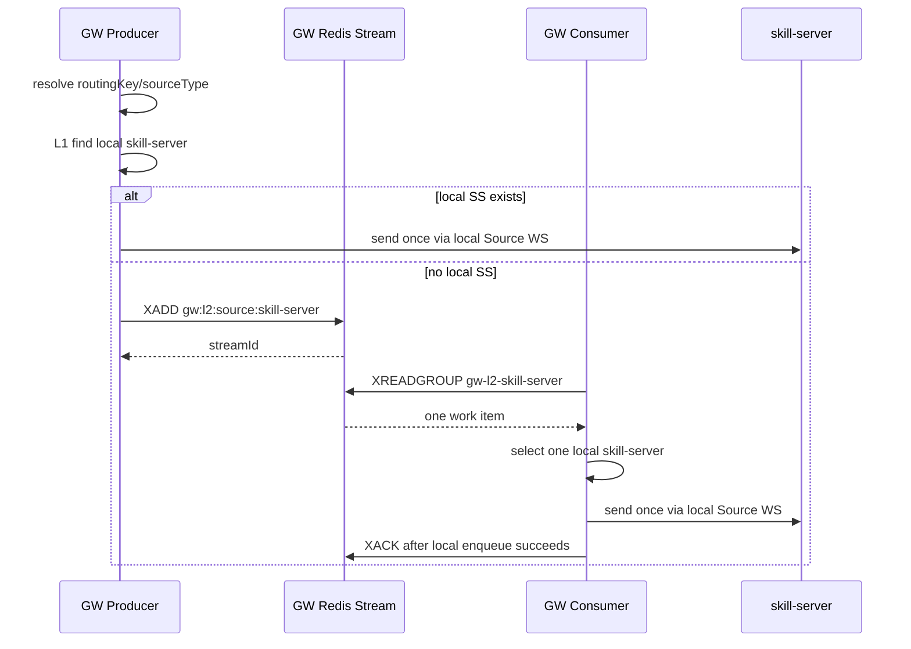
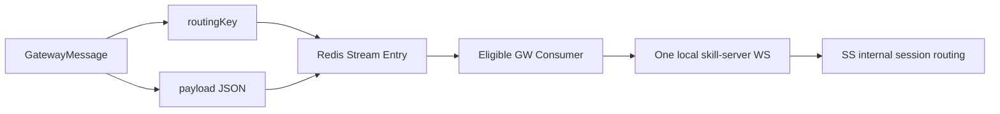
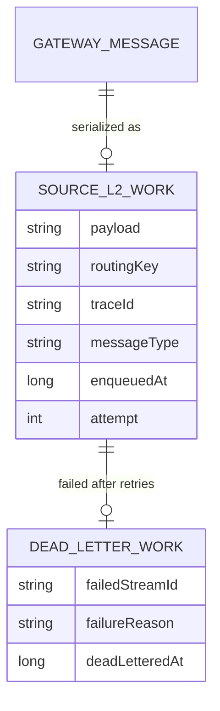
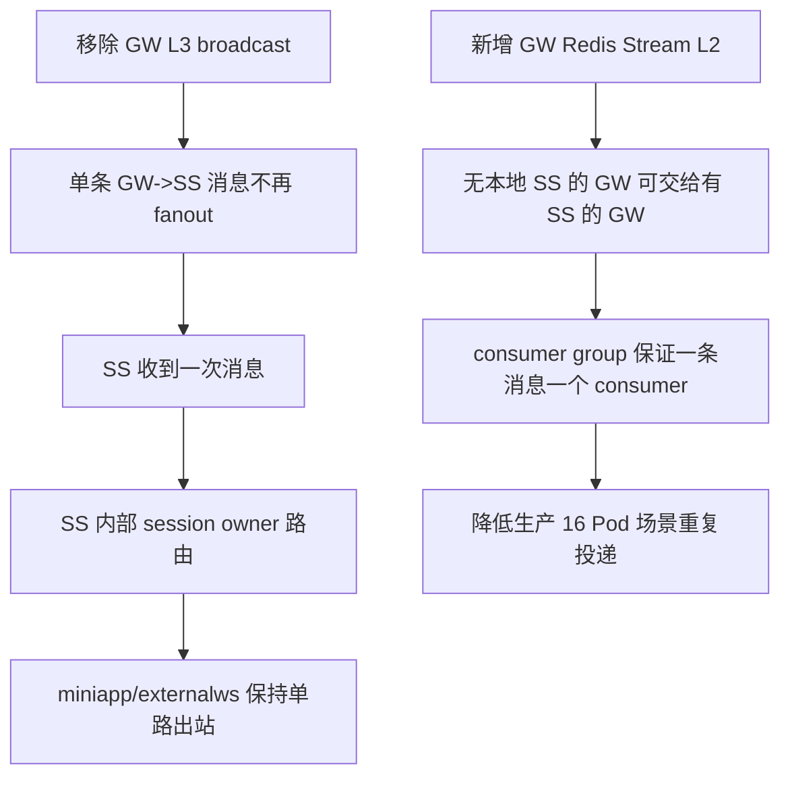
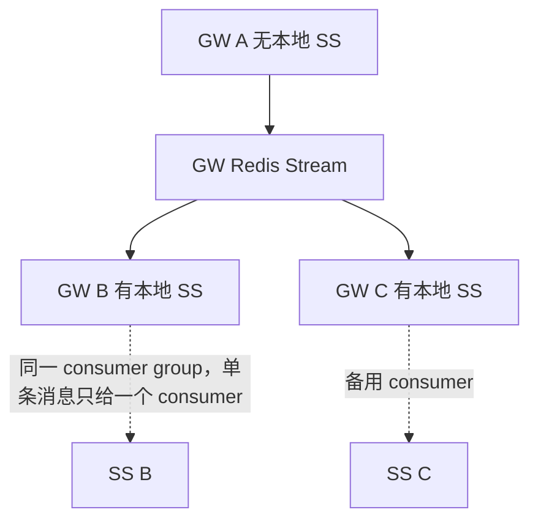

# US需求设计文档：移除 GW L3 广播兜底并改为单 skill-server Pod 投递

## 一、需求概述（必填）

### 1.1 用户故事

- **As（用户角色）**：系统运维、后端开发、消息链路排障人员
- **I want（功能描述）**：当 ai-gateway 无法在本机精准路由到 skill-server 时，不再跨 GW 广播，而是把消息交给一个有本地 skill-server 连接的 GW，再由该 GW 投递给一个 skill-server Pod
- **So that（业务价值）**：避免 `tool_done`、`tool_event`、`tool_error` 等主动推送事件因 GW L3 广播被重复投递，降低生产环境 16 个 GW Pod 下的消息放大、日志噪声和重复处理风险

### 1.2 业务功能逻辑说明

#### 1.2.1 业务场景描述

当前生产日志出现如下现象：

```text
[V2]No source connection available for broadcast,type = tool_done
[V2-V3]broadcast relay to 14 remote GW:type=tool_done,source=skill-service
```

该现象说明 GW 在本机找不到可用 source 连接后，进入了跨 GW 广播兜底。广播会把一个本应由 skill-server 处理一次的消息推送给多个 GW，再由这些 GW 转发给各自本地的 Source 连接，导致单条消息被放大。

本需求调整边界如下：

- GW 只负责把消息交给一个 skill-server Pod。
- skill-server 内部负责 session owner 路由、auto claim、owner 死亡后的 takeover。
- GW 与 SS 使用独立 Redis，GW 不读取 SS Redis 中的 `instance:roster`、`ss:internal:instance:*` 等内部状态。
- L3 广播兜底移除，GW 不再通过 `to-source-broadcast` 把消息扇出到所有 GW。

#### 1.2.2 业务流程说明



**流程步骤说明：**

1. GW 收到需要回传给 skill-server 的消息，例如 `tool_done`、`tool_event`、`tool_error`、`permission_request`、`session_created`、`agent_online`、`agent_offline`、`im_push`。
2. GW 生成或沿用 `traceId`，按优先级计算 `routingKey`：`welinkSessionId`、`toolSessionId`、`payload.toolSessionId`、`ak`、`traceId`。
3. GW 解析目标 `sourceType`：优先使用本机 `UpstreamRoutingTable`，其次使用 `message.source`，都不存在时默认 `skill-server`。
4. 若 `message.source=skill-service`，统一归一为 `skill-server`。
5. L1：若本 GW 存在本地 open 的 `skill-server` Source WS，则通过 hash ring 或首个 open 连接选择一个连接，发送一次。
6. 若 L1 找不到本地 `skill-server`，L2 写入一条 `gw:l2:source:skill-server` Redis Stream work item。
7. 只有本机存在 open `skill-server` Source WS 的 GW 会消费该 Stream consumer group。
8. Redis consumer group 保证一条 work item 只分配给一个 GW consumer。
9. consumer GW 收到 work item 后，选择一个本地 skill-server 连接并发送一次。
10. skill-server 收到消息后，按现有内部逻辑处理：本机 owner 直接处理，远端 owner 通过 `ss:relay:{owner}` 转发，无 owner 时 auto claim，owner 死亡时 tryTakeover。

#### 1.2.3 业务规则

- GW 不再使用 L3 broadcast 作为路由兜底。
- GW L1 只允许单点投递，不允许本地 source group 广播。
- GW L2 不做精准 session owner 路由，只做 one work item -> one eligible GW -> one local skill-server Pod 的交付。
- GW 不读取 SS Redis 活跃 Pod 状态，因为 GW 与 SS Redis 独立。
- `skill-service` 作为历史别名统一归一为 `skill-server`。
- `session_created`、`agent_online`、`agent_offline` 需要进入 GW L2，否则 L1 缺失时无法交给 SS 做本地副作用处理。
- `im_push` 暂时保留在 L2 支持范围内，但 REST 入口 `POST /api/gateway/cloud/im-push` 属于后续 backlog 清理项。
- L2 consumer 只在本 GW 有本地 open `skill-server` Source WS 时消费。
- Stream work item 只有本地发送成功后 ACK；发送失败时重试，超过上限进入 dead-letter stream。

#### 1.2.4 预期结果

- **正常场景**：
  - 本 GW 有本地 SS 连接时，消息只发送给一个本地 skill-server Pod。
  - 本 GW 无本地 SS 连接时，消息只写入一条 GW Redis Stream 记录，由一个有 SS 连接的 GW 消费并发送给一个本地 skill-server Pod。
  - 不再出现 `[V2-L3] Broadcast relay to N remote GWs` 这类正常路径日志。
- **异常场景**：
  - 当前 GW 没有本地 SS，且 L2 Stream 写入失败：本次 `relayToSkill` 返回失败并记录告警日志。
  - consumer 获取 work item 后本地 SS 断开：不广播；按 retry 机制重新入队或进入 dead-letter stream。
  - 消息体非法或反序列化失败：进入失败处理流程，超过重试上限进入 dead-letter stream。
  - 目标 `sourceType` 非 `skill-server` 且本地无连接：不进入 SS L2，避免把其他 Source 类型错误投递给 skill-server。

#### 1.2.5 界面交互说明

不涉及前端界面交互。本需求只调整 ai-gateway 与 skill-server 之间的后端消息路由行为。

#### 1.2.6 相关链接

- 当前任务目录：`.trellis/tasks/06-01-remove-gw-l3-broadcast-fallback-and-route-to-one-skill-server-pod/`
- 代码模块：
  - `ai-gateway/src/main/java/com/opencode/cui/gateway/service/SkillRelayService.java`
  - `ai-gateway/src/main/java/com/opencode/cui/gateway/service/RedisMessageBroker.java`
  - `ai-gateway/src/main/java/com/opencode/cui/gateway/service/EventRelayService.java`
  - `ai-gateway/src/main/java/com/opencode/cui/gateway/model/RelayMessage.java`

---

## 二、技术设计（必填）

### 2.1 功能实现设计

#### 2.1.1 逻辑视图



**核心类/模块说明：**

- `SkillRelayService`：GW -> Source 的主路由服务。负责 L1 本地单点投递、L2 Stream 入队、L2 consumer 消费并投递给一个本地 SS。
- `RedisMessageBroker`：封装 GW Redis 操作。新增 Source L2 Stream 的 XADD、XREADGROUP、ACK、requeue、dead-letter 能力。
- `EventRelayService`：处理 GW pub/sub relay。移除 `to-source-broadcast` 分支，保留 `to-agent`、`to-source`、`to-cloud-control`。
- `RelayMessage`：GW relay DTO。移除 L3 broadcast relay 常量和工厂方法，避免后续再从 DTO 层恢复 L3 扇出。
- `UpstreamRoutingTable`：仍作为 L1 sourceType 解析入口，不再作为广播兜底触发器。
- `ConsistentHashRing`：用于在本地同一 sourceType 的连接中选择一个连接。

#### 2.1.2 进程视图



**进程/组件说明：**

- `ai-gateway Pod`：多实例部署，负责 Agent/Cloud 与 Source 的连接管理、GW Redis Stream L2 producer/consumer。
- `skill-server Pod`：多实例部署，作为 Source WebSocket 客户端连接到 GW，负责业务 session owner 路由。
- `GW Redis`：ai-gateway 独立 Redis，用于 GW 内部 relay、source 连接注册、L2 Stream work queue。
- `SS Redis`：skill-server 独立 Redis。本需求中 GW 不访问该 Redis。

#### 2.1.3 开发视图

```text
ai-gateway/
├── src/main/java/com/opencode/cui/gateway/
│   ├── model/
│   │   └── RelayMessage.java
│   └── service/
│       ├── EventRelayService.java
│       ├── RedisMessageBroker.java
│       └── SkillRelayService.java
├── src/main/resources/
│   └── application.yml
└── src/test/java/com/opencode/cui/gateway/service/
    ├── RedisMessageBrokerTest.java
    ├── RedisMessageBrokerSourceConnTest.java
    ├── SkillRelayServiceTest.java
    ├── SkillRelayServiceV2Test.java
    └── EventRelayServiceTest.java
```

**代码组织说明：**

- 路由主流程集中在 `SkillRelayService`，避免 controller 或 handler 分散实现 L2 兜底逻辑。
- Redis key、stream、group 相关封装集中在 `RedisMessageBroker`，调用方不直接拼接 Redis Stream 操作。
- DTO 能力集中在 `RelayMessage`，移除不再支持的 broadcast relay 类型。

#### 2.1.4 物理视图



说明：

- 本需求不改变部署拓扑。
- 仍由 skill-server 对外提供 miniapp WS 与 external WS 出站路径。
- 不新增 REST 出站路径，`im_push` REST 入口仅保留兼容，后续清理。

#### 2.1.5 时序图



**时序说明：**

- L1 成功时不访问 Redis Stream。
- L2 入队成功即认为 GW 已完成一次可恢复交付，不再进入广播兜底。
- consumer 只在本地存在 SS 连接时消费，减少 claim 后无法发送的概率。
- consumer 发送成功后 ACK；失败时重试或进入 dead-letter。

#### 2.1.6 数据流图



**数据流说明：**

- `GatewayMessage`：原始业务消息，L1 直接序列化后发给本地 Source WS；L2 作为 Stream `payload` 字段保存。
- `routingKey`：用于本地 hash 选一个连接，不作为全局 session owner 路由依据。
- `traceId`：用于链路日志串联，缺失时由 `GatewayMessage.ensureTraceId()` 生成。
- `messageType`：写入 Stream 字段，便于观测和死信排查。
- `attempt`：L2 retry 次数控制字段。

#### 2.1.7 异常处理机制

| 异常类型 | 异常场景 | 处理方式 | 错误码/消息 |
|---------|---------|---------|-----------|
| L1 miss | 本 GW 没有 open 的 `skill-server` Source WS | 进入 L2 Stream 入队 | `[V2-L2] Enqueued one skill-server L2 work item` |
| L2 enqueue failed | Redis 不可用或 XADD 失败 | 返回 false，记录 error 日志，不广播 | `[V2-L2] Failed to enqueue skill-server L2 work item` |
| Consumer no local SS | consumer 触发时本地 SS 已断开 | 不消费或失败重试，不广播 | `[V2-L2-CONSUME] Requeued...` |
| Payload invalid | Stream 中 payload 为空或反序列化失败 | 按 retry/dead-letter 流程处理 | `empty_payload` / 异常类名 |
| Retry exhausted | 重试次数达到上限 | 写入 dead-letter stream 并 ACK 原消息 | `[V2-L2-CONSUME] Dead-lettered...` |
| 非 skill-server Source miss | `sourceType` 非 `skill-server` 且本地无连接 | 返回 false，不投递给 SS | debug log |

#### 2.1.8 配置变化

| 配置项 | 配置文件路径 | 原值 | 新值 | 说明 |
|-------|-------------|------|------|------|
| `gateway.l2-source-stream.max-len` | `ai-gateway/src/main/resources/application.yml` | 无 | `${GATEWAY_L2_SOURCE_STREAM_MAX_LEN:10000}` | L2 Stream 最大保留长度，避免无限增长 |
| `gateway.l2-source-stream.poll-delay-ms` | `ai-gateway/src/main/resources/application.yml` | 无 | `${GATEWAY_L2_SOURCE_STREAM_POLL_DELAY_MS:200}` | consumer 调度间隔 |
| `gateway.l2-source-stream.poll-block-ms` | `ai-gateway/src/main/resources/application.yml` | 无 | `${GATEWAY_L2_SOURCE_STREAM_POLL_BLOCK_MS:100}` | XREADGROUP block 时间 |
| `gateway.l2-source-stream.poll-batch-size` | `ai-gateway/src/main/resources/application.yml` | 无 | `${GATEWAY_L2_SOURCE_STREAM_POLL_BATCH_SIZE:10}` | 单次消费批量 |
| `gateway.l2-source-stream.max-attempts` | `ai-gateway/src/main/resources/application.yml` | 无 | `${GATEWAY_L2_SOURCE_STREAM_MAX_ATTEMPTS:3}` | 重试上限，超过后进入 dead-letter |

**设计文档链接：**

- 当前文档即为详细设计：`.trellis/tasks/06-01-remove-gw-l3-broadcast-fallback-and-route-to-one-skill-server-pod/prd.md`

---

### 2.2 接口设计

#### 2.2.1 接口清单

| 接口名称 | 接口路径 | 请求方式 | 提供方 | 消费方 | 说明 |
|---------|---------|---------|-------|-------|------|
| Source WebSocket | `/ws/source` 或现有 Source WS 路径 | WebSocket | ai-gateway | skill-server | 维持现有 SS 与 GW 的 Source 连接，不变 |
| GW Redis Stream | `gw:l2:source:skill-server` | Redis XADD/XREADGROUP | ai-gateway | ai-gateway | 新增内部 L2 work queue，不对外暴露 |
| GW Relay Pub/Sub | `gw:relay:{instanceId}` | Redis Pub/Sub | ai-gateway | ai-gateway | 保留 to-agent、to-source、to-cloud-control；移除 to-source-broadcast |

#### 2.2.2 接口详细定义

**接口1：GW Redis Stream L2 Work Item**

- **请求路径**：`gw:l2:source:skill-server`
- **请求方式**：Redis Stream `XADD` / `XREADGROUP`
- **请求参数**：

```json
{
  "payload": {
    "类型": "String",
    "必填": "是",
    "说明": "序列化后的 GatewayMessage JSON",
    "示例": "{\"type\":\"tool_done\",\"toolSessionId\":\"T1\",\"traceId\":\"trace-1\"}"
  },
  "routingKey": {
    "类型": "String",
    "必填": "否",
    "说明": "本地 hash 选择 SS 连接的稳定 key",
    "示例": "T1"
  },
  "traceId": {
    "类型": "String",
    "必填": "否",
    "说明": "链路追踪 ID",
    "示例": "trace-1"
  },
  "messageType": {
    "类型": "String",
    "必填": "否",
    "说明": "GatewayMessage.type",
    "示例": "tool_done"
  },
  "enqueuedAt": {
    "类型": "Long",
    "必填": "是",
    "说明": "入队时间戳，毫秒",
    "示例": "1780296000000"
  },
  "attempt": {
    "类型": "Integer",
    "必填": "是",
    "说明": "重试次数",
    "示例": "0"
  }
}
```

- **响应参数**：

```json
{
  "streamId": {
    "类型": "String",
    "说明": "Redis Stream record id",
    "示例": "1710000000000-0"
  }
}
```

- **错误码定义**：

| 错误码 | 错误描述 | 处理建议 |
|-------|---------|---------|
| `L2_ENQUEUE_FAILED` | XADD 失败或 Redis 不可用 | 检查 GW Redis 状态，观察 error 日志 |
| `L2_CONSUME_FAILED` | consumer 反序列化或发送失败 | 查看 retry/dead-letter 日志 |
| `L2_DEAD_LETTERED` | 超过最大重试次数 | 人工排查 dead-letter stream 中 payload |

**接口设计链接：**

- 不涉及外部 APIDesigner；该接口为内部 Redis Stream 协议。

---

### 2.3 数据设计

#### 2.3.1 概念模型



#### 2.3.2 逻辑模型

**实体定义：**

| 实体名称 | 属性列表 | 主键 | 外键 | 说明 |
|---------|---------|------|------|------|
| `SourceL2Work` | `id`、`payload`、`routingKey`、`traceId`、`messageType`、`enqueuedAt`、`attempt` | Redis Stream ID | 无 | L2 fallback 待投递消息 |
| `DeadLetterWork` | `id`、`failedStreamId`、`payload`、`failureReason`、`deadLetteredAt` | Redis Stream ID | `failedStreamId` | 重试耗尽后的排障记录 |

#### 2.3.3 物理模型

不涉及数据库表结构变更。

**Redis Stream：`gw:l2:source:skill-server`**

| 字段名 | 字段类型 | 长度 | 是否主键 | 是否外键 | 是否必填 | 默认值 | 索引 | 说明 |
|-------|---------|------|---------|---------|---------|-------|------|------|
| `payload` | String | 受 GatewayMessage 大小限制 | 否 | 否 | 是 | 无 | 无 | GatewayMessage JSON |
| `routingKey` | String | 变长 | 否 | 否 | 否 | 无 | 无 | 本地 hash key |
| `traceId` | String | 变长 | 否 | 否 | 否 | 无 | 无 | 链路追踪 |
| `messageType` | String | 变长 | 否 | 否 | 否 | 无 | 无 | 消息类型 |
| `enqueuedAt` | Long | 13 | 否 | 否 | 是 | 当前时间 | 无 | 入队时间 |
| `attempt` | Integer | - | 否 | 否 | 是 | `0` | 无 | 重试次数 |

**Redis Stream：`gw:l2:source:skill-server:dead`**

| 字段名 | 字段类型 | 长度 | 是否主键 | 是否外键 | 是否必填 | 默认值 | 索引 | 说明 |
|-------|---------|------|---------|---------|---------|-------|------|------|
| `failedStreamId` | String | 变长 | 否 | 是 | 是 | 无 | 无 | 原 Stream ID |
| `failureReason` | String | 变长 | 否 | 否 | 是 | `unknown` | 无 | 失败原因 |
| `deadLetteredAt` | Long | 13 | 否 | 否 | 是 | 当前时间 | 无 | 死信时间 |
| `payload` | String | 受 GatewayMessage 大小限制 | 否 | 否 | 是 | 无 | 无 | 原消息 JSON |

**索引设计：**

| 索引名称 | 索引类型 | 索引字段 | 说明 |
|---------|---------|---------|------|
| 不涉及 | 不涉及 | 不涉及 | Redis Stream 依赖 Stream ID 与 consumer group，不新增 DB 索引 |

#### 2.3.4 缓存设计

| 缓存Key | 缓存类型 | 过期时间 | 数据结构 | 使用场景 |
|---------|---------|---------|---------|---------|
| `gw:l2:source:skill-server` | Redis | 无 TTL，使用 `XTRIM` 近似限制长度 | Stream | L2 单消费者 work queue |
| `gw:l2:source:skill-server:dead` | Redis | 无 TTL，需按运维策略清理 | Stream | L2 死信排障 |
| `gw:source-conn:{sourceType}:{sourceInstanceId}` | Redis | 2 小时，心跳刷新 | Hash | 保留现有 Source 连接注册，不作为 L2 精准路由主路径 |
| `UpstreamRoutingTable` | Memory | 现有本地 TTL | Caffeine/内存表 | L1 sourceType 解析 |

#### 2.3.5 运营数据设计

| 数据项 | 数据来源 | 统计维度 | 统计周期 | 使用场景 |
|-------|---------|---------|---------|---------|
| L1 命中次数 | `SkillRelayService` metrics/log | `messageType`、`sourceType` | 分钟/小时 | 观察本地 SS 覆盖率 |
| L2 入队次数 | `[V2-L2] Enqueued...` | `messageType`、`routingKey` | 分钟/小时 | 观察跨 GW fallback 频率 |
| L2 消费成功次数 | `[V2-L2-CONSUME] Delivered...` | `consumerGw`、`sourceInstanceId`、`messageType` | 分钟/小时 | 验证 L2 是否正常被单个 GW 消费 |
| L2 retry 次数 | `[V2-L2-CONSUME] Requeued...` | `reason`、`attempt` | 分钟/小时 | 判断 SS 连接波动 |
| L2 dead-letter 次数 | `[V2-L2-CONSUME] Dead-lettered...` | `reason`、`messageType` | 分钟/小时 | 告警与人工排障 |

**数据设计链接：**

- 不涉及数据库建模工具。

---

### 2.4 集成设计

#### 2.4.1 内部微服务集成

| 服务名称 | 服务类型 | 集成方式 | 接口名称 | 调用方向 | 说明 |
|---------|---------|---------|---------|---------|------|
| ai-gateway | 微服务 | WebSocket | Source WS | skill-server -> ai-gateway | SS 作为 Source 连接到 GW |
| ai-gateway | 微服务 | Redis Stream | `gw:l2:source:skill-server` | GW producer -> GW consumer | L2 单消费者 work queue |
| ai-gateway | 微服务 | Redis Pub/Sub | `gw:relay:{instanceId}` | GW -> GW | 保留 agent/cloud/to-source 精准 relay，不再支持 broadcast relay |
| skill-server | 微服务 | Redis Pub/Sub | `ss:relay:{owner}` | SS -> SS | SS 内部 session owner 转发，本需求不改 |

#### 2.4.2 外部系统集成

| 系统名称 | 系统类型 | 集成方式 | 接口名称 | 认证方式 | 说明 |
|---------|---------|---------|---------|---------|------|
| miniapp | 内部/客户端系统 | WebSocket | miniapp WS | 现有认证 | 出站路径之一，本需求不改 |
| externalws | 外部接入系统 | WebSocket | external WS | 现有认证 | 出站路径之一，本需求不改 |
| REST `im_push` | 历史接口 | REST | `/api/gateway/cloud/im-push` | 现有认证 | 标记为 backlog 清理，不作为新设计出站路径 |

#### 2.4.3 周边依赖设计

| 依赖项 | 依赖类型 | 依赖版本 | 依赖方式 | 影响范围 | 说明 |
|-------|---------|---------|---------|---------|------|
| Redis Stream | 中间件能力 | 现有 Spring Data Redis / Redis | 强依赖 | GW L2 fallback | 需要支持 XADD、XREADGROUP、XACK、XTRIM |
| Spring Scheduler | 框架能力 | Spring Boot 3.4.x | 强依赖 | L2 consumer polling | 使用 `@Scheduled` 周期消费 |
| Source WebSocket | 内部连接 | 现有协议 | 强依赖 | L1/L2 最终发送 | 必须有至少一个 GW 持有本地 SS 连接 |
| SS 内部路由 | 业务组件 | 现有能力 | 强依赖 | session owner 路由 | GW 只交给一个 SS，SS 继续处理 owner 路由 |

---

### 2.5 依赖项及影响面分析

#### 2.5.1 直接依赖分析

| 被修改模块/接口 | 直接调用方 | 调用场景 | 影响评估 | 测试建议 |
|---------------|-----------|---------|---------|---------|
| `SkillRelayService.relayToSkill` | `CloudPushController`、`CloudAgentService`、`BusinessInvokeRouteStrategy`、`EventRelayService` 等 | GW -> SS 主动消息回传 | 高 | 覆盖 L1 成功、L2 入队、L2 消费、非 SS source miss |
| `RedisMessageBroker` L2 Stream API | `SkillRelayService` | L2 work item 写入/消费/ACK/死信 | 中 | 单测 XADD、XREADGROUP、ACK、trim、dead-letter |
| `EventRelayService.handleGwRelayMessage` | Redis relay listener | GW pub/sub 收包处理 | 中 | 验证 to-agent、to-source、to-cloud-control 保持可用，broadcast relay 不再处理 |
| `RelayMessage` | `EventRelayService`、`RedisMessageBroker` | GW relay DTO 序列化 | 中 | RelayMessage 序列化测试、编译检查 |
| `application.yml` | Spring 配置加载 | L2 Stream 参数 | 低 | 启动/单测加载默认配置 |

#### 2.5.2 间接依赖分析（影响传播）



**影响传播说明：**

- `SkillRelayService.relayToSkill` -> L1 单点选择 -> 消除本地 source group 广播 -> 消除多 SS Pod 重复处理。
- `SkillRelayService.enqueueSkillServerL2Work` -> Redis Stream -> eligible GW consumer -> SS 内部 owner 路由 -> miniapp/externalws 出站不重复。
- `RelayMessage` 移除 broadcast 类型 -> `EventRelayService` 不再有 L3 RX 分支 -> 正常路径无法恢复旧广播。

#### 2.5.3 运行时影响监控

| 监控项 | 监控指标 | 监控方式 | 告警阈值 | 处理策略 |
|-------|---------|---------|---------|---------|
| L2 入队量 | 每分钟 `Enqueued one skill-server L2 work item` 数量 | 日志/监控平台 | 较基线突增 | 检查 GW 与 SS Source WS 分布 |
| L2 消费延迟 | `enqueuedAt` 到 delivered 日志的差值 | 日志聚合 | P95 > 1s | 检查 Redis、consumer 调度、SS 连接 |
| L2 dead-letter | dead-letter 日志数量 | 日志/Redis Stream | > 0 持续出现 | 人工查看 dead stream payload |
| L3 残留 | `[V2-L3]`、`to-source-broadcast` 日志 | 日志搜索 | 任意出现 | 检查是否存在旧版本 Pod 或未清理代码 |
| SS 内部 relay | `ss:relay:{owner}` 成功/失败 | SS 日志 | 失败率升高 | 排查 SS owner 路由和 Redis |

#### 2.5.4 影响面汇总

**影响范围：**

- **产品内部服务依赖**：ai-gateway、skill-server。
- **上下游服务依赖**：Agent/Cloud 回 SS 的主动消息链路；miniapp WS、external WS 的最终出站行为由 SS 保持。
- **外部服务依赖**：无新增外部依赖。
- **周边环境依赖**：GW Redis 需要支持 Redis Stream consumer group；部署环境需保证至少部分 GW Pod 有本地 skill-server Source WS 连接。

---

## 三、DFX设计（必填）

### 3.1 性能设计

#### 3.1.1 性能需求规格

| 性能指标 | 目标值 | 测试方法 | 说明 |
|---------|-------|---------|------|
| L1 投递延迟 | 与现有本地 WS 投递基本持平 | 单测/压测观察 | L1 不访问 Redis Stream |
| L2 投递延迟 | P95 < 1s | 构造无本地 SS 的 GW，观察 enqueuedAt 到 delivered | 受 poll delay、block ms、Redis 性能影响 |
| 单条消息 fanout 数 | 1 | 日志与 mock send 次数验证 | 不允许 N 个 GW/SS 重复收到 |
| L2 吞吐量 | 满足现有 tool event 回传峰值 | Redis Stream 压测 | 可通过 batch size 和 poll delay 调整 |

#### 3.1.2 性能设计方案

**性能优化策略：**

- **数据库优化**：不涉及数据库。
- **缓存策略**：L2 使用 Redis Stream + `XTRIM` 控制长度；L1 继续使用本地内存连接表和 hash ring。
- **代码优化**：L1 不做跨网络查找；L2 入队后立即停止，不继续查精准 route 或广播。
- **架构优化**：consumer group 用 one-consumer 语义替代 pub/sub fanout，降低 16 GW Pod 场景下的消息放大。

**性能测试计划：**

- L1 场景：注册两个本地 SS，发送 `tool_done`，验证只有一个 SS mock 收到。
- L2 场景：当前 GW 无本地 SS，mock Redis Stream 返回 `streamId`，验证仅 XADD 一条记录。
- L2 consumer 场景：consumer GW 有本地 SS，读取一条 work item，验证发送一次并 ACK。
- 残留广播检查：全仓搜索 `to-source-broadcast`、`[V2-L3]`，确认 GW 主路径无残留。

---

### 3.2 高可用设计

#### 3.2.1 接入层高可用

- **负载均衡策略**：沿用现有 GW 多 Pod 负载均衡。
- **故障转移机制**：当前 GW 无本地 SS 时，L2 Stream 将消息转交给有本地 SS 的其他 GW。
- **健康检查机制**：consumer 是否消费由本地 open SS Source WS 状态决定。

#### 3.2.2 应用层高可用

- **服务冗余策略**：GW 与 SS 均多实例部署。
- **故障恢复机制**：consumer 发送失败时重试；超过上限进入 dead-letter，避免无限循环。
- **容灾策略**：依赖现有 GW Redis 高可用；如果 GW Redis 故障，L2 fallback 不可用但不会广播放大。

#### 3.2.3 数据层高可用

- **数据库高可用**：不涉及数据库。
- **缓存高可用**：依赖现有 GW Redis HA。
- **存储高可用**：Redis Stream work item 在 ACK 前保留，consumer 短暂故障不会导致已读未处理消息立即丢失。

#### 3.2.4 高可用架构图



---

### 3.3 安全设计

#### 3.3.1 安全威胁分析

| 威胁类型 | 威胁场景 | 风险等级 | 影响范围 |
|---------|---------|---------|---------|
| 重复投递 | 旧 L3 broadcast 导致多 Pod 重复处理 | 高 | GW/SS/miniapp/externalws 出站 |
| Redis Stream 积压 | consumer 不可用或 SS 全部断开 | 中 | GW Redis 内存、消息延迟 |
| 敏感信息泄露 | `payload` 中可能包含业务字段 | 中 | Redis 与日志 |
| 错误 sourceType 投递 | 非 skill-server 消息被送到 SS | 中 | Source 路由正确性 |

#### 3.3.2 安全技术设计

- **认证机制**：不变，沿用现有 GW/SS WebSocket 与内部接口认证。
- **授权机制**：不新增用户授权能力。
- **数据加密**：沿用现有 Redis 与服务间传输安全策略；本需求不新增明文外部出口。
- **输入校验**：L2 入队要求 `sourceType` 与 `payload` 非空；consumer 校验 payload 非空且可反序列化。
- **敏感数据保护**：日志只输出 `streamId`、`routingKey`、`type`、`traceId` 等排障字段，不打印完整 payload。
- **审计日志**：新增 L2 enqueue、consume、deliver、requeue、dead-letter 日志。

#### 3.3.3 安全合规检查

- 不新增外部接口，不扩大外部攻击面。
- 不读取 SS Redis 内部状态，避免跨服务越界依赖。
- 不把消息广播到所有 GW，降低误投递和重复处理风险。

---

### 3.4 兼容性设计

#### 3.4.1 中间件兼容性

| 中间件 | 当前版本 | 目标版本 | 兼容方案 | 测试建议 |
|-------|---------|---------|---------|---------|
| Redis | 现网版本 | 不变 | 需支持 Redis Stream 与 consumer group | 在测试环境执行 XADD/XREADGROUP/XACK/XTRIM |
| Spring Data Redis | Spring Boot 3.4.x 管理版本 | 不变 | 使用 `StringRedisTemplate.opsForStream()` | 单测覆盖 StreamOperations mock |

#### 3.4.2 周边集成兼容性

| 集成系统 | 当前接口版本 | 新接口版本 | 兼容方案 | 影响评估 |
|---------|-------------|-----------|---------|---------|
| skill-server Source WS | 现有协议 | 不变 | GW 仍发送 GatewayMessage JSON | 低 |
| GW Pub/Sub relay | 现有 `RelayMessage` | 移除 `to-source-broadcast` | 保留 `to-agent`、`to-source`、`to-cloud-control` | 中 |
| miniapp WS | 现有协议 | 不变 | 由 SS 内部路由后继续出站 | 低 |
| external WS | 现有协议 | 不变 | 由 SS 内部路由后继续出站 | 低 |

#### 3.4.3 数据兼容性

- **数据迁移方案**：不涉及 DB 数据迁移。
- **数据兼容处理**：
  - `source=skill-service` 归一为 `skill-server`，兼容生产日志中出现的历史别名。
  - 保留现有 `gw:source-conn:*` 注册逻辑，避免影响其他诊断或兼容测试。
- **版本兼容策略**：
  - 推荐滚动发布时优先观察 `[V2-L2]` 与 `[V2-L2-CONSUME]` 日志。
  - 灰度期间若仍出现 `to-source-broadcast` 或 `[V2-L3]` 日志，应定位是否存在旧版本 GW Pod。

#### 3.4.4 扩展性设计

- **业务扩展**：后续如果新增 GW -> SS 消息类型，只要目标为 skill-server，默认可进入相同 L1/L2 单点投递模型。
- **技术扩展**：Redis Stream consumer group 可扩展为更细粒度的 sourceType stream，但本次只实现 `skill-server`。

---

## 四、附录

### 4.1 相关文档链接

- 当前 US/PRD：`.trellis/tasks/06-01-remove-gw-l3-broadcast-fallback-and-route-to-one-skill-server-pod/prd.md`
- 相关实现文件：
  - `ai-gateway/src/main/java/com/opencode/cui/gateway/service/SkillRelayService.java`
  - `ai-gateway/src/main/java/com/opencode/cui/gateway/service/RedisMessageBroker.java`
  - `ai-gateway/src/main/java/com/opencode/cui/gateway/service/EventRelayService.java`
  - `ai-gateway/src/main/java/com/opencode/cui/gateway/model/RelayMessage.java`
- 相关测试文件：
  - `ai-gateway/src/test/java/com/opencode/cui/gateway/service/SkillRelayServiceV2Test.java`
  - `ai-gateway/src/test/java/com/opencode/cui/gateway/service/RedisMessageBrokerTest.java`
  - `ai-gateway/src/test/java/com/opencode/cui/gateway/service/EventRelayServiceTest.java`

### 4.2 参考规范

- Envoy ring hash / Maglev load balancing：https://www.envoyproxy.io/docs/envoy/latest/intro/arch_overview/upstream/load_balancing/load_balancers.html
- Kubernetes Service session affinity：https://kubernetes.io/docs/reference/networking/virtual-ips/#session-affinity
- NATS queue groups：https://docs.nats.io/nats-concepts/core-nats/queue
- Akka Cluster Sharding：https://doc.akka.io/libraries/akka-core/current/typed/cluster-sharding.html
- Orleans grain directory：https://learn.microsoft.com/en-us/dotnet/orleans/host/grain-directory
- Socket.IO Redis adapter：https://socket.io/docs/v4/redis-adapter/

### 4.3 版本历史

| 版本 | 日期 | 修改人 | 修改内容 |
|------|------|--------|---------|
| v1.0 | 2026-06-01 | Llllviaaaa | 初版，明确移除 GW L3 broadcast，定义 L1/L2 两层路由与 Redis Stream consumer group 方案 |

---

## Backlog

- `im_push` / `POST /api/gateway/cloud/im-push` 是历史 REST 源出站路径，当前产品有效出站面应为 miniapp WebSocket 与 external WebSocket。后续需要单独任务清理该 REST path 及相关 SS handler/test 假设。
- 如需进一步降低 L2 延迟，可在压测后调整 `poll-delay-ms`、`poll-block-ms`、`poll-batch-size`。

## Out of Scope

- 不改 miniapp WebSocket 出站协议。
- 不改 external WebSocket 出站协议。
- 不改 skill-server 内部 session owner 路由算法。
- 不新增 GW 读取 SS Redis 的跨服务依赖。
- 不保留或扩展 REST-originated `im_push` 作为新出站路径。

## 验收标准

- GW 主路径不再调用 L3 broadcast fallback。
- `RelayMessage` 不再暴露 `to-source-broadcast` 类型或 factory。
- `EventRelayService` 不再接收并处理 `to-source-broadcast`。
- L1 本地 SS 存在时只发送给一个本地 SS 连接。
- L1 无本地 SS 时只写入一条 `gw:l2:source:skill-server` Stream work item。
- L2 consumer 只在本地存在 SS 连接时消费，并在本地发送成功后 ACK。
- `mvn.cmd test` 在 `ai-gateway` 模块通过。
