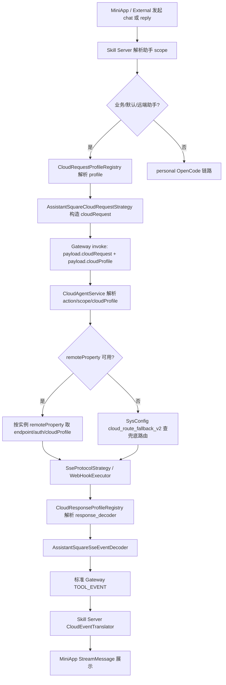
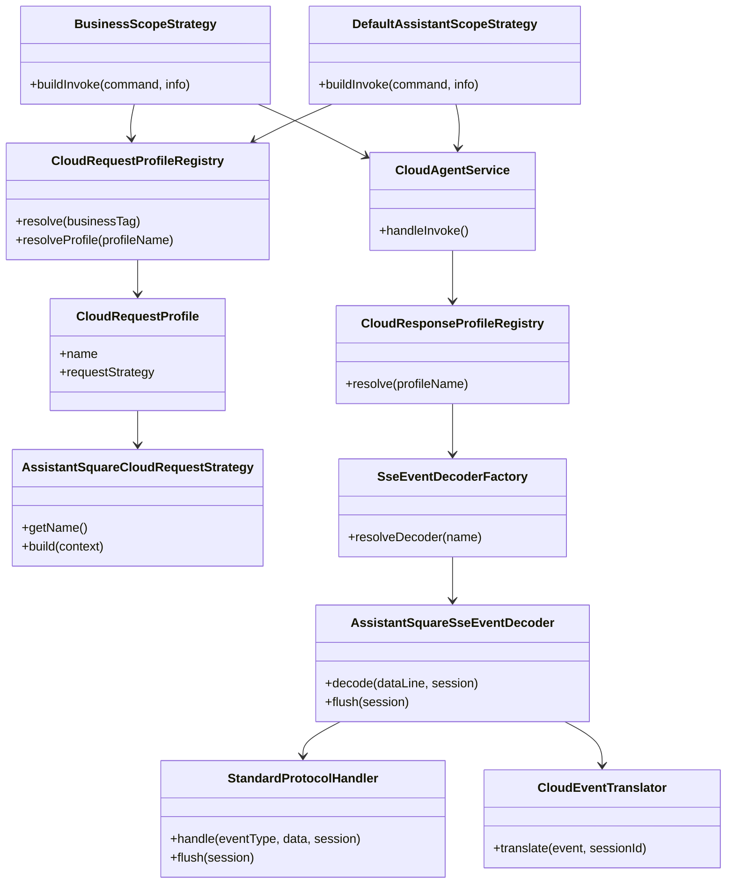
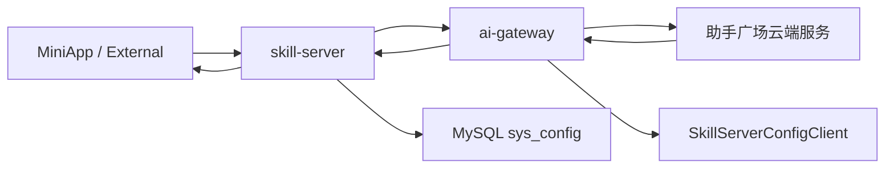
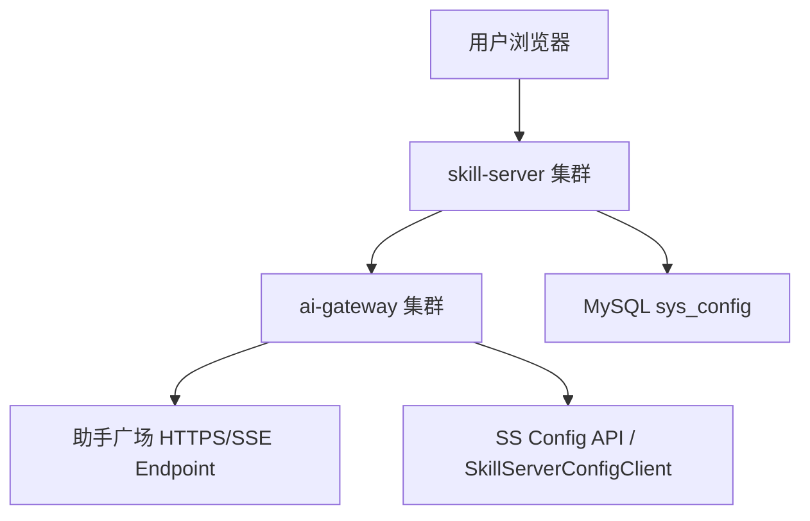
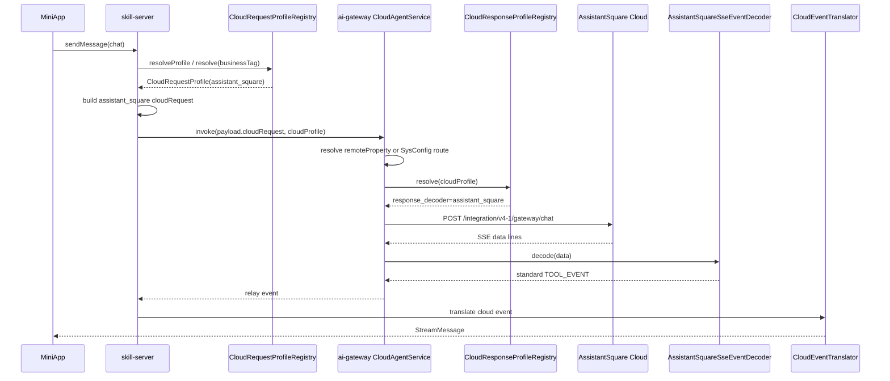
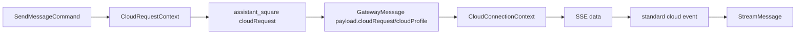
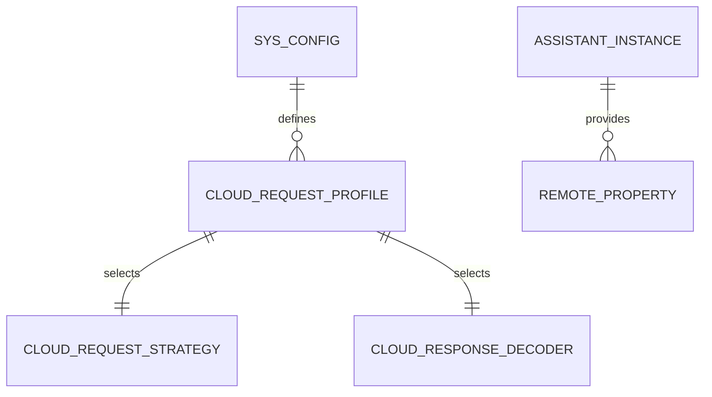
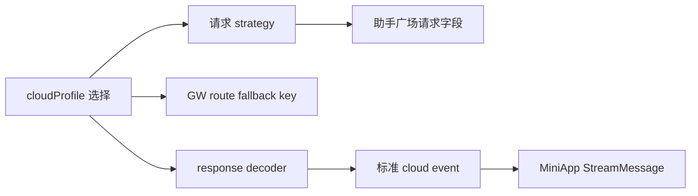
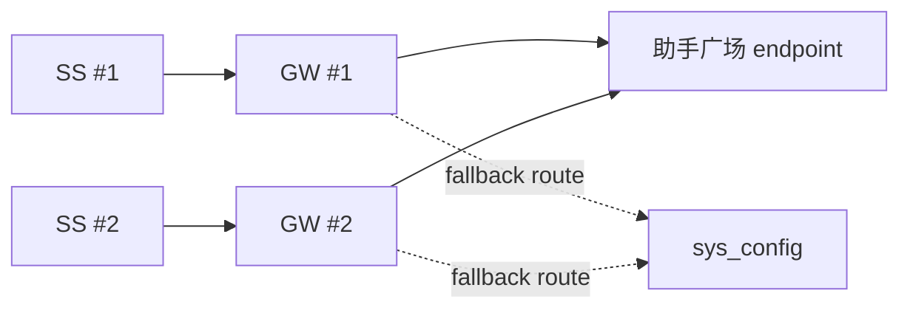

# 助手广场协议适配技术设计文档

> 当前文档描述截至 2026-05-28 代码库现状方案。本文档不引入新的运行时变更，用于沉淀 Skill Server 与 AI Gateway 对助手广场云端协议的请求构造、路由选择与 SSE 响应解码设计。

## 一、需求概述（必填）

### 1.1 用户故事
- **As**（用户角色）：MiniApp 用户、云端助手运营人员、系统运维人员
- **I want**（功能描述）：业务助手、默认助手或远端助手可以按助手广场协议接入云端服务，并把响应转换成 MiniApp 可消费的统一 StreamMessage
- **So that**（业务价值）：同一聊天入口可以兼容本地 OpenCode 助手和助手广场云端助手，降低接入新云端协议的重复改造成本

### 1.2 业务功能逻辑说明

#### 1.2.1 业务场景描述

助手广场协议适配覆盖三类来源：

1. **远端助手**：assistant-instance 接口返回 `remoteType=1`，系统识别为 `cloudProfile=assistant_square`。
2. **业务助手**：`AssistantInfo.businessTag` 通过 `cloud_protocol_profile:{businessTag}` 映射到 `assistant_square` profile。
3. **默认助手**：`default_assistant_rule` 命中后，按规则中的 `businessTag` 选择 profile。

当前方案分为两段：

- **SS 出站适配**：`CloudRequestProfileRegistry` 选择 `AssistantSquareCloudRequestStrategy`，把内部 `CloudRequestContext` 映射为助手广场 `POST /integration/v4-1/gateway/chat` 入参。
- **GW 入站适配**：`SseProtocolStrategy` 根据 `cloudProfile` 选择 `AssistantSquareSseEventDecoder`，把助手广场 SSE `data` 转成标准 cloud event，再回流给 SS 的 `CloudEventTranslator`。

#### 1.2.2 业务流程说明



**流程步骤说明：**

1. SS 入口根据 assistant scope 选择 `BusinessScopeStrategy`、`DefaultAssistantScopeStrategy` 或 personal strategy。
2. 业务/默认助手跳过本地 Agent 在线检查，生成 Snowflake `toolSessionId`，兼容助手广场 `topicId` Long 格式。
3. `CloudRequestProfileRegistry` 优先使用 `AssistantInfo.cloudProfile`，否则按 `businessTag` 查 `sys_config` 映射，缺省为 `default`。
4. `AssistantSquareCloudRequestStrategy` 将内部字段映射为 `assistantAccount/sendW3Account/msgBody/clientLang/topicId/extParameters/replyContext`。
5. SS 向 GW 发送 `invoke`，`payload.cloudProfile` 固定携带 profile 名。
6. GW `CloudAgentService` 优先按 `assistantAccount` 查询 assistant-instance remoteProperty；不可用时按 `(cloudProfile, scope)` 查询 `cloud_route_fallback_v2`。
7. chat 流式链路进入 `SseProtocolStrategy`；reply 链路进入 `WebHookExecutor`。
8. SSE 主循环只负责读取 `data:` 行，具体解码交给 `SseEventDecoder`。
9. `AssistantSquareSseEventDecoder` 按 `protocolType` 分派，`standard` handler 转成标准 cloud event。
10. SS `CloudEventTranslator` 将标准 cloud event 转成 MiniApp `StreamMessage`。

#### 1.2.3 业务规则

- `remoteType=1` 映射 `cloudProfile=assistant_square`；`remoteType=2` 映射 `cloudProfile=default`；`remoteType=0` 视为本地助手。
- profile 选择优先级：实例接口明确的 `cloudProfile` > `cloud_protocol_profile:{businessTag}` > `default`。
- `assistantAccount` 与 `sendUserAccount` 是助手广场请求必填字段，缺失时 SS fast-fail。
- `topicId` 必须为可解析 Long 的字符串；业务/默认助手使用 Snowflake 数字字符串生成。
- `extParameters` 至少发送空对象；非空时透传 `businessExtParam` 和 `platformExtParam`。
- `question_reply` 与 `permission_reply` 不另造协议，统一通过 `replyContext` 表达。
- GW 解码端按 `cloud_protocol_profile_def:{profile}` 的 `response_decoder` 选择 decoder；缺配置时约定 `profileName == decoderName`。
- 助手广场 `protocolType=standard` 才做 MVP 转换；未知派系丢弃事件，不中断 SSE 连接。
- 助手广场 `FINISH` / `[DONE]` 视为终止符，`eventType=ping` 视为心跳。

#### 1.2.4 预期结果

- **正常场景**：助手广场助手能够收到符合其协议的请求；SSE 响应被转成 `planning/thinking/text/search/reference/ask_more/step` 等标准事件；MiniApp 无需感知 vendor 差异。
- **异常场景**：profile 未配置时回退 default；decoder 未注册时回退 default；必要账号或 topicId 非法时在 SS 明确失败；云端 HTTP/SSE 异常回流为标准 cloud error。

#### 1.2.5 界面交互说明

本需求不新增界面交互。MiniApp 继续渲染统一 `StreamMessage` 与 `MessagePart`。

#### 1.2.6 相关链接

- 运维说明：`docs/superpowers/specs/2026-05-15-default-assistant-rule-ops.md`
- 路由时序：`docs/assistant-three-route-sequences.md`
- 协议沉淀：`docs/superpowers/specs/2026-05-12-miniapp-skill-server-protocol.md`

---

## 二、技术设计（必填）

### 2.1 功能实现设计

#### 2.1.1 逻辑视图



**核心类/模块说明：**

- `AssistantInfoService` / `AssistantInstanceInfo`：识别远端助手与 `cloudProfile` hint。
- `CloudRequestProfileRegistry`：SS 端请求 profile 注册表，按 SysConfig 装配请求策略。
- `AssistantSquareCloudRequestStrategy`：助手广场请求体适配器。
- `BusinessScopeStrategy` / `DefaultAssistantScopeStrategy`：业务/默认助手 invoke 构造者。
- `CloudAgentService`：GW 端云端调用编排，选择 remoteProperty 或 SysConfig route。
- `CloudResponseProfileRegistry`：GW 端响应 profile 注册表，解析 `response_decoder`。
- `AssistantSquareSseEventDecoder`：助手广场 SSE 顶层 decoder。
- `StandardProtocolHandler`：助手广场 standard 派系事件映射和流式片段闭合。
- `CloudEventTranslator`：SS 端标准 cloud event 到 MiniApp StreamMessage 的最终翻译器。

#### 2.1.2 进程视图



**进程/组件说明：**

- `skill-server`：负责助手身份、profile 选择、请求体构造、回流事件转 StreamMessage。
- `ai-gateway`：负责云端 endpoint/auth/channel 选择和 SSE/Webhook 执行。
- `助手广场云端服务`：外部云端模型/智能体服务，暴露 chat/reply 协议。
- `sys_config`：保存 profile 定义、businessTag 映射、兜底路由配置。

#### 2.1.3 开发视图

```text
skill-server/src/main/java/com/opencode/cui/skill/
├── model/
│   ├── AssistantInfo.java
│   └── AssistantInstanceInfo.java
├── service/
│   ├── CloudEventTranslator.java
│   ├── cloud/
│   │   ├── CloudRequestContext.java
│   │   ├── CloudRequestStrategy.java
│   │   ├── DefaultCloudRequestStrategy.java
│   │   ├── AssistantSquareCloudRequestStrategy.java
│   │   └── profile/
│   │       ├── CloudRequestProfile.java
│   │       └── CloudRequestProfileRegistry.java
│   └── scope/
│       ├── BusinessScopeStrategy.java
│       └── DefaultAssistantScopeStrategy.java
└── resources/db/migration/
    └── V12__init_cloud_protocol_profile.sql

ai-gateway/src/main/java/com/opencode/cui/gateway/
├── service/
│   ├── CloudAgentService.java
│   └── cloud/
│       ├── SseProtocolStrategy.java
│       ├── WebHookExecutor.java
│       ├── profile/
│       │   ├── CloudResponseProfile.java
│       │   └── CloudResponseProfileRegistry.java
│       └── decoder/
│           ├── SseEventDecoderFactory.java
│           └── assistantsquare/
│               ├── AssistantSquareSseEventDecoder.java
│               ├── StandardProtocolHandler.java
│               └── UnknownProtocolFallbackHandler.java
```

#### 2.1.4 物理视图



#### 2.1.5 时序图



**时序说明：**

- SS 与 GW 均使用 `cloudProfile`，但职责不同：SS 决定请求构造策略，GW 决定响应 decoder 与路由兜底。
- remoteProperty 优先于 SysConfig fallback，适配助手广场实例化 endpoint 配置。
- MiniApp 只消费统一 StreamMessage，不直接处理助手广场原始事件。

#### 2.1.6 数据流图



**数据流说明：**

- `businessExtParam` 与 `platformExtParam` 进入 `extParameters`。
- `toolSessionId` 同时作为 SS/GW 会话 key 与助手广场 `topicId`。
- `cloudProfile` 贯穿 SS 请求策略和 GW 响应 decoder。
- 助手广场 `messageBody/planning/think` 等字段被规范化为标准 `content`。

#### 2.1.7 异常处理机制

| 异常类型 | 异常场景 | 处理方式 | 错误码/消息 |
|---------|---------|---------|-----------|
| profile 映射缺失 | `cloud_protocol_profile:{businessTag}` 缺失 | SS 回退 `default` | 无 |
| profile_def 解析失败 | JSON 非法或缺 request_strategy | WARN，按 profileName 或 default 回退 | 无 |
| 请求字段缺失 | assistantAccount/sendUserAccount 为空 | SS 抛 `IllegalArgumentException`，上层按业务错误处理 | 明确字段错误 |
| topicId 非数字 | toolSessionId 非 Long 字符串 | SS fast-fail | `topicId must be numeric` |
| 路由缺失 | GW 找不到 remoteProperty 且 SysConfig route 为空 | 回流 cloud error | callback config missing |
| channel 类型不匹配 | chat 配 webhook 或 reply 配 sse | 回流 cloud error | Invalid channel type |
| decoder 未注册 | `response_decoder` 无对应实现 | GW WARN，回退 default decoder | 无 |
| SSE 解析失败 | data 非 JSON | GW WARN，丢弃该行 | 无 |
| 未知 protocolType | 非 standard 派系 | 丢弃事件 | 无 |

#### 2.1.8 配置变化

| 配置项 | 配置文件路径/存储 | 原值 | 新值 | 说明 |
|-------|------------------|------|------|------|
| `cloud_protocol_profile_def:assistant_square` | `sys_config` / `V12__init_cloud_protocol_profile.sql` | 无 | `{"request_strategy":"assistant_square","response_decoder":"assistant_square"}` | 定义助手广场协议套餐 |
| `cloud_protocol_profile:{businessTag}` | `sys_config` | 无 | `assistant_square` | 业务标签到 profile 映射，按需配置 |
| `cloud_route_fallback_v2:assistant_square:chat` | `sys_config` | 无 | endpoint/auth/channel JSON | GW 无 remoteProperty 时兜底 chat 路由 |
| `cloud_route_fallback_v2:assistant_square:question` | `sys_config` | 无 | endpoint/auth/channel JSON | question_reply/permission_reply 兜底 webhook |
| `skill-server.cloud-protocol-profile.cache-ttl-ms` | application/env | 300000 | 可覆盖 | SS profile 缓存 TTL |
| `gateway.cloud-protocol-profile.cache-ttl-ms` | application/env | 300000 | 可覆盖 | GW response profile 缓存 TTL |

**设计文档链接：**

- 不涉及外部云文档链接。

---

### 2.2 接口设计

#### 2.2.1 接口清单

| 接口名称 | 接口路径 | 请求方式 | 提供方 | 消费方 | 说明 |
|---------|---------|---------|-------|-------|------|
| 助手广场 chat | `/integration/v4-1/gateway/chat` | POST/SSE | 助手广场云端 | ai-gateway | chat 流式调用 |
| GW invoke | Gateway 内部消息通道 | WebSocket/内部消息 | skill-server | ai-gateway | 携带 `cloudRequest/cloudProfile` |
| SysConfig 读取 | SS 配置接口/内部服务 | GET/内部调用 | skill-server | ai-gateway/skill-server | profile 与 route 配置 |
| assistant-instance 查询 | 实例信息接口 | REST | 上游实例服务 | SS/GW | 识别 remoteType/remoteProperty |

#### 2.2.2 接口详细定义

**接口1：助手广场 chat**

- **请求路径**：`/integration/v4-1/gateway/chat`
- **请求方式**：`POST`
- **请求参数**：

```json
{
  "assistantAccount": {
    "类型": "String",
    "必填": "是",
    "说明": "助手广场助手账号，String 直传",
    "示例": "dig_30051824"
  },
  "sendW3Account": {
    "类型": "String",
    "必填": "是",
    "说明": "发送用户账号",
    "示例": "u3-xxx"
  },
  "msgBody": {
    "类型": "String",
    "必填": "是",
    "说明": "用户消息正文",
    "示例": "帮我总结"
  },
  "clientLang": {
    "类型": "String",
    "必填": "否",
    "说明": "客户端语言，默认 zh",
    "示例": "zh"
  },
  "imGroupId": {
    "类型": "String",
    "必填": "否",
    "说明": "群聊 ID",
    "示例": "group-1"
  },
  "topicId": {
    "类型": "Long",
    "必填": "否",
    "说明": "会话 topic，来自 toolSessionId",
    "示例": 1234567890123456789
  },
  "extParameters": {
    "类型": "Object",
    "必填": "是",
    "说明": "业务与平台扩展参数",
    "示例": {"businessExtParam": {}, "platformExtParam": {}}
  },
  "replyContext": {
    "类型": "Object",
    "必填": "否",
    "说明": "question_reply / permission_reply 上下文",
    "示例": {"type": "question_reply", "toolCallId": "tc-1", "answers": [["A"]]}
  }
}
```

- **响应参数**：SSE `data:` 行，示例：

```json
{
  "eventType": "message",
  "protocolType": "standard",
  "messageType": "TEXT",
  "messageId": "m1",
  "messageBody": "hello"
}
```

- **错误码定义**：

| 错误码 | 错误描述 | 处理建议 |
|-------|---------|---------|
| HTTP 非 200 | 云端调用失败 | GW 回流 cloud error |
| `eventType=error` | 云端业务错误 | decoder 转 `TOOL_ERROR` |

**接口2：GW invoke payload**

- **请求路径**：Gateway 内部消息通道
- **请求方式**：内部消息
- **请求参数**：

```json
{
  "type": "invoke",
  "ak": "AK",
  "source": "skill-server",
  "action": "chat",
  "assistantScope": "business",
  "assistantAccount": "dig_30051824",
  "businessTag": "assistant_square",
  "userId": "u3-xxx",
  "welinkSessionId": "123",
  "traceId": "trace-id",
  "payload": {
    "cloudRequest": {},
    "toolSessionId": "1234567890123456789",
    "cloudProfile": "assistant_square"
  }
}
```

**接口设计链接：**

- 不涉及 APIDesigner 链接。

---

### 2.3 数据设计

#### 2.3.1 概念模型



#### 2.3.2 逻辑模型

| 实体名称 | 属性列表 | 主键 | 外键 | 说明 |
|---------|---------|------|------|------|
| `CloudRequestProfile` | name, requestStrategy | name | 无 | SS 请求侧 profile |
| `CloudResponseProfile` | name, responseDecoderName | name | 无 | GW 响应侧 profile |
| `CloudRequestContext` | content, assistantAccount, sendUserAccount, topicId, extParameters, replyContext fields | 无 | 无 | 请求构造上下文 |
| `AssistantInstanceInfo` | partnerAccount, remoteType, bizRobotTag, remoteProperty | assistantAccount | 无 | 远端实例信息 |

#### 2.3.3 物理模型

**表名：`sys_config`**

| 字段名 | 字段类型 | 长度 | 是否主键 | 是否外键 | 是否必填 | 默认值 | 索引 | 说明 |
|-------|---------|------|---------|---------|---------|-------|------|------|
| `config_type` | varchar | 128 | 否 | 否 | 是 | 无 | `uk_type_key` | 配置类型 |
| `config_key` | varchar | 255 | 否 | 否 | 是 | 无 | `uk_type_key` | 配置 key |
| `config_value` | text | - | 否 | 否 | 是 | 无 | 无 | 配置 JSON 或字符串 |
| `status` | int | - | 否 | 否 | 是 | 1 | 无 | 1=启用 |

**索引设计：**

| 索引名称 | 索引类型 | 索引字段 | 说明 |
|---------|---------|---------|------|
| `uk_type_key` | 唯一 | `config_type, config_key` | 保证 profile/route 配置幂等 upsert |

#### 2.3.4 缓存设计

| 缓存Key | 缓存类型 | 过期时间 | 数据结构 | 使用场景 |
|---------|---------|---------|---------|---------|
| `business:{businessTag}` | Memory | 默认 300s | `CloudRequestProfile` | SS businessTag → request profile |
| `profile:{profileName}` | Memory | 默认 300s | `CloudRequestProfile` | SS 已知 profileName 解析 |
| `{profileName}` | Memory | 默认 300s | `CloudResponseProfile` | GW profile → response decoder |
| `(cloudProfile, scope)` | Memory | 由 provider 控制 | `CallbackConfig` | GW SysConfig fallback route |

#### 2.3.5 运营数据设计

| 数据项 | 数据来源 | 统计维度 | 统计周期 | 使用场景 |
|-------|---------|---------|---------|---------|
| profile 命中量 | GW/SS 日志 | cloudProfile/action/scope | 日/周 | 观察助手广场流量 |
| decoder fallback 次数 | GW 日志 | decoderName/profile | 实时 | 发现配置错误 |
| cloud error 次数 | 回流 TOOL_ERROR | action/businessTag | 实时/日 | 监控云端调用失败 |
| topicId fast-fail | SS 日志 | assistantAccount/profile | 实时 | 识别非数字 session 问题 |

**数据设计链接：**

- 不涉及数据建模工具链接。

---

### 2.4 集成设计

#### 2.4.1 内部微服务集成

| 服务名称 | 服务类型 | 集成方式 | 接口名称 | 调用方向 | 说明 |
|---------|---------|---------|---------|---------|------|
| skill-server | 微服务 | Gateway invoke | 云端 invoke payload | SS → GW | 构造 cloudRequest/cloudProfile |
| ai-gateway | 微服务 | 回流事件 | TOOL_EVENT/TOOL_ERROR | GW → SS | 回传标准 cloud event |
| SkillServerConfigClient | 内部客户端 | REST/内部调用 | getConfigValue | GW → SS | 读取 profile_def 与 route fallback |

#### 2.4.2 外部系统集成

| 系统名称 | 系统类型 | 集成方式 | 接口名称 | 认证方式 | 说明 |
|---------|---------|---------|---------|---------|------|
| 助手广场云端服务 | 第三方/内部云端 | SSE/Webhook | `/integration/v4-1/gateway/chat` | SOA/APIG/none/integration_token | chat 与 reply 执行 |
| assistant-instance 服务 | 内部系统 | REST | instance query | 内部认证 | 提供 remoteType 与 remoteProperty |

#### 2.4.3 周边依赖设计

| 依赖项 | 依赖类型 | 依赖版本 | 依赖方式 | 影响范围 | 说明 |
|-------|---------|---------|---------|---------|------|
| `sys_config` | 配置表 | 当前版本 | 强依赖 | profile/route | 配置错误会导致 fallback 或 cloud error |
| Java HttpClient | HTTP 客户端 | JDK 当前版本 | 强依赖 | SSE chat | GW SSE 调用 |
| `SseEventDecoder` SPI | 组件接口 | 当前版本 | 强依赖 | 响应解码 | 新协议可新增 decoder |
| `CloudEventTranslator` | SS 协议层 | 当前版本 | 强依赖 | MiniApp 展示 | 标准事件最终归一化 |

---

### 2.5 依赖项及影响面分析

#### 2.5.1 直接依赖分析

| 被修改模块/接口 | 直接调用方 | 调用场景 | 影响评估 | 测试建议 |
|---------------|-----------|---------|---------|---------|
| `AssistantSquareCloudRequestStrategy` | `BusinessScopeStrategy`, `DefaultAssistantScopeStrategy` | 构造助手广场请求 | 中 | 字段映射、fast-fail、replyContext |
| `CloudRequestProfileRegistry` | scope strategies | profile 选择 | 中 | mapping/default/cache |
| `CloudAgentService` | `BusinessInvokeRouteStrategy` | 云端调用路由 | 高 | remoteProperty/SysConfig/action/channel |
| `AssistantSquareSseEventDecoder` | `SseProtocolStrategy` | SSE 响应解码 | 中 | ping/FINISH/standard/unknown |
| `CloudEventTranslator` | Skill relay 回流 | StreamMessage 翻译 | 中 | 新事件类型完整性 |

#### 2.5.2 间接依赖分析（影响传播）



**影响传播说明：**

- `cloudProfile` 错误会同时影响请求字段、GW 兜底路由和响应 decoder。
- `topicId` 非数字会在 SS 请求构造阶段失败，不会进入云端。
- decoder 丢弃未知派系事件会导致前端少展示内容，但不应打断流。

#### 2.5.3 运行时影响监控

| 监控项 | 监控指标 | 监控方式 | 告警阈值 | 处理策略 |
|-------|---------|---------|---------|---------|
| profile fallback | `[PROFILE_REG]` WARN | 日志平台 | 持续出现 | 检查 `cloud_protocol_profile_def` |
| route missing | `sysconfig route missing` | 日志平台 | 任意生产持续出现 | 补充 `cloud_route_fallback_v2` 或 remoteProperty |
| decoder fallback | `[SSE_DECODER] unknown cloudProfile` | 日志平台 | 持续出现 | 注册 decoder 或修正配置 |
| SSE 解析失败 | `failed to parse assistant_square event` | 日志平台 | 持续出现 | 检查云端 SSE data 格式 |
| cloud error | TOOL_ERROR 回流 | 业务监控 | 按业务 SLA | 检查 endpoint/auth/channel |

#### 2.5.4 影响面汇总

**影响范围：**

- **产品内部服务依赖**：skill-server scope 策略、ai-gateway cloud route、MiniApp 协议展示。
- **上下游服务依赖**：assistant-instance、SkillServerConfigClient、Gateway relay。
- **外部服务依赖**：助手广场云端 SSE/Webhook endpoint。
- **周边环境依赖**：sys_config 配置、认证配置、网络出口。

---

## 三、DFX设计（必填）

### 3.1 性能设计

#### 3.1.1 性能需求规格

| 性能指标 | 目标值 | 测试方法 | 说明 |
|---------|-------|---------|------|
| profile 解析耗时 | P95 < 5ms（缓存命中） | 单测/压测 | in-memory cache |
| SSE 首事件等待 | 按现有 cloud timeout | 端到端压测 | 由 `CloudConnectionLifecycle` 控制 |
| decoder 单事件耗时 | P95 < 2ms | decoder 单测/benchmark | JSON 解析和轻量状态机 |

#### 3.1.2 性能设计方案

**性能优化策略：**

- **数据库优化**：profile_def 与 mapping 通过 SysConfig 缓存读取。
- **缓存策略**：SS/GW 均使用 5 分钟 in-memory profile cache。
- **代码优化**：SSE 主循环只做传输，协议解析委托 decoder；standard handler 维护轻量 session 状态。
- **架构优化**：新增协议通过 strategy/decoder SPI 扩展，避免主链路复杂分支膨胀。

**性能测试计划：**

- 助手广场 chat SSE 长回复：验证首事件、idle、最大时长超时策略。
- 大量 `text.delta`：验证 decoder 状态机不会造成明显 CPU 压力。
- profile 缓存命中/过期：验证配置变更 5 分钟内自然生效。

---

### 3.2 高可用设计

#### 3.2.1 接入层高可用

- **负载均衡策略**：沿用 skill-server 与 ai-gateway 现有 LB。
- **故障转移机制**：remoteProperty 不可用时可走 SysConfig fallback route。
- **健康检查机制**：不把单个云端 endpoint 纳入 GW 整体健康检查。

#### 3.2.2 应用层高可用

- **服务冗余策略**：SS/GW 多实例部署，profile cache 每实例独立。
- **故障恢复机制**：profile/decoder 缺失有 default fallback；云端异常回流标准错误。
- **容灾策略**：单个 profile 或 endpoint 故障只影响对应助手/业务标签。

#### 3.2.3 数据层高可用

- **数据库高可用**：沿用 `sys_config` 所在 MySQL 高可用。
- **缓存高可用**：profile cache 为本地内存，可重建。
- **存储高可用**：不新增存储。

#### 3.2.4 高可用架构图



---

### 3.3 安全设计

#### 3.3.1 安全威胁分析

| 威胁类型 | 威胁场景 | 风险等级 | 影响范围 |
|---------|---------|---------|---------|
| 认证配置误用 | remoteProperty header 被错误透传 | 高 | 云端调用权限 |
| 请求字段泄露 | assistantAccount/userId 出现在过量日志 | 中 | 用户与助手隐私 |
| endpoint 配置篡改 | sys_config route 指向非预期地址 | 高 | 数据泄露/调用劫持 |

#### 3.3.2 安全技术设计

- **认证机制**：GW 根据 remoteProperty header type 或 SysConfig `authType` 选择 SOA/APIG/integration_token/none。
- **授权机制**：云端 endpoint 侧按 appId/token/认证策略校验。
- **数据加密**：依赖 HTTPS；不在本方案新增消息体加密。
- **输入校验**：SS fast-fail 关键账号和 topicId；GW 校验 action/channelType。
- **敏感数据保护**：日志中对 assistantAccount 做 mask；不回放 raw remoteProperty custom headers。
- **审计日志**：记录 cloudProfile/action/channel/traceId，便于链路追踪。

#### 3.3.3 安全合规检查

- 不使用 `remoteProperty.dataProtocol` 覆盖 `cloudProfile`。
- 不把 remoteProperty 自定义 header 原样透传到日志。
- 生产配置变更需要走配置审核流程。

---

### 3.4 兼容性设计

#### 3.4.1 中间件兼容性

| 中间件 | 当前版本 | 目标版本 | 兼容方案 | 测试建议 |
|-------|---------|---------|---------|---------|
| MySQL/sys_config | 当前版本 | 不变 | 通过 V12 幂等 seed profile_def | migration 验证 |
| Java HttpClient | JDK 当前版本 | 不变 | 继续同步读取 SSE InputStream | SSE mock 测试 |
| Spring Bean 收集 | 当前版本 | 不变 | strategy/decoder 自动注册 | Spring context 测试 |

#### 3.4.2 周边集成兼容性

| 集成系统 | 当前接口版本 | 新接口版本 | 兼容方案 | 影响评估 |
|---------|-------------|-----------|---------|---------|
| 助手广场 standard 协议 | 现状 | 不变 | 单独 decoder 适配，不影响 default decoder | 中 |
| OpenCode 标准云协议 | 现状 | 不变 | default profile 保持原策略 | 低 |
| assistant-instance | 现状 | 不变 | 兼容 remoteType 与 bizRobotTag | 中 |

#### 3.4.3 数据兼容性

- **数据迁移方案**：V12 幂等插入 `cloud_protocol_profile_def`。
- **数据兼容处理**：profile_def 缺失时 fallback；旧 `payload.cloudProfile` 在顶层 `businessTag` 缺失时仍兼容。
- **版本兼容策略**：新增 profile 不改变 default profile 行为；配置级灰度切换。

#### 3.4.4 扩展性设计

- **业务扩展**：新增 vendor profile 时新增 `CloudRequestStrategy` 与 `SseEventDecoder`，通过 sys_config 绑定。
- **技术扩展**：可扩展更多 `protocolType` handler，如 athena/uniknow/agentmaker。

---

## 四、附录

### 4.1 相关文档链接

- `skill-server/src/main/java/com/opencode/cui/skill/service/cloud/AssistantSquareCloudRequestStrategy.java`
- `ai-gateway/src/main/java/com/opencode/cui/gateway/service/cloud/decoder/assistantsquare/AssistantSquareSseEventDecoder.java`
- `ai-gateway/src/main/java/com/opencode/cui/gateway/service/cloud/decoder/assistantsquare/StandardProtocolHandler.java`
- `skill-server/src/main/resources/db/migration/V12__init_cloud_protocol_profile.sql`

### 4.2 参考规范

- `.trellis/spec/skill-server/backend/conventions.md`
- `.trellis/spec/ai-gateway/backend/conventions.md`
- `.trellis/spec/guides/cross-layer-thinking-guide.md`

### 4.3 版本历史

| 版本 | 日期 | 修改人 | 修改内容 |
|------|------|--------|---------|
| v1.0 | 2026-05-28 | Codex | 初版，沉淀助手广场协议适配现状方案 |

---

**文档编写说明：**

- 本文按 US 需求设计文档模板编写。
- 不涉及的部分已标注“不涉及”。
- 本文是现状方案沉淀，不代表新增开发任务已启动。
