# 三类助理链路时序图

本文用于梳理后续改造目标：入口先分流为个人助理、云端助理、默认助理，再由不同策略处理会话、invoke、回流和错误恢复。

## 约定

- `assistantAccount` / `partnerAccount` 是真实分身或助理账号身份。
- `ak` 不是入口必填字段。个人助理链路最终需要解析出 `resolvedAk` 才能路由到本地 Agent。
- 云端助理 `ak` 可为空。云端路由以 `assistantAccount` 为主，GW 自己查询实例接口拿远端配置。
- 默认助理由 `(businessSessionDomain, businessSessionType)` 命中默认规则，本质走云端语义，但保留 virtual AK + callback config 兼容路径。
- `cloudProfile` 继续由 `businessTag` / `bizRobotTag` 决定，不使用 `dataProtocol` 选择 profile。
- 云端助理和默认助理没有会话重建概念，不走 `create_session` / `session_created` / pending replay。
- 图中的 `RoutePlan` 是建议新增的入口分流结果，不是当前已有对象。

## 0. 入口分流总览

### 0.1 双向复用架构

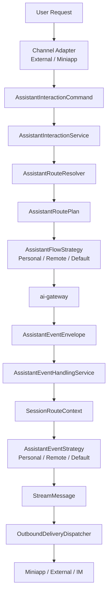

职责边界：

- `Channel Adapter` 只处理入口差异，把 External / Miniapp 请求转换为统一 `AssistantInteractionCommand`。
- `AssistantRouteResolver` 只负责一次性定性：`PERSONAL`、`REMOTE`、`DEFAULT`。
- `AssistantFlowStrategy` 负责 user -> agent：会话准备、toolSessionId、online check、rebuild 语义、invoke 构造。
- `AssistantEventStrategy` 负责 agent -> user：事件翻译、`session_created`、错误恢复、是否允许 rebuild。
- `OutboundDeliveryDispatcher` 负责最终投递：Miniapp WS、External WS、IM REST。

核心原则：

- External 和 Miniapp 不各自实现助理分流、会话生命周期和 invoke 构造；它们只做入口适配。
- 三类助理的差异不散落在 Controller、SessionManager、GatewayRelay 和 Router 中，而是集中到 FlowStrategy / EventStrategy。
- 正向和反向都基于同一个 `RoutePlan` / `SessionRouteContext` 判断助理类型，避免每一步重复用 `ak`、`businessTag`、`toolSessionId` 猜类型。

### 0.2 分流判定

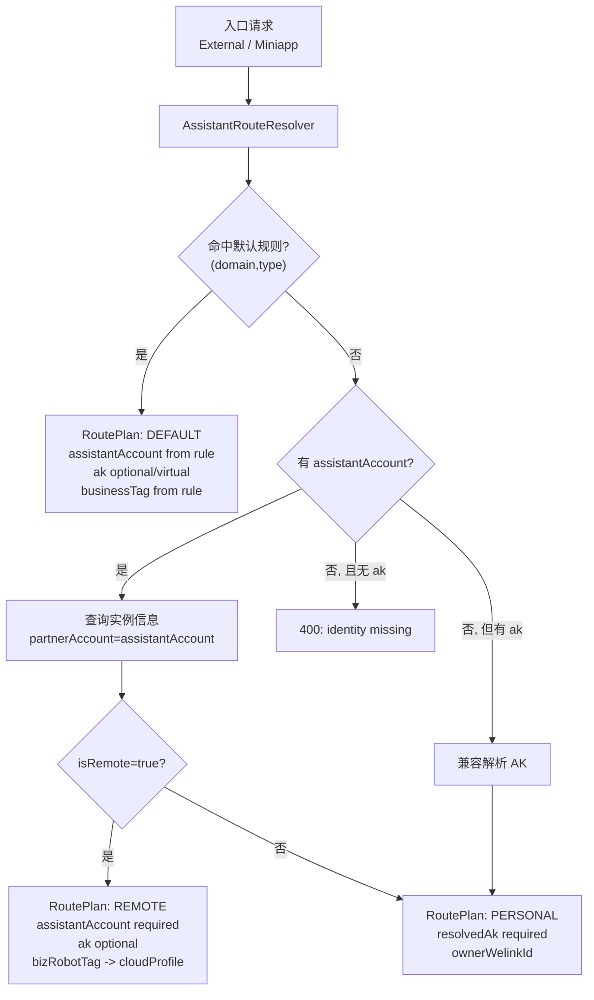

## 1. 三条主链路

### 1.1 个人助理链路

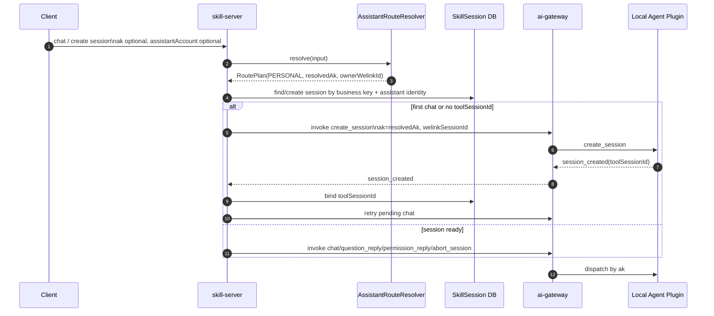

### 1.2 云端助理链路

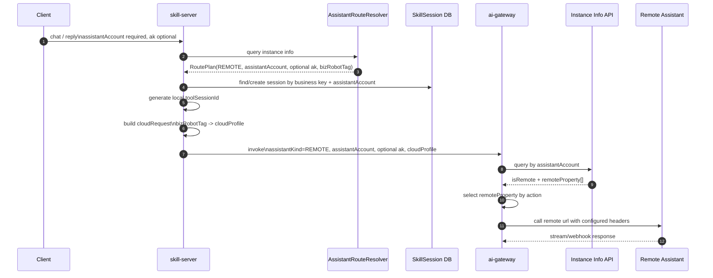

### 1.3 默认助理链路

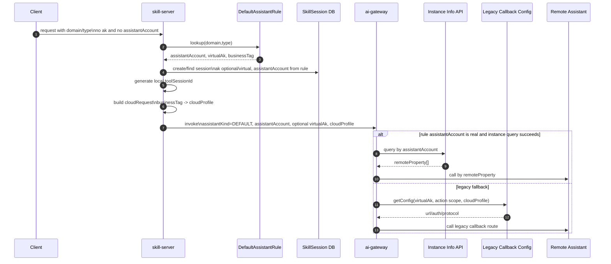

## 2. External 场景

External 当前入口是 `POST /api/external/invoke`，现有 action 包含 `chat`、`question_reply`、`permission_reply`、`rebuild`。目标设计中如果要支持中止对话，需要新增或明确 `abort` action。

### 2.1 External 首次聊天 - 单聊 direct

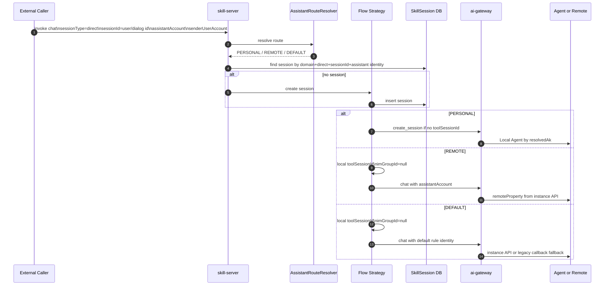

### 2.2 External 首次聊天 - 群聊 group

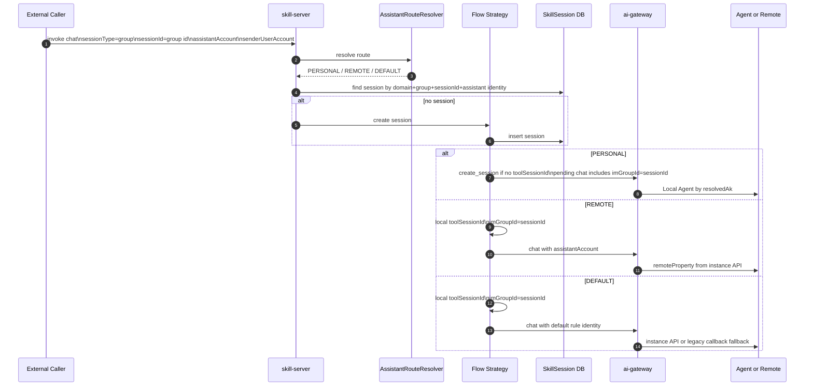

### 2.3 External 后续聊天

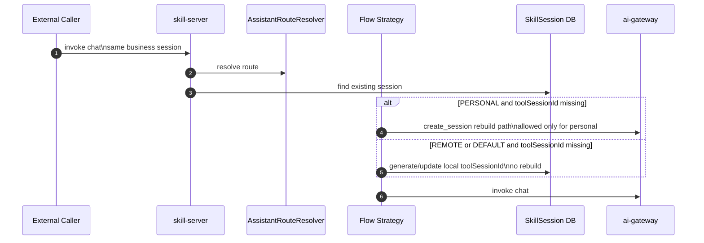

### 2.4 External question_reply

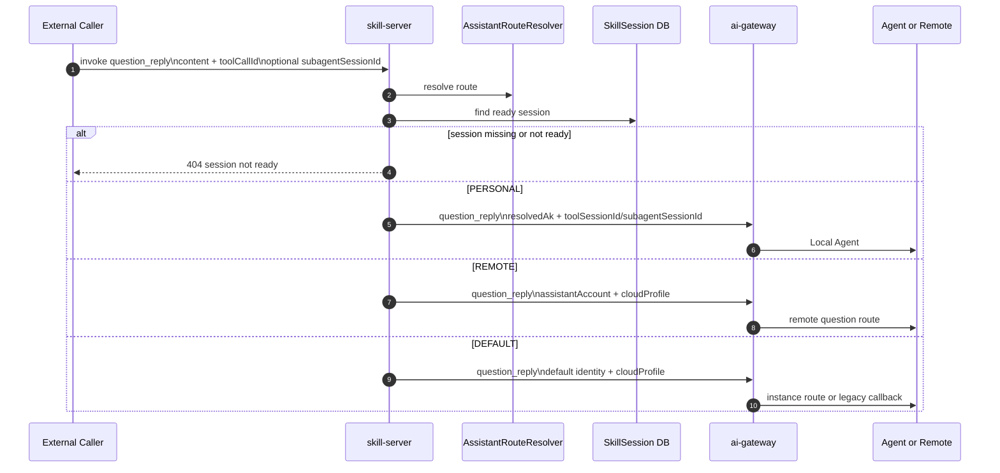

### 2.5 External permission_reply

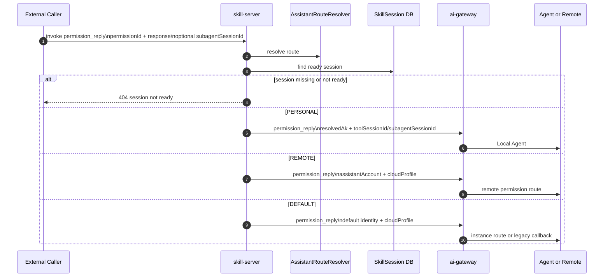

### 2.6 External 中止对话

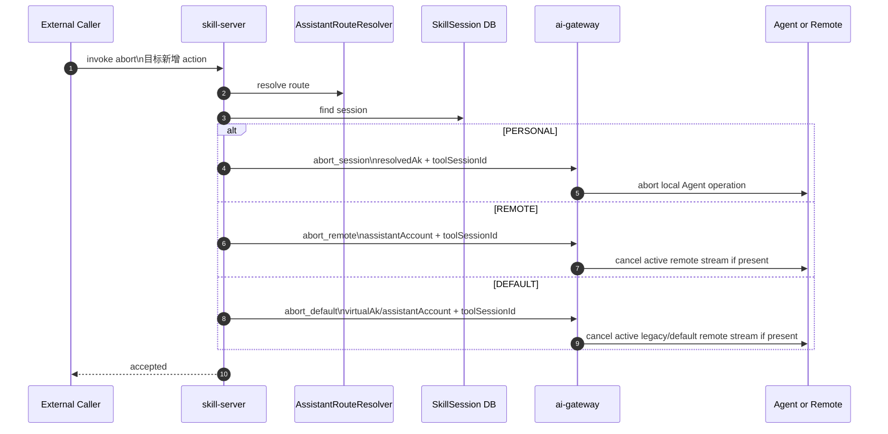

当前缺口：External 控制器没有 `abort` action；GW 云端路径也没有独立的 cloud cancel action。

## 3. Miniapp 场景

### 3.1 Miniapp 新建会话

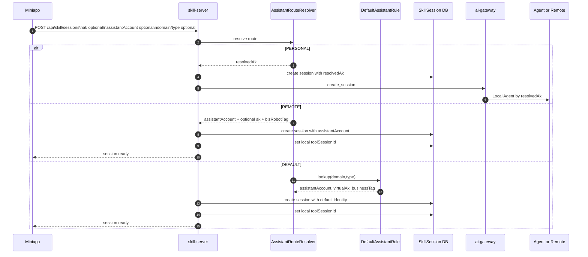

### 3.2 Miniapp 对话

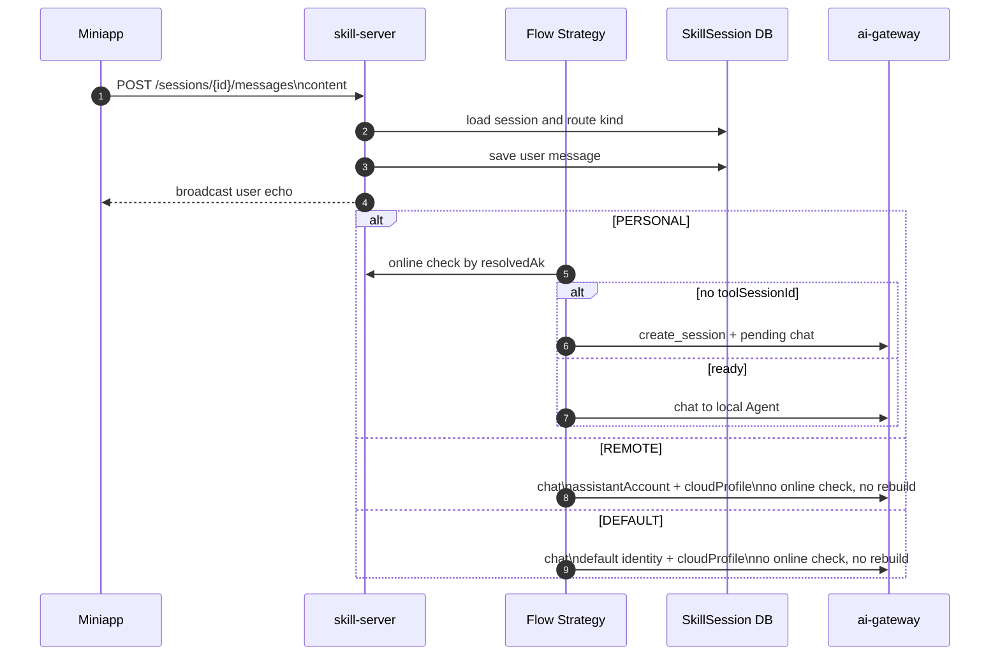

### 3.3 Miniapp question_reply

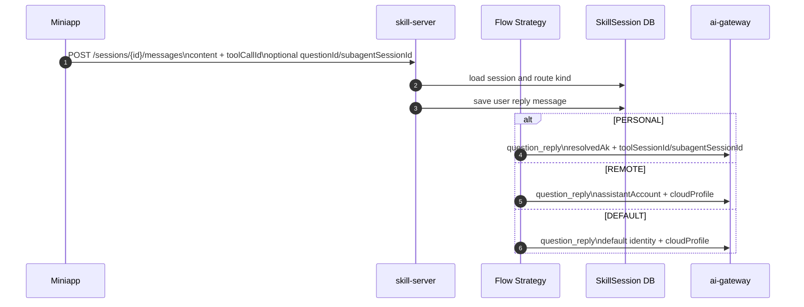

### 3.4 Miniapp permission_reply

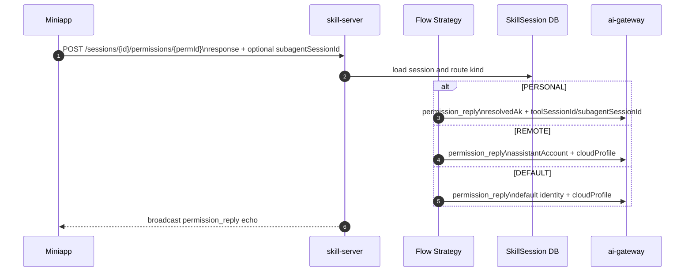

### 3.5 Miniapp 中止对话

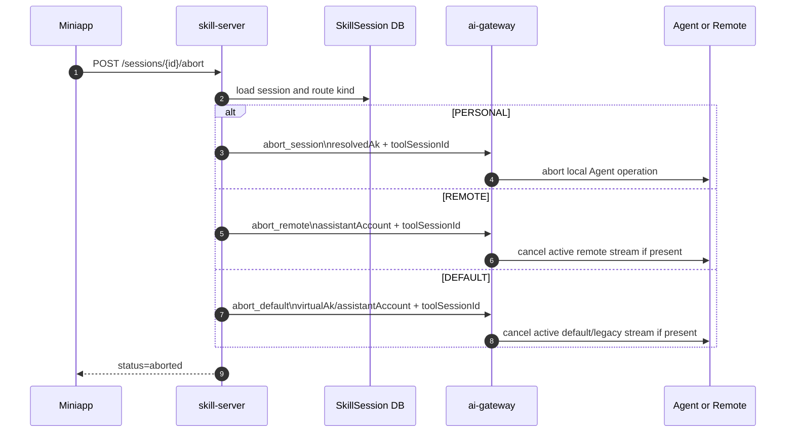

当前缺口：现有 miniapp abort 对默认助理直接跳过 GW；云端 business action 也没有清晰的 cancel strategy。

## 4. 回流链路

### 4.1 本地个人助理回复链路

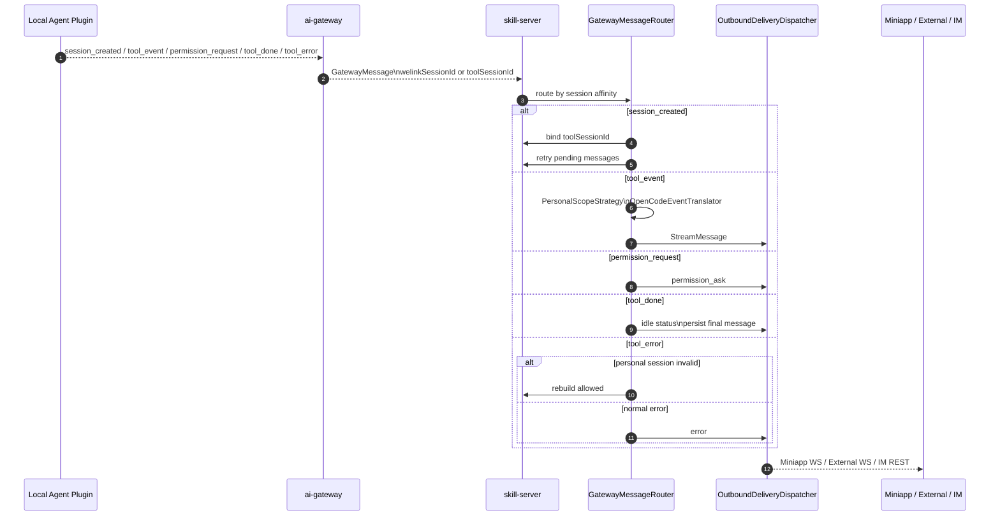

### 4.2 云端助理和默认助理回复链路

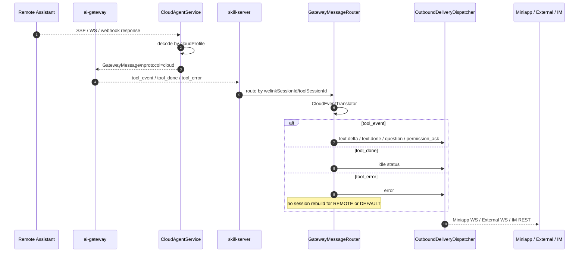

## 5. 需要从图落到实现的分流点

### 5.1 正向 user -> agent

1. 新增统一命令模型：`AssistantInteractionCommand`，覆盖 chat、question_reply、permission_reply、abort、create_session。
2. 新增 `AssistantRouteResolver`，在入口生成 `AssistantRoutePlan`，后续只看 `RoutePlan.kind`，不再每一步用 `ak`、`businessTag`、`toolSessionId` 反复猜类型。
3. 新增或收敛 `AssistantInteractionService`，承接 External / Miniapp Adapter 的统一命令。
4. `PersonalAssistantFlowStrategy` 独占 online check、`create_session`、`session_created`、pending replay、rebuild。
5. `RemoteAssistantFlowStrategy` 以 `assistantAccount` 为主身份，`ak` 可空，SS 只发身份和 `cloudProfile`，GW 自己查实例接口拿 `remoteProperty`。
6. `DefaultAssistantFlowStrategy` 以默认规则为入口，走云端语义，保留 virtual AK + callback config fallback。
7. session 查询和锁不能继续只以 AK 作为唯一助理维度。目标应支持 `(domain,type,businessSessionId,assistantAccount)`，personal 可额外带 `resolvedAk`。
8. External 需要补中止动作；GW 云端路径需要补 cancel/correlation 管理，否则 remote/default abort 仍会落到 unknown action。

### 5.2 反向 agent -> user

1. 新增统一事件模型：`AssistantEventEnvelope`，承接 `tool_event`、`tool_done`、`tool_error`、`session_created`、`permission_request`。
2. 新增 `AssistantEventHandlingService`，从 `GatewayMessageRouter` 中抽出事件编排职责。
3. 新增 `SessionRouteContext`，通过 `welinkSessionId/toolSessionId` 找 session，并还原助理类型与投递来源。
4. `PersonalAssistantEventStrategy` 处理 `session_created`、pending replay、OpenCode event 翻译和 personal rebuild。
5. `RemoteAssistantEventStrategy` 只走 Cloud event 翻译，不处理 `session_created`，不 rebuild。
6. `DefaultAssistantEventStrategy` 与 remote 一样走 Cloud event 语义，但允许 legacy callback 配置来源。
7. `OutboundDeliveryDispatcher` 继续作为最终投递策略，保留 Miniapp / External / IM 差异；上游只产出统一 `StreamMessage`。

### 5.3 实施顺序建议

1. 先落模型：`RoutePlan`、`InteractionCommand`、`EventEnvelope`、`SessionRouteContext`。
2. 再落分流：`AssistantRouteResolver` 和实例信息查询缓存。
3. 再改 SS 正向：External / Miniapp 入口适配到统一 `AssistantInteractionService`。
4. 再改 GW：remote/default 云端路由优先级，GW 自查实例接口，legacy callback fallback。
5. 再改 SS 反向：从 `GatewayMessageRouter` 抽出 `AssistantEventHandlingService` 和 EventStrategy。
6. 最后补测试：三类助理、两个入口、正向五类动作、反向回流、无 AK 云端、默认助手 legacy fallback。
