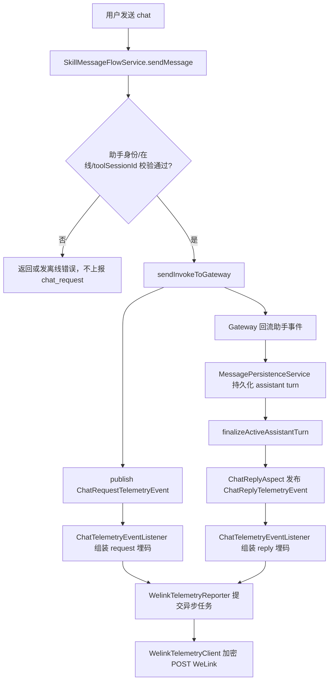
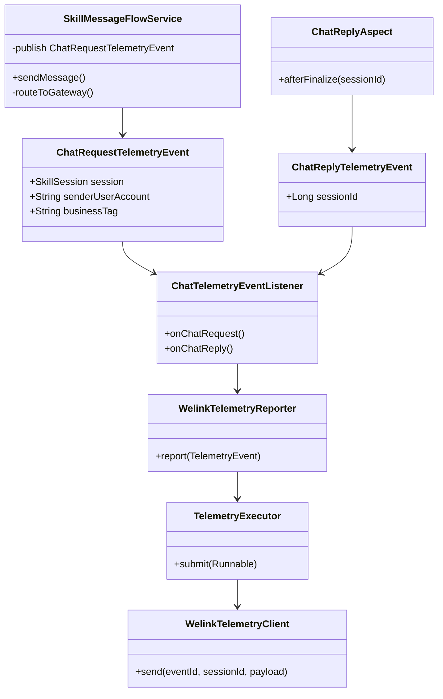
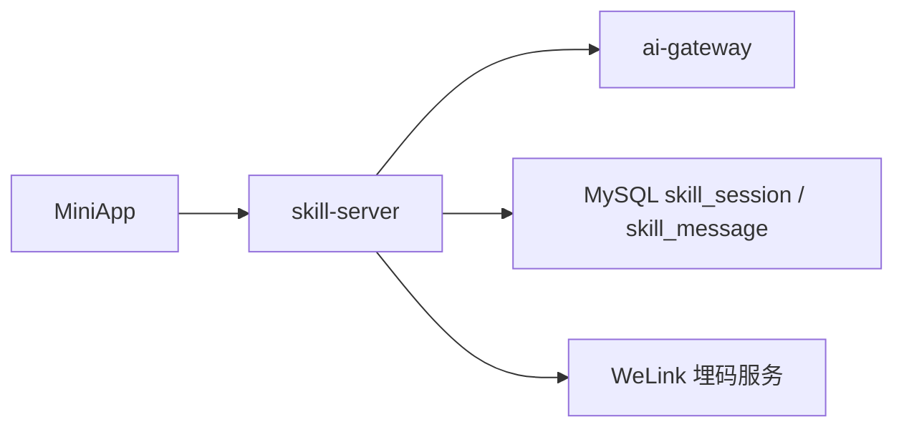
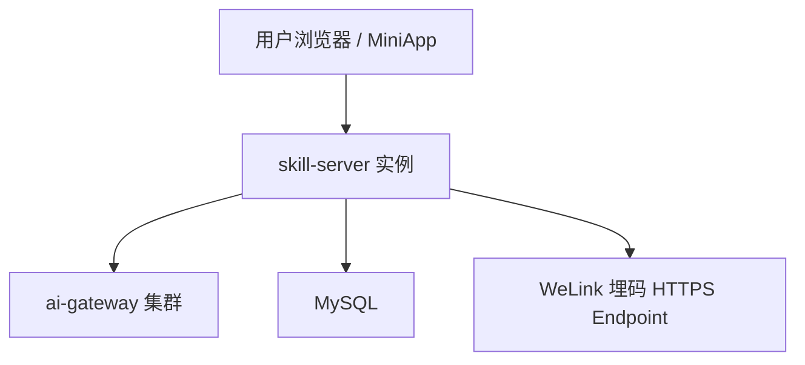
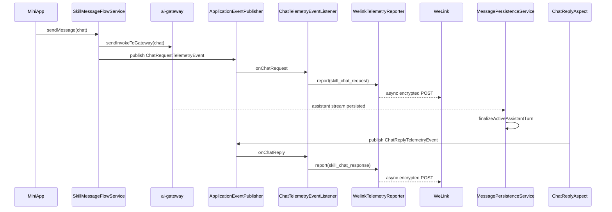
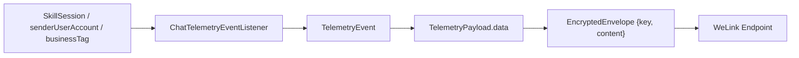
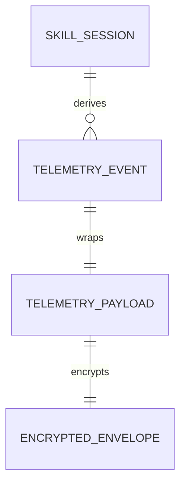
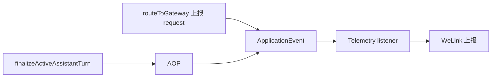
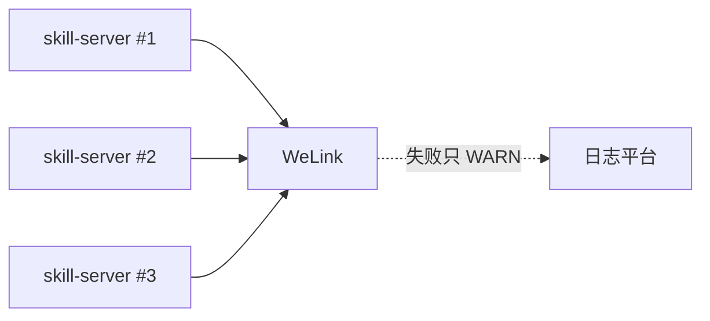

# 对话埋码上报技术设计文档

> 当前文档描述截至 2026-05-28 代码库现状方案。本文档不引入新的运行时变更，用于沉淀 Skill Server 对 chat 请求与助手回复的 WeLink 埋码上报设计。

## 一、需求概述（必填）

### 1.1 用户故事
- **As**（用户角色）：业务运营人员、数据分析人员、系统运维人员
- **I want**（功能描述）：系统在用户发起 chat 对话和助手完成回复时，异步上报标准化埋码事件
- **So that**（业务价值）：运营侧可以统计对话发起量、回复量、会话归属、助手账号、业务标签等关键数据，同时不影响主链路对话稳定性

### 1.2 业务功能逻辑说明

#### 1.2.1 业务场景描述

对话埋码覆盖 Skill Server 内部 MiniApp 消息主链路：

1. 用户在 MiniApp 中向某个会话发送 chat 消息。
2. Skill Server 完成权限、助手身份、在线状态、toolSessionId 校验后，调用 Gateway 下发 invoke。
3. 下发成功后发布 `ChatRequestTelemetryEvent`，上报“用户发起 chat 对话”。
4. Gateway 回流助手事件，Skill Server 持久化 assistant turn。
5. `MessagePersistenceService.finalizeActiveAssistantTurn(...)` 完成后，AOP 发布 `ChatReplyTelemetryEvent`，上报“助手回复 chat 对话”。

当前方案只沉淀 chat 主链路埋码，不覆盖 `question_reply`、`permission_reply`、离线拦截、toolSessionId 重建前置路径。

#### 1.2.2 业务流程说明



**流程步骤说明：**

1. `SkillMessageFlowService.routeToGateway(...)` 判断会话具备 assistant identity。
2. personal scope 且开启 assistant online check 时，先调用 `AssistantAvailabilityService.resolve(ak)`；离线则发送错误消息并返回。
3. 缺少 `toolSessionId` 时触发 rebuild，不上报 chat request。
4. chat 分支构造 `InvokeCommand` 并发送到 Gateway。
5. invoke 发送后发布 `ChatRequestTelemetryEvent(session, effectiveUserId, businessTag)`。
6. `ChatTelemetryEventListener.onChatRequest(...)` 校验 sender 非空，构建 `skill_chat_request` 事件。
7. 助手回复持久化完成后，`ChatReplyAspect.afterFinalize(sessionId)` 发布 `ChatReplyTelemetryEvent`。
8. `ChatTelemetryEventListener.onChatReply(...)` 反查 `SkillSession` 与 `AssistantInfo`，构建 `skill_chat_response` 事件。
9. `WelinkTelemetryReporter` 注入公共字段、MDC traceId、extendData，并提交给独立 executor。
10. `WelinkTelemetryClient` 使用 RSA+AES 加密成 `{key, content}` 信封，POST 到 WeLink 埋码服务。

#### 1.2.3 业务规则

- 上报总开关为 `telemetry.welink.enabled`，默认关闭。
- `enabled=true` 但 `url/token/publicKey/tenantId` 缺失时，reporter 标记为 `effectiveEnabled=false`，只打 WARN，不阻断启动。
- 埋码链路所有异常都只能 WARN，不允许抛回业务线程。
- request 事件在 Gateway invoke 发送之后发布；前置失败、离线、缺 `toolSessionId` 不上报。
- reply 事件在 assistant turn finalize 之后发布；找不到 session 或缺 assistantAccount 时跳过。
- `skill_chat_request.userId = senderUserAccount`。
- `skill_chat_response.userId = assistantAccount`。
- `extendData` 固定包含 `businessSessionDomain`、`businessSessionType`、`businessSessionId`、`senderUserAccount`、`assistantAccount`、`businessTag`，缺失值转空串。
- executor 队列满时按 `discard` 策略丢弃，保护主业务线程。

#### 1.2.4 预期结果

- **正常场景**：每次成功 chat 下发产生一条 request 埋码；每次助手回复 finalize 产生一条 response 埋码；两类事件都带业务会话、用户、助手、业务标签和 traceId。
- **异常场景**：WeLink 服务不可用、加密失败、HTTP 非 2xx、DB 查询失败、配置缺失、executor 拒绝任务时，只记录日志，不影响消息发送、回复持久化和 WebSocket 推送。

#### 1.2.5 界面交互说明

本需求不新增界面交互。MiniApp 聊天体验不感知埋码上报状态。

#### 1.2.6 相关链接

- 现状代码：`skill-server/src/main/java/com/opencode/cui/skill/telemetry/`
- 配置文件：`skill-server/src/main/resources/application.yml`
- 关联规范：`.trellis/spec/skill-server/backend/conventions.md`

---

## 二、技术设计（必填）

### 2.1 功能实现设计

#### 2.1.1 逻辑视图



**核心类/模块说明：**

- `SkillMessageFlowService`：chat 请求主链路，在 invoke 成功发送后发布 request 埋码事件。
- `ChatReplyAspect`：AOP 切入 assistant turn finalize 点，发布 reply 埋码事件。
- `ChatTelemetryEventListener`：把内部事件翻译为统一 `TelemetryEvent`。
- `WelinkTelemetryReporter`：注入公共字段、traceId、策略名，提交异步发送任务。
- `TelemetryExecutor`：独立线程池，隔离上报与业务主线程。
- `WelinkTelemetryClient`：完成加密信封构造与 HTTP POST。
- `WelinkTelemetryAutoConfiguration`：按配置开关装配上报链路，并做必填配置软校验。

#### 2.1.2 进程视图



**进程/组件说明：**

- `skill-server`：埋码生产方、事件组装方、异步发送方。
- `ai-gateway`：chat invoke 下游，不直接参与本埋码上报。
- `MySQL`：reply 事件反查 session 与 assistant turn finalize 的持久化来源。
- `WeLink 埋码服务`：外部接收方，接收加密上报信封。

#### 2.1.3 开发视图

```text
skill-server/src/main/java/com/opencode/cui/skill/
├── service/
│   ├── SkillMessageFlowService.java
│   └── MessagePersistenceService.java
├── telemetry/
│   ├── chat/
│   │   ├── ChatRequestTelemetryEvent.java
│   │   ├── ChatReplyTelemetryEvent.java
│   │   ├── ChatReplyAspect.java
│   │   └── ChatTelemetryEventListener.java
│   ├── client/
│   │   ├── WelinkTelemetryClient.java
│   │   └── dto/
│   ├── config/
│   │   ├── WelinkTelemetryAutoConfiguration.java
│   │   └── WelinkTelemetryProperties.java
│   ├── core/
│   │   ├── TelemetryEvent.java
│   │   ├── TelemetryExecutor.java
│   │   └── WelinkTelemetryReporter.java
│   └── crypto/
│       └── WelinkCipherUtil.java
└── resources/
    └── application.yml
```

#### 2.1.4 物理视图



#### 2.1.5 时序图



**时序说明：**

- request 上报点在 invoke 发送后，避免前置校验失败也被统计为真实请求。
- reply 上报点在 finalize 后，确保只统计已形成完整 assistant turn 的回复。
- HTTP 上报永远发生在 executor 线程，不占用用户请求线程。

#### 2.1.6 数据流图



**数据流说明：**

- `SkillSession`：提供业务会话域、类型、业务会话 ID、assistantAccount。
- `AssistantInfo`：reply 路径按 `ak` 反查 businessTag。
- `MDC traceId`：由 reporter 写入公共 data 字段。
- `TelemetryPayload`：明文字段集合，进入 client 前被序列化。
- `EncryptedEnvelope`：实际出站 HTTP body。

#### 2.1.7 异常处理机制

| 异常类型 | 异常场景 | 处理方式 | 错误码/消息 |
|---------|---------|---------|-----------|
| 配置缺失 | enabled=true 但缺 url/token/publicKey/tenantId | reporter 软关闭，WARN | 不返回给用户 |
| 事件字段缺失 | request sender 为空、reply assistantAccount 为空 | 跳过上报，WARN | 不返回给用户 |
| DB 查询失败 | reply listener 反查 session/assistant info 异常 | catch Throwable，WARN | 不返回给用户 |
| 加密失败 | RSA/AES 加密异常 | client WARN，不重试 | 不返回给用户 |
| HTTP 失败 | WeLink 非 2xx、超时、网络错误 | client WARN，不重试 | 不返回给用户 |
| executor 拒绝 | 队列满或线程池关闭 | discard / WARN 计数 | 不返回给用户 |

#### 2.1.8 配置变化

| 配置项 | 配置文件路径 | 原值 | 新值 | 说明 |
|-------|-------------|------|------|------|
| `telemetry.welink.enabled` | `skill-server/src/main/resources/application.yml` | `false` | 生产按环境变量开启 | 总开关 |
| `telemetry.welink.url` | 同上 | 空 | WeLink 上报 URL | 必填，缺失软关闭 |
| `telemetry.welink.token` | 同上 | 空 | Bearer token | 必填，敏感 |
| `telemetry.welink.public-key` | 同上 | 空 | WeLink 公钥 | 必填，敏感 |
| `telemetry.welink.policy-name` | 同上 | `POLICY_WELINK_SERVER` | 按需覆盖 | 埋码策略名 |
| `telemetry.welink.tenant-id` | 同上 | 空 | 租户 ID | 必填 |
| `telemetry.welink.executor.*` | 同上 | core=2/max=4/queue=1000 | 按容量调整 | 独立线程池 |

**设计文档链接：**

- 不涉及外部云文档链接。

---

### 2.2 接口设计

#### 2.2.1 接口清单

| 接口名称 | 接口路径 | 请求方式 | 提供方 | 消费方 | 说明 |
|---------|---------|---------|-------|-------|------|
| WeLink 埋码上报 | `${telemetry.welink.url}` | POST | WeLink 埋码服务 | skill-server | 加密信封上报 |
| Spring 内部事件 | N/A | ApplicationEvent | skill-server | telemetry listener | 进程内事件，不对外暴露 |

#### 2.2.2 接口详细定义

**接口1：WeLink 埋码上报**

- **请求路径**：`${telemetry.welink.url}`
- **请求方式**：`POST`
- **请求头**：

```json
{
  "Authorization": "Bearer ${telemetry.welink.token}",
  "x-wlk-hwa": "1",
  "Content-Type": "application/json"
}
```

- **请求参数**：

```json
{
  "key": {
    "类型": "String",
    "必填": "是",
    "说明": "RSA 加密后的 AES key",
    "示例": "base64..."
  },
  "content": {
    "类型": "String",
    "必填": "是",
    "说明": "AES 加密后的 TelemetryPayload JSON",
    "示例": "base64..."
  }
}
```

- **明文 Payload 结构**：

```json
{
  "data": {
    "policyName": "POLICY_WELINK_SERVER",
    "serviceName": "skill-server",
    "appName": "skill-server",
    "appPackageName": "com.opencode.cui.skill",
    "tenantId": "tenant",
    "sessionId": "businessSessionId",
    "eventType": "event",
    "eventTime": 1710000000000,
    "traceId": "trace-id",
    "eventId": "skill_chat_request",
    "eventLabel": "用户发起 chat 对话",
    "userId": "sender-or-assistant",
    "extendData": {
      "businessSessionDomain": "xxx",
      "businessSessionType": "xxx",
      "businessSessionId": "xxx",
      "senderUserAccount": "u-001",
      "assistantAccount": "dig_xxx",
      "businessTag": "assistant_square"
    }
  },
  "policyName": "POLICY_WELINK_SERVER"
}
```

- **响应参数**：调用方不依赖响应体；仅根据 HTTP status 打日志。

- **错误码定义**：

| 错误码 | 错误描述 | 处理建议 |
|-------|---------|---------|
| 4xx/5xx | WeLink 服务返回失败 | WARN 日志观察；不影响业务 |
| timeout | 网络超时 | WARN 日志观察；必要时调整下游 SLA |

**接口设计链接：**

- 不涉及 APIDesigner 链接。

---

### 2.3 数据设计

#### 2.3.1 概念模型



#### 2.3.2 逻辑模型

| 实体名称 | 属性列表 | 主键 | 外键 | 说明 |
|---------|---------|------|------|------|
| `SkillSession` | id, userId, ak, assistantAccount, businessSessionDomain, businessSessionType, businessSessionId | id | 无 | 埋码字段来源 |
| `TelemetryEvent` | eventId, eventLabel, sessionId, userId, extendData | 无 | 无 | 内部统一事件接口 |
| `TelemetryPayload` | data, policyName | 无 | 无 | WeLink 明文负载 |
| `EncryptedEnvelope` | key, content | 无 | 无 | HTTP 实际发送体 |

#### 2.3.3 物理模型

不新增数据库表。读取已有 `skill_session`，reply finalize 依赖已有 `skill_message` 持久化流程。

**索引设计：**

不涉及新增索引。

#### 2.3.4 缓存设计

不涉及新增缓存。

#### 2.3.5 运营数据设计

| 数据项 | 数据来源 | 统计维度 | 统计周期 | 使用场景 |
|-------|---------|---------|---------|---------|
| chat 请求数 | `skill_chat_request` | domain/type/businessTag/assistantAccount/senderUserAccount | 实时/日/周/月 | 业务活跃度 |
| chat 回复数 | `skill_chat_response` | domain/type/businessTag/assistantAccount | 实时/日/周/月 | 助手响应量 |
| 请求回复比 | 两类事件聚合 | sessionId/assistantAccount/businessTag | 日/周/月 | 识别异常失败或回复缺失 |
| 上报失败日志 | skill-server 日志 | eventId/httpCode/error | 实时 | 运维告警 |

**数据设计链接：**

- 不涉及数据建模工具链接。

---

### 2.4 集成设计

#### 2.4.1 内部微服务集成

| 服务名称 | 服务类型 | 集成方式 | 接口名称 | 调用方向 | 说明 |
|---------|---------|---------|---------|---------|------|
| ai-gateway | 微服务 | WebSocket/内部调用既有链路 | sendInvokeToGateway | skill-server → ai-gateway | 埋码 request 发生在 invoke 下发后 |
| Skill Server 内部事件总线 | 进程内组件 | Spring Event | ChatRequest/ReplyTelemetryEvent | service/aspect → listener | 解耦业务链路与上报链路 |

#### 2.4.2 外部系统集成

| 系统名称 | 系统类型 | 集成方式 | 接口名称 | 认证方式 | 说明 |
|---------|---------|---------|---------|---------|------|
| WeLink 埋码服务 | 外部系统 | REST | 加密上报接口 | Bearer token + 加密信封 | 失败不影响业务 |

#### 2.4.3 周边依赖设计

| 依赖项 | 依赖类型 | 依赖版本 | 依赖方式 | 影响范围 | 说明 |
|-------|---------|---------|---------|---------|------|
| Spring AOP | 框架组件 | 项目当前版本 | 强依赖 | reply 事件发布 | 切入 finalize 方法 |
| Spring Event | 框架组件 | 项目当前版本 | 强依赖 | request/reply 事件解耦 | 进程内同步分发 |
| RestTemplate | HTTP 客户端 | 项目当前版本 | 强依赖 | WeLink 上报 | 由 client 使用 |
| RSA/AES 加密工具 | 本地组件 | 项目当前版本 | 强依赖 | WeLink 加密协议 | 失败仅影响上报 |

---

### 2.5 依赖项及影响面分析

#### 2.5.1 直接依赖分析

| 被修改模块/接口 | 直接调用方 | 调用场景 | 影响评估 | 测试建议 |
|---------------|-----------|---------|---------|---------|
| `SkillMessageFlowService.routeToGateway` | MiniApp 发送消息 | chat request 上报点 | 中 | sendMessage chat 成功/离线/no toolSessionId |
| `MessagePersistenceService.finalizeActiveAssistantTurn` | Gateway 回流持久化 | reply 上报点 | 中 | finalize 后事件发布 |
| `WelinkTelemetryClient` | `WelinkTelemetryReporter` | 外部上报 | 低 | 加密成功、HTTP 2xx/非 2xx/异常 |

#### 2.5.2 间接依赖分析（影响传播）



**影响传播说明：**

- request 上报点异常被 catch，不影响 Gateway invoke。
- reply 上报点异常被 catch，不影响 assistant turn 持久化。
- WeLink 下游故障只影响运营统计完整性，不影响对话。

#### 2.5.3 运行时影响监控

| 监控项 | 监控指标 | 监控方式 | 告警阈值 | 处理策略 |
|-------|---------|---------|---------|---------|
| 上报 HTTP 失败 | `WelinkTelemetry.send http_failed/non-2xx` 日志数 | 日志平台 | 连续 5 分钟明显升高 | 检查 token/url/下游服务 |
| 加密失败 | `cipher_failed` 日志数 | 日志平台 | 任意持续出现 | 检查 publicKey 配置 |
| 配置缺失 | reporter soft disabled WARN | 启动日志 | 生产出现 | 补齐环境变量 |
| 队列丢弃 | executor discard 计数/日志 | 日志/监控 | 队列持续满 | 扩容 executor 或降采样 |

#### 2.5.4 影响面汇总

**影响范围：**

- **产品内部服务依赖**：skill-server 对话主链路、消息持久化 finalize 链路。
- **上下游服务依赖**：ai-gateway 仅作为 request 上报前置成功条件。
- **外部服务依赖**：WeLink 埋码服务。
- **周边环境依赖**：环境变量、日志平台、网络出口。

---

## 三、DFX设计（必填）

### 3.1 性能设计

#### 3.1.1 性能需求规格

| 性能指标 | 目标值 | 测试方法 | 说明 |
|---------|-------|---------|------|
| 主链路额外耗时 | P95 < 5ms | sendMessage 单测/压测对比 | 只做事件发布和对象组装 |
| 上报线程池容量 | 默认 core=2/max=4/queue=1000 | 压测 + 日志观察 | 队列满丢弃 |
| 下游上报成功率 | 按运营要求 | 日志聚合 | 不作为业务成功条件 |

#### 3.1.2 性能设计方案

**性能优化策略：**

- **数据库优化**：request 事件不额外查 DB；reply 事件只按 sessionId 查一次 session。
- **缓存策略**：不新增缓存，避免统计字段 stale。
- **代码优化**：公共字段组装轻量化，HTTP 调用全部异步。
- **架构优化**：独立 executor 隔离上报链路，队列满时主动丢弃。

**性能测试计划：**

- chat 正常发送压测：比较开启/关闭埋码下 `sendMessage` P95/P99。
- WeLink 慢响应压测：模拟上报超时，确认业务请求不阻塞。

---

### 3.2 高可用设计

#### 3.2.1 接入层高可用

- **负载均衡策略**：沿用 skill-server 现有接入层负载均衡。
- **故障转移机制**：WeLink 上报失败不重试，避免放大故障。
- **健康检查机制**：不把 WeLink 可用性纳入 skill-server 健康检查。

#### 3.2.2 应用层高可用

- **服务冗余策略**：多实例 skill-server 各自上报本实例产生的事件。
- **故障恢复机制**：配置缺失软关闭；异常只 WARN。
- **容灾策略**：WeLink 故障时对话服务继续可用，运营数据允许短时缺口。

#### 3.2.3 数据层高可用

- **数据库高可用**：沿用现有 MySQL 高可用；DB 异常只影响 reply 埋码补字段。
- **缓存高可用**：不涉及。
- **存储高可用**：不涉及新增存储。

#### 3.2.4 高可用架构图



---

### 3.3 安全设计

#### 3.3.1 安全威胁分析

| 威胁类型 | 威胁场景 | 风险等级 | 影响范围 |
|---------|---------|---------|---------|
| 敏感配置泄露 | token/publicKey 被打印或提交 | 高 | WeLink 上报权限 |
| 业务账号泄露 | sender/assistantAccount 在日志中过度暴露 | 中 | 用户隐私 |
| 下游伪造 | 未加密或 token 错误导致伪造/篡改 | 中 | 埋码可信度 |

#### 3.3.2 安全技术设计

- **认证机制**：HTTP `Authorization: Bearer <token>`。
- **授权机制**：由 WeLink 端按 token/policy 校验。
- **数据加密**：明文 payload 进入 HTTP 前加密为 `{key, content}`。
- **输入校验**：listener 对空 sender/assistant 做跳过处理。
- **敏感数据保护**：配置通过环境变量注入，不在日志输出 token/publicKey。
- **审计日志**：只记录 eventId/sessionId/httpCode/duration/error，不记录加密明文 payload。

#### 3.3.3 安全合规检查

- 敏感配置不落库、不提交代码仓库。
- 日志避免输出 token、publicKey、完整加密明文。

---

### 3.4 兼容性设计

#### 3.4.1 中间件兼容性

| 中间件 | 当前版本 | 目标版本 | 兼容方案 | 测试建议 |
|-------|---------|---------|---------|---------|
| Spring Boot/AOP | 项目当前版本 | 不变 | 使用标准 `@Aspect` 和 `@ConditionalOnProperty` | 启动上下文测试 |
| RestTemplate | 项目当前版本 | 不变 | 沿用已有 HTTP 客户端 | HTTP mock 测试 |

#### 3.4.2 周边集成兼容性

| 集成系统 | 当前接口版本 | 新接口版本 | 兼容方案 | 影响评估 |
|---------|-------------|-----------|---------|---------|
| WeLink 埋码服务 | 现有加密上报协议 | 不变 | 按 `{key, content}` 信封发送 | 低 |

#### 3.4.3 数据兼容性

- **数据迁移方案**：不涉及。
- **数据兼容处理**：缺失字段转空串，保证 extendData shape 稳定。
- **版本兼容策略**：默认关闭，生产按环境变量灰度开启；关闭开关即可回退。

#### 3.4.4 扩展性设计

- **业务扩展**：新增事件时实现 `TelemetryEvent` 或新增 listener，不改 reporter/client。
- **技术扩展**：可增加重试、采样、批量上报，但默认保持 fire-and-forget。

---

## 四、附录

### 4.1 相关文档链接

- `skill-server/src/main/java/com/opencode/cui/skill/telemetry/chat/ChatTelemetryEventListener.java`
- `skill-server/src/main/java/com/opencode/cui/skill/telemetry/core/WelinkTelemetryReporter.java`
- `skill-server/src/main/java/com/opencode/cui/skill/telemetry/client/WelinkTelemetryClient.java`

### 4.2 参考规范

- `.trellis/spec/skill-server/backend/conventions.md`
- `.trellis/spec/skill-server/backend/index.md`

### 4.3 版本历史

| 版本 | 日期 | 修改人 | 修改内容 |
|------|------|--------|---------|
| v1.0 | 2026-05-28 | Codex | 初版，沉淀对话埋码上报现状方案 |

---

**文档编写说明：**

- 本文按 US 需求设计文档模板编写。
- 不涉及的部分已标注“不涉及”。
- 本文是现状方案沉淀，不代表新增开发任务已启动。
