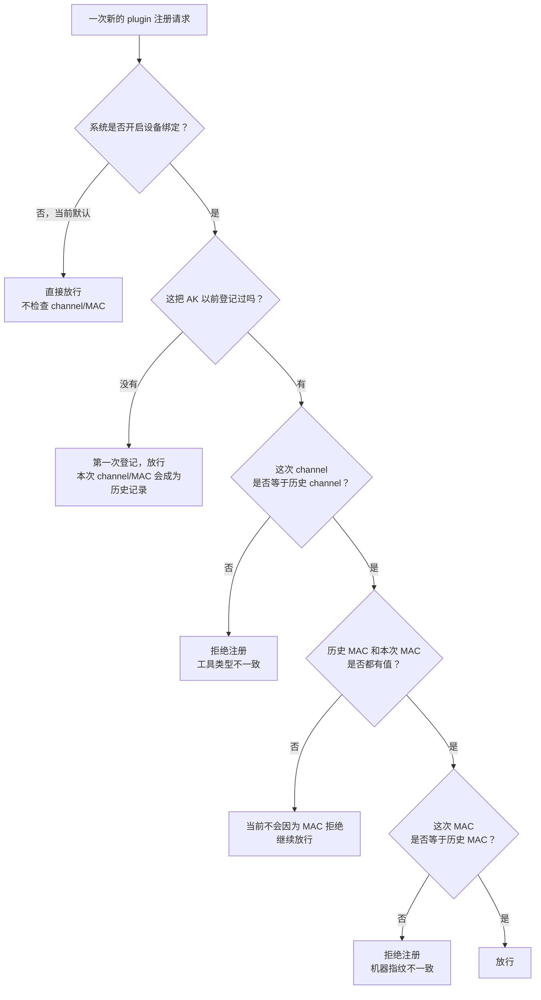
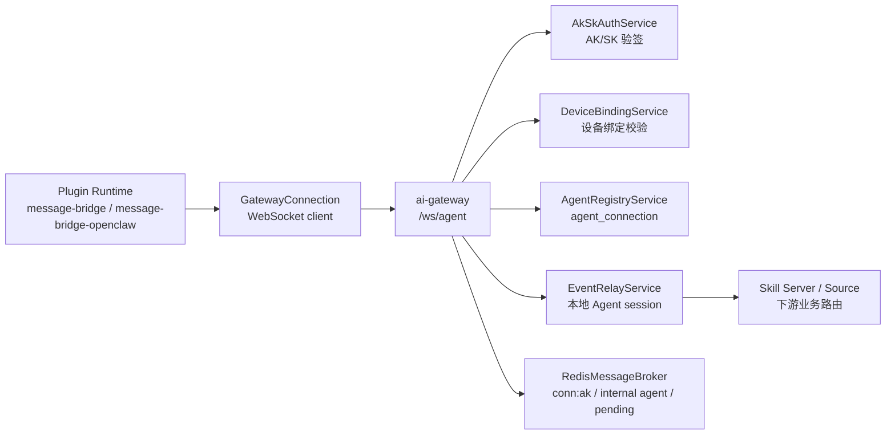
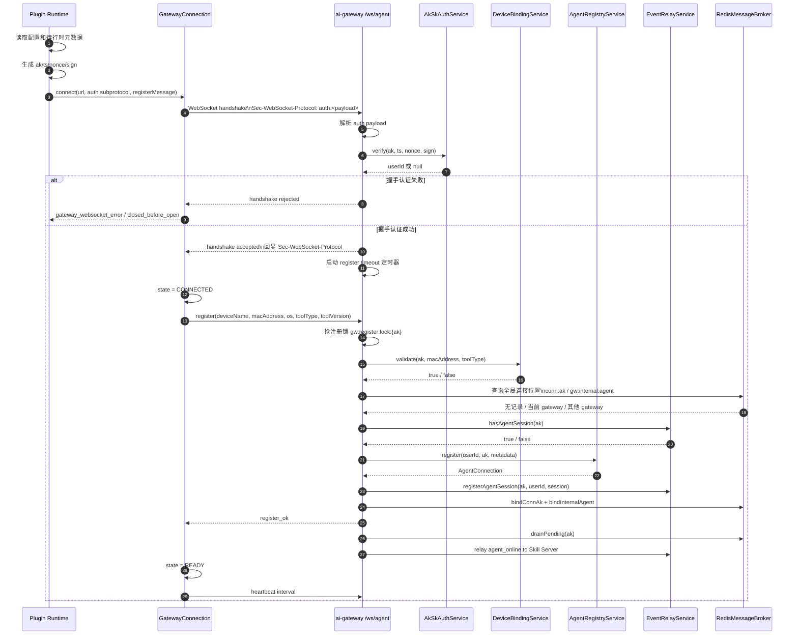
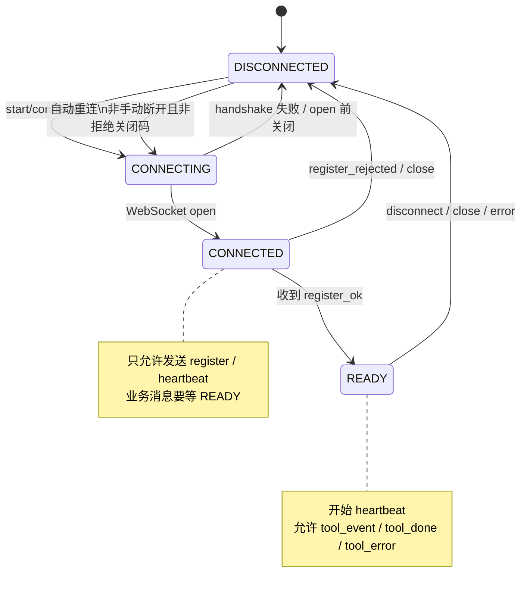
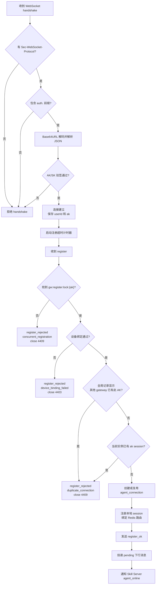
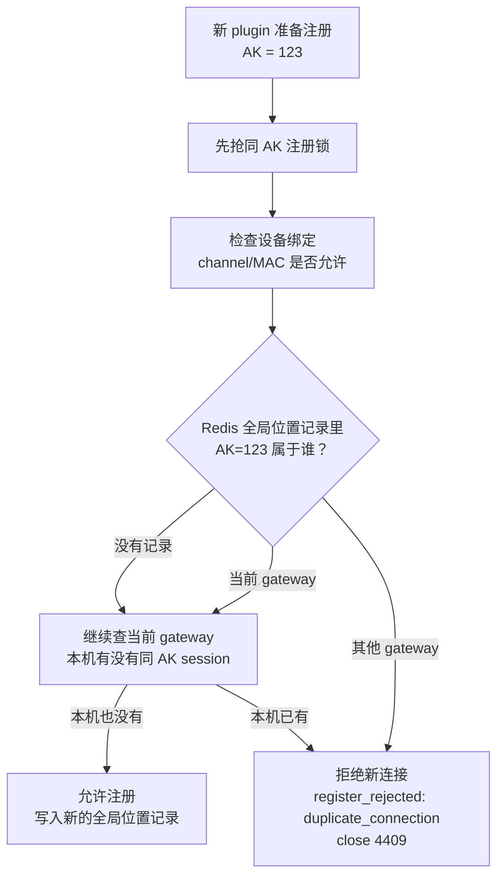
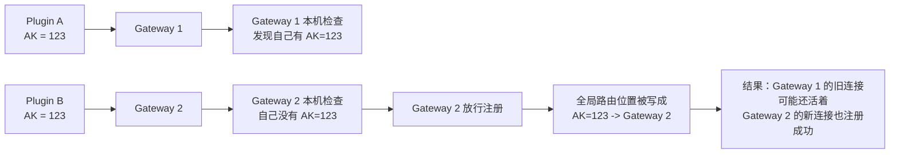
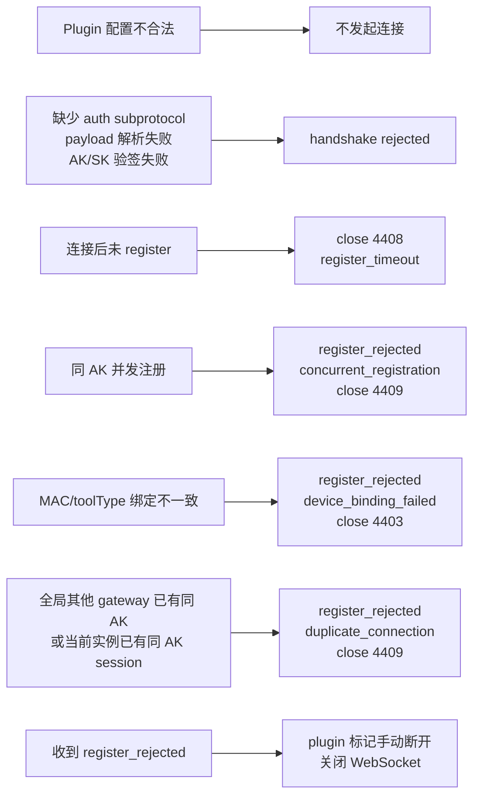
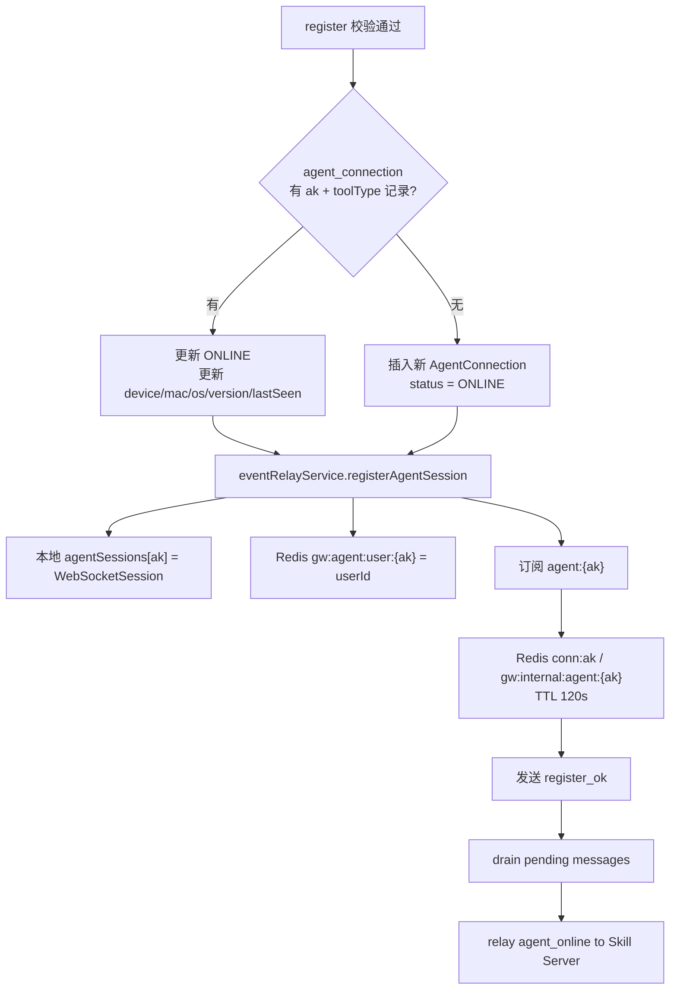

# Gateway 与 Plugin 建连注册逻辑分析

本文说明当前 `ai-gateway` 与 plugin 之间的 WebSocket 建连、注册、校验和失败处理逻辑。

结论先行：

* plugin 作为 Agent 接入 `ai-gateway` 的 `/ws/agent`。
* 建连认证在 WebSocket handshake 阶段完成，使用 `Sec-WebSocket-Protocol: auth.<base64url(json)>`。
* 注册在 WebSocket open 后由 plugin 主动发送 `register` 消息完成。
* gateway 注册成功后回 `register_ok`，plugin 才进入 `READY` 并开始心跳。
* gateway 主要校验握手认证、注册并发、设备绑定、全局重复连接和注册超时。

## 1. 先用通俗话说清楚

这条链路里有三个容易混淆的身份：

| 名字 | 可以理解成 | 它回答的问题 | 举例 |
|---|---|---|---|
| AK | 账号钥匙 | “是谁在接入？” | 同一个用户或同一个助理账号的一把钥匙 |
| channel | 工具类型牌子 | “这个账号这次是用哪类工具接入？” | `openx`、`uniassistant`、`codeagent` |
| MAC 地址 | 机器指纹 | “这次是从哪台机器接入？” | 某台电脑网卡的硬件地址 |

最核心的业务规则是：

> 如果开启了设备绑定，同一把 AK 以后只能继续用“第一次留下来的工具类型 + 机器指纹”接入。工具类型换了，或者机器指纹换了，就会被认为不是同一个绑定设备。

这里的 `channel` 不是 WebSocket 通道，也不是网络连接通道；它更像“工具身份类型”。OpenClaw 版本当前固定报 `openx`，OpenCode message-bridge 版本则从配置里的 `gateway.channel` 取值。

## 2. channel 和 MAC 到底怎么校验

用几个例子看会更直观：

| 场景 | 历史记录 | 这次请求 | 当前结果 | 原因 |
|---|---|---|---|---|
| 设备绑定没开启 | 不重要 | 任意 channel / 任意 MAC | 放行 | 默认就是不检查设备绑定 |
| 第一次使用 AK | 没有历史记录 | `openx` + 电脑 A | 放行 | 第一次接入先登记 |
| 同一台电脑再次接入 | `openx` + 电脑 A | `openx` + 电脑 A | 放行 | 工具类型和机器都对得上 |
| 换工具类型 | `openx` + 电脑 A | `uniassistant` + 电脑 A | 拒绝 | 同一把 AK 不允许换工具类型 |
| 换电脑 | `openx` + 电脑 A | `openx` + 电脑 B | 拒绝 | 同一把 AK 不允许换机器 |
| 这次取不到 MAC | `openx` + 电脑 A | `openx` + 空 MAC | 放行 | 当前逻辑只有双方都有 MAC 且不同才拒绝 |

需要特别注意两点：

1. 设备绑定默认是关闭的。关闭时，channel 和 MAC 只是被记录，不用来拦截。
2. MAC 为空不是强拒绝。plugin 取不到可用 MAC 时会发空值；当前 gateway 不会因为“这次 MAC 为空”直接拒绝。

## 3. 参与组件

关键入口：

| 位置 | 文件 | 职责 |
|---|---|---|
| WebSocket endpoint 注册 | `ai-gateway/src/main/java/com/opencode/cui/gateway/config/GatewayConfig.java` | 注册 `/ws/agent` 和 `/ws/skill` |
| Agent WS 握手和注册 | `ai-gateway/src/main/java/com/opencode/cui/gateway/ws/AgentWebSocketHandler.java` | 处理 handshake、register、heartbeat、上行消息 |
| AK/SK 认证 | `ai-gateway/src/main/java/com/opencode/cui/gateway/service/AkSkAuthService.java` | 验签、时间窗、nonce 防重放 |
| 设备绑定 | `ai-gateway/src/main/java/com/opencode/cui/gateway/service/DeviceBindingService.java` | 校验 AK 历史绑定的 MAC 和 toolType |
| Agent 入库 | `ai-gateway/src/main/java/com/opencode/cui/gateway/service/AgentRegistryService.java` | 创建或复用 `agent_connection` |
| Plugin WS 客户端 | `plugins/agent-plugin/plugins/message-bridge/src/connection/GatewayConnection.ts` | 建连、发 register、接 register_ok、心跳、重连 |
| Plugin runtime 启动 | `plugins/agent-plugin/plugins/message-bridge/src/runtime/BridgeRuntime.ts` | 组装认证 payload 和 register message |

## 4. 端到端时序

## 5. Plugin 侧状态机

Plugin 侧关键行为：

| 阶段 | 行为 | 说明 |
|---|---|---|
| 配置加载 | 校验 `auth.ak`、`auth.sk`、`gateway.url` 等 | 未通过则 runtime 不启动 |
| 握手准备 | 生成 `auth.<base64url(json)>` subprotocol | JSON 内有 `ak/ts/nonce/sign` |
| open 后 | 立即发送 `register` | register 是控制消息，READY 前允许发送 |
| 收到 `register_ok` | 进入 `READY` | 开始定时 heartbeat |
| 收到 `register_rejected` | 标记手动断开并关闭 WS | 通常不再自动重连 |
| close code 4403/4408/4409 | 视为 gateway 拒绝 | 不走普通重连 |

## 6. Gateway 注册主流程

## 7. 重复连接：现在是全局 + 本机双层判断

这里要把几个概念分开：

| 概念 | 现在有没有 | 作用 | 能不能保证全局只有一个连接 |
|---|---|---|---|
| 注册并发锁 | 有，而且是全局的 | 防止同一把 AK 在同一瞬间同时写注册记录 | 只能防同时抢，不代表长期唯一 |
| 全局连接位置记录 | 有 | 告诉系统“某个 AK 现在归哪个 gateway 实例管” | 现在会被用来做注册前判断 |
| 全局重复连接检查 | 有 | 注册前判断别的 gateway 实例是否已有同 AK 活连接 | 能挡住跨 gateway 重复连接 |
| 本机重复连接检查 | 有 | 防止同一个 gateway 实例里已有同 AK 连接时再接一个 | 兜住同实例内的重复连接 |

现在的规则可以用一句话理解：

> 新 plugin 注册时，gateway 先问 Redis：“这把 AK 现在是不是已经归别的 gateway 实例管了？”如果答案是“是”，新连接直接拒绝，旧连接继续保留。

全局判断看的不是当前进程里的连接表，而是 Redis 里的两个位置记录：

| Redis 位置记录 | 通俗解释 | 什么时候写入 | 什么时候续命 |
|---|---|---|---|
| `conn:ak:{ak}` | “这把 AK 当前在哪个 gateway 上” | 注册成功后写入 | 心跳时刷新 TTL |
| `gw:internal:agent:{ak}` | gateway 内部转发消息时用的同一份位置线索 | 注册成功后写入 | 心跳时刷新 TTL |

如果任意一份记录显示“这个 AK 属于其他 gateway 实例”，就按重复连接处理：

之前只查本机时，多实例下的风险是这样的：

现在改成全局判断后，这类情况会被挡住：

| 场景 | 现在结果 | 通俗解释 |
|---|---|---|
| Gateway 1 已有 AK=123，Gateway 2 又来注册 AK=123 | Gateway 2 拒绝 | 旧连接优先，新连接不抢占 |
| Redis 没有 AK=123 的位置记录，当前 gateway 本机也没有 session | 放行 | 系统认为这把 AK 当前不在线 |
| Redis 记录指向当前 gateway，但当前 gateway 本机已经有 session | 拒绝 | 同一个实例内也不能重复接 |
| 旧 gateway 异常退出，Redis 位置记录还没过期 | 暂时拒绝新连接 | 保守策略会等 TTL 过期，避免误接两条连接 |

这里采用的是“保守策略”，不是“抢占策略”。也就是说：不会因为新连接来了就踢掉旧连接。这样行为更容易理解，用户看到 `duplicate_connection` 时，可以按“同一把 AK 已经在别处启动了”去排查。

## 8. 校验矩阵

| 校验阶段 | 校验位置 | 校验内容 | 失败结果 |
|---|---|---|---|
| Plugin 配置 | `ConfigValidator` | `auth.ak/auth.sk` 必填，`gateway.url` 必须 `ws://` 或 `wss://`，heartbeat/reconnect 为正整数，事件 allowlist 合法 | runtime 配置加载失败，不建连 |
| OpenClaw 配置 | `message-bridge-openclaw/src/channel.ts` 和 `config.ts` | 只支持 default 单账号，`gateway/auth` 必填，不支持废弃的 `accounts` 配置，setup 输入 URL 合法 | channel 未配置或 setup 拒绝 |
| 注册元数据 | `RegisterMetadata.ts` | MAC 必须格式合法、非内网、非全 0；取不到时发空字符串。deviceName 来自 hostname | 不阻断注册，仅记录 warning |
| WebSocket endpoint | `GatewayConfig` | `/ws/agent` 注册 handler，允许 origin 默认 `*`，文本帧默认 1MB | 超大帧可能被容器拒绝 |
| Handshake subprotocol | `AgentWebSocketHandler.beforeHandshake` | 必须有 `Sec-WebSocket-Protocol`，且包含 `auth.` 前缀 | handshake 返回 false |
| Auth payload 解析 | `AgentWebSocketHandler.beforeHandshake` | base64url 解码，JSON 读取 `ak/ts/nonce/sign` | handshake 返回 false |
| AK/SK 公共校验 | `AkSkAuthService.verify` | 参数非空，`ts` 可解析，默认时间窗 ±300 秒，nonce Redis SETNX 防重放 | handshake 返回 false |
| AK/SK gateway 模式 | `AkSkAuthService.verifyLocally` | `ak_sk_credential` 中存在 active AK，`HMAC-SHA256(SK, ak+ts+nonce)` 与 sign 一致 | handshake 返回 false |
| AK/SK remote 模式 | `AkSkAuthService.resolveIdentity` | L1/L2/L3 身份解析，L3 由外部 identity API 判断签名 | identity 解析失败则 handshake 返回 false |
| 注册超时 | `AgentWebSocketHandler.afterConnectionEstablished` | 默认 10 秒内必须收到并完成 register | close 4408 `register_timeout` |
| 注册并发 | `AgentWebSocketHandler.handleRegister` | 同一 AK 抢 Redis 锁 `gw:register:lock:{ak}`，TTL 10 秒 | `register_rejected: concurrent_registration`，close 4409 |
| 设备绑定 | `DeviceBindingService.validate` | 配置开启后，最新历史记录的 toolType 和 MAC 要与本次一致；首次连接放行 | `register_rejected: device_binding_failed`，close 4403 |
| 重复连接 | `AgentWebSocketHandler.handleRegister` | 先查 Redis 全局位置记录是否指向其他 gateway，再查当前 gateway 实例内是否已有同 AK open session | `register_rejected: duplicate_connection`，close 4409 |
| Agent 入库 | `AgentRegistryService.register` | 按 `ak + toolType` 复用旧记录，否则创建新记录 | 当前无显式业务拒绝 |
| READY 前业务发送 | `GatewayConnection.send` | READY 前只允许 `register` 和 `heartbeat` | plugin 侧抛错，不发送业务消息 |
| Heartbeat | `AgentWebSocketHandler.handleHeartbeat` | 已注册 session 才更新 `last_seen_at` 和 Redis TTL | 未注册 heartbeat 只记录 warning |

## 9. 拒绝路径总览

失败原因和常见排查方向：

| 现象 | 直接原因 | 排查方向 |
|---|---|---|
| WS open 前失败 | handshake 认证未通过 | 检查 `gateway.url`、AK/SK、时间同步、nonce 重放、`auth.` subprotocol |
| `register_timeout` | plugin open 后没有及时发 register | 检查 plugin runtime 是否卡在启动、WebSocket 是否 open 后异常 |
| `concurrent_registration` | 同一 AK 同时有多个注册请求 | 检查多实例启动、重连抖动、旧进程未退出 |
| `device_binding_failed` | 设备绑定开启后，MAC 或 toolType 与历史记录不一致 | 检查 `gateway.device-binding.*` 配置和 `agent_connection` 最新记录 |
| `duplicate_connection` | 其他 gateway 或当前 gateway 已有同 AK 活跃 session | 检查同一 AK 是否在别处重复启动 plugin；如果刚异常退出，等待 Redis TTL 过期或确认旧连接清理 |
| READY 前业务发送失败 | plugin 还没收到 `register_ok` | 检查 gateway 是否发回 register_ok，或是否被 register_rejected |

## 10. 注册成功后的写入和副作用

成功后，后续心跳会刷新：

* `agent_connection.last_seen_at`
* `conn:ak` TTL
* `gw:internal:agent:{ak}` TTL

断开后，gateway 会：

* 标记对应 `agent_connection` 为 `OFFLINE`
* 移除本地 session
* 清理 `conn:ak` 和 `gw:internal:agent:{ak}`
* 通知 Skill Server `agent_offline`

## 11. 当前边界和注意点

| 点位 | 当前行为 | 影响 |
|---|---|---|
| `deviceName/os/toolVersion` | gateway 不强制非空 | 异常元数据不会阻断注册 |
| `toolType` | plugin 侧未知类型只 warning，gateway 不做白名单校验 | 可能写入非预期 toolType；设备绑定开启时会影响后续校验 |
| MAC 为空 | plugin 取不到 MAC 时发空字符串；gateway 设备绑定校验仅在双方都非 null 且不一致时拒绝 | 设备绑定开启时，空 MAC 不一定能阻断 |
| 设备绑定默认关闭 | `gateway.device-binding.enabled:false` | 默认不会限制 AK 换设备或换 toolType |
| remote auth cache | remote 模式 L1/L2 命中时按 AK 返回缓存身份 | 外部验签主要发生在 L3 miss 时 |
| 重复连接范围 | 当前拒绝重复连接时会先查 Redis 全局位置，再查本 gateway 实例 | 多 gateway 部署下，同一 AK 已在其他实例在线时，新连接会被拒绝 |
| 全局连接位置 | 注册成功后会写全局路由位置，注册前也会读取它做重复连接判断 | 它既用于路由消息，也用于保守地维持同 AK 全局单连接 |
| register 成功确认 | gateway 会显式返回 `register_ok` | plugin 收到后才 READY；这和旧文档里“无显式确认”的描述可能不同 |

## 12. 代码索引

| 主题 | 文件 |
|---|---|
| `/ws/agent` endpoint | `ai-gateway/src/main/java/com/opencode/cui/gateway/config/GatewayConfig.java` |
| Handshake 和 register | `ai-gateway/src/main/java/com/opencode/cui/gateway/ws/AgentWebSocketHandler.java` |
| AK/SK 验签 | `ai-gateway/src/main/java/com/opencode/cui/gateway/service/AkSkAuthService.java` |
| 设备绑定 | `ai-gateway/src/main/java/com/opencode/cui/gateway/service/DeviceBindingService.java` |
| Agent 生命周期 | `ai-gateway/src/main/java/com/opencode/cui/gateway/service/AgentRegistryService.java` |
| 本地 session 路由 | `ai-gateway/src/main/java/com/opencode/cui/gateway/service/EventRelayService.java` |
| Plugin WS 连接 | `plugins/agent-plugin/plugins/message-bridge/src/connection/GatewayConnection.ts` |
| Plugin register 组装 | `plugins/agent-plugin/plugins/message-bridge/src/runtime/BridgeRuntime.ts` |
| Plugin 注册元数据 | `plugins/agent-plugin/plugins/message-bridge/src/runtime/RegisterMetadata.ts` |
| OpenClaw 版本连接 | `plugins/agent-plugin/plugins/message-bridge-openclaw/src/connection/GatewayConnection.ts` |
