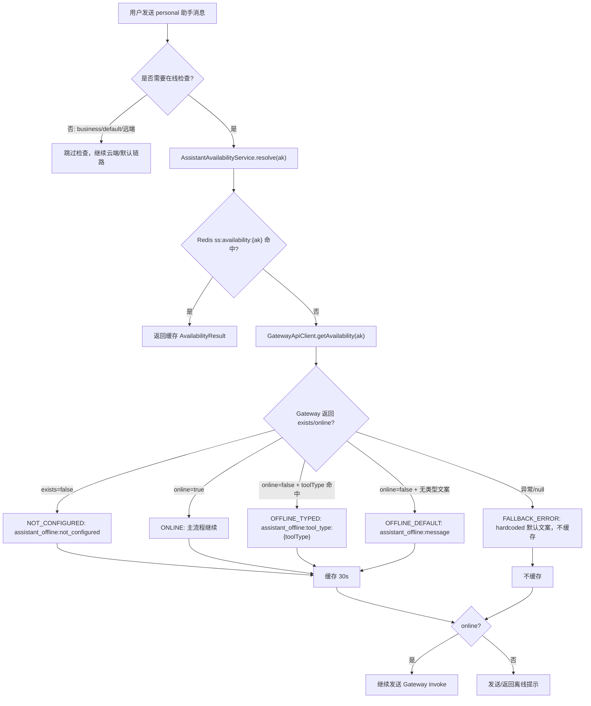
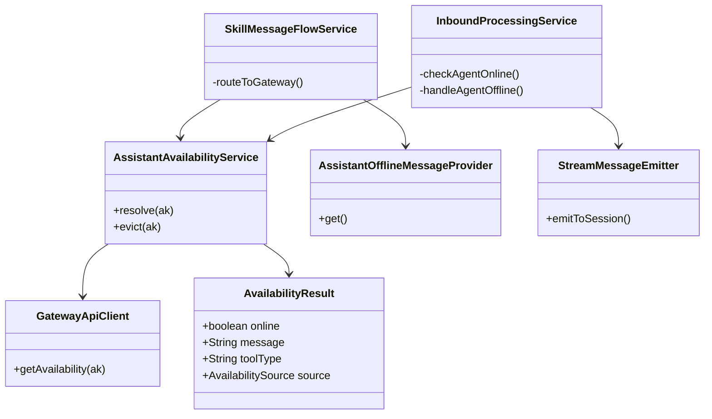
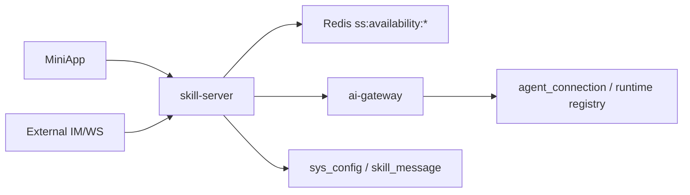
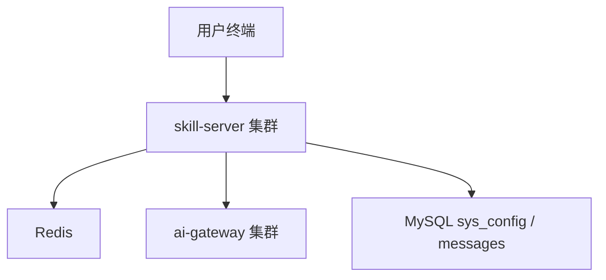
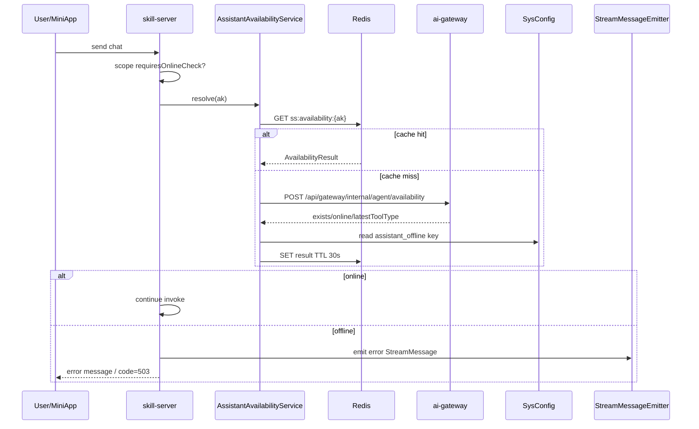
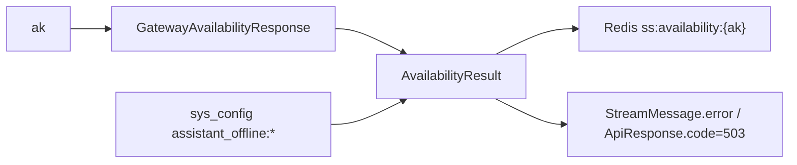
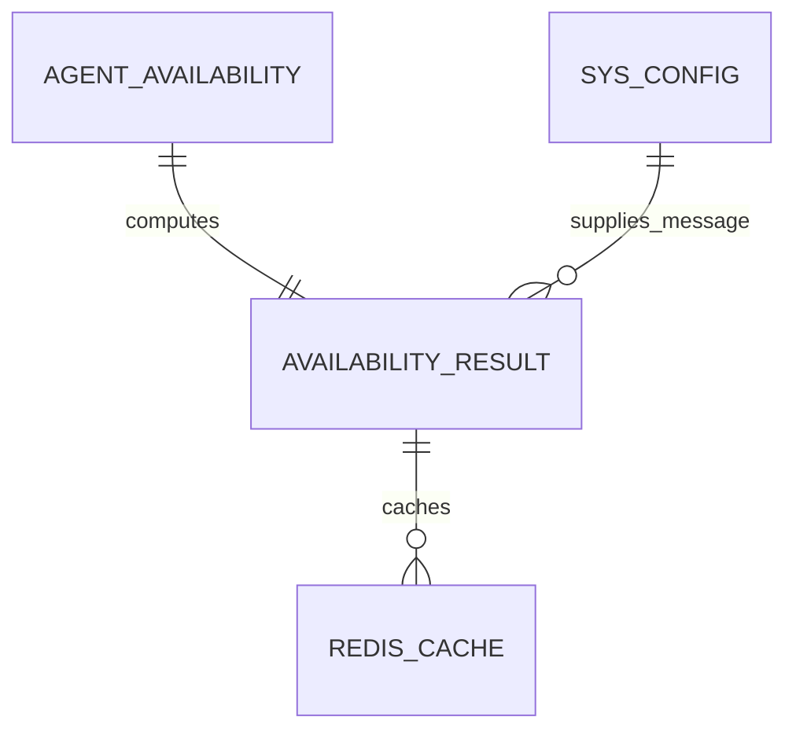
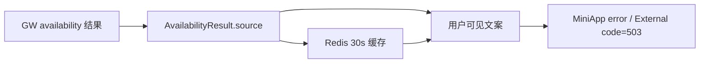
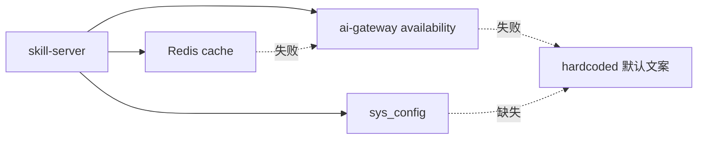

# 本地助手离线提示分级技术设计文档

> 当前文档描述截至 2026-05-28 代码库现状方案。本文档不引入新的运行时变更，用于沉淀本地 personal 助手离线时按“未配置 / 工具类型 / 默认 / 网关异常”分级返回提示文案的设计。

## 一、需求概述（必填）

### 1.1 用户故事
- **As**（用户角色）：MiniApp 用户、外部 IM 用户、系统运维人员
- **I want**（功能描述）：当本地助手不可用时，系统能根据助手配置状态和工具类型返回更准确的离线提示
- **So that**（业务价值）：用户可以知道是“尚未完成绑定配置”还是“客户端离线”，运维可以通过配置调整不同工具类型的提示文案

### 1.2 业务功能逻辑说明

#### 1.2.1 业务场景描述

离线提示分级只作用于需要本地 Agent 在线的 personal scope 助手。业务助手、默认助手、远端助手走云端链路，不做本地在线检查。

主要触发路径：

1. MiniApp `POST /api/skill/sessions/{sessionId}/messages` 发送 chat。
2. 外部入口 `POST /api/external/invoke` 处理 chat/rebuild/question_reply/permission_reply。
3. personal scope 且 `assistant-id` 在线检查开启。
4. Skill Server 调用 AI Gateway 内部可用性接口，获取 `exists/online/latestToolType`。
5. Skill Server 按分级规则选择文案，返回 503 业务错误或推送 `type=error` 流消息。

#### 1.2.2 业务流程说明



**流程步骤说明：**

1. 调用方进入发送消息或外部 inbound 处理。
2. scope dispatcher 判断是否是 personal scope，且是否需要在线检查。
3. 默认助手规则命中时跳过在线检查。
4. `AssistantAvailabilityService` 先查 Redis 短缓存。
5. 缓存未命中时调用 GW `POST /api/gateway/internal/agent/availability`。
6. GW 返回 `exists=false` 时，按未配置处理。
7. GW 返回 `online=true` 时，主流程继续。
8. GW 返回 `online=false` 时，优先使用 `latestToolType` 对应文案。
9. 类型文案缺失时使用 `assistant_offline:message`。
10. GW 异常或返回 null 时使用 hardcoded fallback，且不缓存。
11. MiniApp 主链路离线时保存系统消息并推送 `StreamMessage(type=error)`。
12. 外部入口离线时返回 HTTP 200 + body `code=503`，并尽量带回业务会话 ID 与内部 welinkSessionId。

#### 1.2.3 业务规则

- 只检查 personal/local 助手；business/default/remote 助手跳过。
- `AvailabilityResult.source` 分为 `ONLINE`、`OFFLINE_TYPED`、`OFFLINE_DEFAULT`、`NOT_CONFIGURED`、`FALLBACK_ERROR`。
- `exists=false` 使用 `assistant_offline:not_configured`，缺失则 fallback 到 `assistant_offline:message`，再缺失则 hardcoded 默认文案。
- `online=false` 且 `latestToolType` 非空时，优先查 `assistant_offline:tool_type:{toolType}`。
- toolType 会 trim 并转小写。
- `FALLBACK_ERROR` 不写缓存，避免 GW 短暂故障污染离线判断。
- 其他 AvailabilityResult 写 Redis，TTL 30 秒。
- Redis 读写失败只 WARN，继续实时查询或返回实时结果。
- MiniApp 离线提示通过协议错误消息展示；外部入口通过业务错误码 `503` 返回。

#### 1.2.4 预期结果

- **正常场景**：未配置助手提示用户去平台完成绑定；OpenCode 客户端离线提示“确保 OpenCode 客户端在线”；类型未知时使用默认离线文案；在线时不影响主流程。
- **异常场景**：GW 可用性接口异常时返回保守默认离线提示但不缓存；Redis 故障不影响判断；系统消息持久化失败不阻断 WebSocket 错误提示。

#### 1.2.5 界面交互说明

本需求不新增界面交互。

- MiniApp 消息区：接收 `StreamMessage(type=error, error=<离线文案>)` 并展示错误消息。
- 外部 IM/WS：消费 `code=503/errormsg` 或 outbound error 消息。

#### 1.2.6 相关链接

- 外部协议说明：`docs/superpowers/specs/2026-05-12-external-skill-server-protocol.md`
- MiniApp 协议说明：`docs/superpowers/specs/2026-05-12-miniapp-skill-server-protocol.md`
- 旧离线响应方案：`docs/superpowers/specs/2026-04-21-external-offline-response-design.md`

---

## 二、技术设计（必填）

### 2.1 功能实现设计

#### 2.1.1 逻辑视图



**核心类/模块说明：**

- `AssistantAvailabilityService`：离线分级核心，查询 GW、读取 sys_config、缓存结果。
- `GatewayApiClient`：调用 GW 内部可用性接口。
- `AvailabilityResult` / `AvailabilitySource`：承载在线状态、文案、工具类型和来源。
- `InboundProcessingService.checkAgentOnline`：外部入口离线前置检查。
- `InboundProcessingService.handleAgentOffline`：推送错误流消息并持久化直聊系统消息。
- `SkillMessageFlowService.routeToGateway`：MiniApp chat 发送前在线检查和错误推送。
- `AssistantOfflineMessageProvider`：旧全局默认文案 provider，仍用于非分级的历史路径兼容。

#### 2.1.2 进程视图



**进程/组件说明：**

- `skill-server`：执行在线检查、选择提示文案、发送错误响应。
- `ai-gateway`：提供 Agent 可用性事实来源。
- `Redis`：缓存短期可用性结果。
- `MySQL sys_config`：保存分级离线文案。
- `MySQL skill_message`：直聊离线系统消息持久化。

#### 2.1.3 开发视图

```text
skill-server/src/main/java/com/opencode/cui/skill/
├── model/
│   ├── AvailabilityResult.java
│   ├── AvailabilitySource.java
│   └── GatewayAvailabilityResponse.java
├── service/
│   ├── AssistantAvailabilityService.java
│   ├── AssistantOfflineMessageProvider.java
│   ├── GatewayApiClient.java
│   ├── InboundProcessingService.java
│   └── SkillMessageFlowService.java
└── resources/db/migration/
    └── V14__seed_assistant_offline_defaults.sql
```

#### 2.1.4 物理视图



#### 2.1.5 时序图



**时序说明：**

- Redis 只做 best-effort 缓存，不是事实来源。
- GW 可用性接口异常时返回 `FALLBACK_ERROR`，不写 Redis。
- 离线错误在进入 Gateway invoke 前返回，避免给离线 agent 写入无效下行消息。

#### 2.1.6 数据流图



**数据流说明：**

- `GatewayAvailabilityResponse.exists` 决定是否未配置。
- `GatewayAvailabilityResponse.online` 决定是否继续主流程。
- `GatewayAvailabilityResponse.latestToolType` 决定是否命中工具类型文案。
- `AvailabilityResult.message` 是最终对用户展示的文案。

#### 2.1.7 异常处理机制

| 异常类型 | 异常场景 | 处理方式 | 错误码/消息 |
|---------|---------|---------|-----------|
| blank ak | 调用 resolve 时 ak 为空 | 记录 `[BUG]`，返回 FALLBACK_ERROR | 默认离线文案 |
| Redis 读失败 | Redis 连接异常 | WARN，继续查 GW | 不返回给用户 |
| Redis 写失败 | 缓存写入失败 | WARN，返回实时结果 | 不返回给用户 |
| GW 超时/异常 | availability 返回 null 或抛异常 | FALLBACK_ERROR，不缓存 | 默认离线文案 |
| sys_config 缺失 | 分级文案未配置 | fallback 到 message 或 hardcoded | 默认离线文案 |
| 系统消息持久化失败 | 保存离线系统消息异常 | ERROR，继续推送错误消息 | 不影响展示 |

#### 2.1.8 配置变化

| 配置项 | 配置文件路径/存储 | 原值 | 新值 | 说明 |
|-------|------------------|------|------|------|
| `assistant_offline:not_configured` | `sys_config` / `V14__seed_assistant_offline_defaults.sql` | 无 | “该助理尚未完成初始化配置...” | 未配置文案 |
| `assistant_offline:tool_type:opencode` | 同上 | 无 | “确保 OpenCode 客户端在线...” | OpenCode 类型离线文案 |
| `assistant_offline:message` | 同上 | 无 | “任务下发失败...” | 默认兜底文案 |
| `ss:availability:{ak}` | Redis | 无 | JSON AvailabilityResult | 30s 短缓存 |

**设计文档链接：**

- 不涉及外部云文档链接。

---

### 2.2 接口设计

#### 2.2.1 接口清单

| 接口名称 | 接口路径 | 请求方式 | 提供方 | 消费方 | 说明 |
|---------|---------|---------|-------|-------|------|
| Agent 可用性查询 | `/api/gateway/internal/agent/availability` | POST | ai-gateway | skill-server | 返回 exists/online/latestToolType |
| MiniApp 发送消息 | `/api/skill/sessions/{sessionId}/messages` | POST | skill-server | MiniApp | 离线时推 error 消息 |
| 外部入口 invoke | `/api/external/invoke` | POST | skill-server | 外部 IM/业务系统 | 离线时 body.code=503 |

#### 2.2.2 接口详细定义

**接口1：Agent 可用性查询**

- **请求路径**：`/api/gateway/internal/agent/availability`
- **请求方式**：`POST`
- **请求参数**：

```json
{
  "ak": {
    "类型": "String",
    "必填": "是",
    "说明": "助手 AK",
    "示例": "ak-001"
  }
}
```

- **响应参数**：

```json
{
  "data": {
    "exists": {
      "类型": "Boolean",
      "说明": "GW 是否存在该 AK 的注册/连接记录",
      "示例": true
    },
    "online": {
      "类型": "Boolean",
      "说明": "当前是否在线",
      "示例": false
    },
    "latestToolType": {
      "类型": "String",
      "说明": "最近一次工具类型，用于分级文案",
      "示例": "opencode"
    },
    "lastSeenAt": {
      "类型": "String",
      "说明": "最近活跃时间，当前分级逻辑不消费",
      "示例": "2026-05-28T10:00:00Z"
    }
  }
}
```

- **错误码定义**：

| 错误码 | 错误描述 | 处理建议 |
|-------|---------|---------|
| 5xx/timeout | GW 查询失败 | SS 返回 FALLBACK_ERROR，不缓存 |
| data 缺失 | 响应体异常 | SS 返回 FALLBACK_ERROR，不缓存 |

**接口2：外部入口离线响应**

- **请求路径**：`/api/external/invoke`
- **请求方式**：`POST`
- **响应参数（离线）**：

```json
{
  "code": 503,
  "errormsg": "任务下发失败，请检查助理是否离线，确保 OpenCode 客户端在线后重试。",
  "data": {
    "businessSessionId": "biz-session-id",
    "welinkSessionId": "123"
  }
}
```

**接口设计链接：**

- 不涉及 APIDesigner 链接。

---

### 2.3 数据设计

#### 2.3.1 概念模型



#### 2.3.2 逻辑模型

| 实体名称 | 属性列表 | 主键 | 外键 | 说明 |
|---------|---------|------|------|------|
| `GatewayAvailabilityResponse` | exists, online, latestToolType, lastSeenAt | ak | 无 | GW 可用性事实 |
| `AvailabilityResult` | online, message, toolType, source | 无 | 无 | SS 分级结果 |
| `sys_config` | config_type, config_key, config_value, status | id | 无 | 文案配置来源 |

#### 2.3.3 物理模型

**表名：`sys_config`**

| 字段名 | 字段类型 | 长度 | 是否主键 | 是否外键 | 是否必填 | 默认值 | 索引 | 说明 |
|-------|---------|------|---------|---------|---------|-------|------|------|
| `config_type` | varchar | 128 | 否 | 否 | 是 | 无 | `uk_type_key` | 固定 `assistant_offline` |
| `config_key` | varchar | 255 | 否 | 否 | 是 | 无 | `uk_type_key` | `not_configured` / `tool_type:*` / `message` |
| `config_value` | text | - | 否 | 否 | 是 | 无 | 无 | 用户可见文案 |
| `status` | int | - | 否 | 否 | 是 | 1 | 无 | 1=启用 |

**索引设计：**

| 索引名称 | 索引类型 | 索引字段 | 说明 |
|---------|---------|---------|------|
| `uk_type_key` | 唯一 | `config_type, config_key` | 支持文案幂等 seed 与运维更新 |

#### 2.3.4 缓存设计

| 缓存Key | 缓存类型 | 过期时间 | 数据结构 | 使用场景 |
|---------|---------|---------|---------|---------|
| `ss:availability:{ak}` | Redis | 30s | JSON `AvailabilityResult` | 减少 GW 可用性查询 |
| `ss:config:assistant_offline:{key}` | Redis | SysConfigService 既有 TTL | String | 文案配置读取 |

#### 2.3.5 运营数据设计

| 数据项 | 数据来源 | 统计维度 | 统计周期 | 使用场景 |
|-------|---------|---------|---------|---------|
| 离线来源分布 | `AvailabilityResult.source` 日志 | source/toolType/domain/type | 日/周 | 识别未配置或离线主因 |
| GW availability 失败 | GatewayApiClient 日志 | ak/error | 实时 | 发现 GW 内部接口异常 |
| 离线提示触发量 | SS WARN 日志 | ak/source/sessionType | 实时/日 | 运维监控 |
| Redis 缓存失败 | Redis WARN 日志 | read/write/delete | 实时 | 缓存健康 |

**数据设计链接：**

- 不涉及数据建模工具链接。

---

### 2.4 集成设计

#### 2.4.1 内部微服务集成

| 服务名称 | 服务类型 | 集成方式 | 接口名称 | 调用方向 | 说明 |
|---------|---------|---------|---------|---------|------|
| ai-gateway | 微服务 | REST | `/api/gateway/internal/agent/availability` | SS → GW | 可用性事实来源 |
| Redis | 中间件 | String KV | `ss:availability:{ak}` | SS ↔ Redis | 30s 短缓存 |
| MySQL/sys_config | 数据库 | Mapper/Service | `SysConfigService.getValue` | SS → DB/Redis | 分级文案 |

#### 2.4.2 外部系统集成

不涉及新增外部系统。外部 IM/业务系统只消费已有 `/api/external/invoke` 响应。

#### 2.4.3 周边依赖设计

| 依赖项 | 依赖类型 | 依赖版本 | 依赖方式 | 影响范围 | 说明 |
|-------|---------|---------|---------|---------|------|
| `GatewayApiClient` | 内部 HTTP 客户端 | 当前版本 | 强依赖 | 在线判断 | 失败走 FALLBACK_ERROR |
| `SysConfigService` | 配置服务 | 当前版本 | 强依赖 | 文案读取 | 缺失走 fallback |
| `StringRedisTemplate` | Redis 客户端 | 当前版本 | 弱依赖 | 缓存 | 失败不阻断 |
| `StreamMessageEmitter` | 协议发送组件 | 当前版本 | 强依赖 | 错误提示推送 | MiniApp/External WS 可见 |

---

### 2.5 依赖项及影响面分析

#### 2.5.1 直接依赖分析

| 被修改模块/接口 | 直接调用方 | 调用场景 | 影响评估 | 测试建议 |
|---------------|-----------|---------|---------|---------|
| `AssistantAvailabilityService.resolve` | `SkillMessageFlowService`, `InboundProcessingService` | 在线检查 | 高 | 五类 source、缓存、GW 异常 |
| `GatewayApiClient.getAvailability` | `AssistantAvailabilityService` | 查询 GW | 中 | 2xx/data/null/异常 |
| `InboundProcessingService.checkAgentOnline` | external invoke | 外部 chat/reply/rebuild | 高 | 404 优先级、503 data 字段 |
| `SkillMessageFlowService.routeToGateway` | MiniApp sendMessage | chat 下发 | 中 | 离线错误推送、系统消息 |

#### 2.5.2 间接依赖分析（影响传播）



**影响传播说明：**

- GW `latestToolType` 准确性直接影响是否命中类型文案。
- Redis 缓存会让配置变更最多延迟 30 秒作用于可用性结果；SysConfig 自身还有既有配置缓存。
- `FALLBACK_ERROR` 不缓存，避免临时故障在 30 秒内扩大影响。

#### 2.5.3 运行时影响监控

| 监控项 | 监控指标 | 监控方式 | 告警阈值 | 处理策略 |
|-------|---------|---------|---------|---------|
| `FALLBACK_ERROR` 比例 | source=FALLBACK_ERROR 日志 | 日志平台 | 连续 5 分钟升高 | 检查 GW availability 接口 |
| `NOT_CONFIGURED` 比例 | source=NOT_CONFIGURED | 日志/运营报表 | 新助手集中出现 | 引导用户完成绑定 |
| Redis 失败 | Redis read/write WARN | 日志平台 | 持续出现 | 检查 Redis 连接 |
| 离线 503 | external `code=503` | 接口日志 | 超出业务基线 | 分析 toolType 与 AK |

#### 2.5.4 影响面汇总

**影响范围：**

- **产品内部服务依赖**：skill-server MiniApp 发送、external invoke、消息持久化。
- **上下游服务依赖**：ai-gateway 可用性查询。
- **外部服务依赖**：不新增。
- **周边环境依赖**：Redis、MySQL sys_config、日志平台。

---

## 三、DFX设计（必填）

### 3.1 性能设计

#### 3.1.1 性能需求规格

| 性能指标 | 目标值 | 测试方法 | 说明 |
|---------|-------|---------|------|
| 缓存命中 resolve 耗时 | P95 < 5ms | 单测/压测 | Redis GET + JSON 反序列化 |
| 缓存未命中 resolve 耗时 | 受 GW 内部接口 SLA 约束 | 集成测试 | 一次 GW HTTP + sys_config 查询 |
| 缓存 TTL | 30s | 单测 | 降低 GW 压力与状态 stale 的折中 |

#### 3.1.2 性能设计方案

**性能优化策略：**

- **数据库优化**：文案读取复用 `SysConfigService` 缓存。
- **缓存策略**：可用性结果短 TTL；异常结果不缓存。
- **代码优化**：Redis 失败不重试，快速降级到 GW。
- **架构优化**：在线检查只在 personal scope 触发，云端助手跳过。

**性能测试计划：**

- 模拟大量 personal chat：观察 GW availability 调用量是否被 30s cache 降低。
- 模拟 Redis 故障：确认请求仍能通过 GW 实时判断。
- 模拟 GW 故障：确认返回默认离线文案且不缓存。

---

### 3.2 高可用设计

#### 3.2.1 接入层高可用

- **负载均衡策略**：沿用现有 skill-server/GW LB。
- **故障转移机制**：Redis 失败降级实时 GW；GW 失败降级默认离线文案。
- **健康检查机制**：GW availability 失败不让 skill-server 实例下线。

#### 3.2.2 应用层高可用

- **服务冗余策略**：多实例 skill-server 独立查询/缓存。
- **故障恢复机制**：`FALLBACK_ERROR` 不缓存，GW 恢复后下一次即可恢复准确判断。
- **容灾策略**：文案配置缺失时使用 hardcoded 默认，保证用户始终有提示。

#### 3.2.3 数据层高可用

- **数据库高可用**：沿用 sys_config 所在 MySQL HA。
- **缓存高可用**：Redis 不可用时降级，不阻断主判断。
- **存储高可用**：系统消息保存失败只影响历史可见性，不影响实时错误提示。

#### 3.2.4 高可用架构图



---

### 3.3 安全设计

#### 3.3.1 安全威胁分析

| 威胁类型 | 威胁场景 | 风险等级 | 影响范围 |
|---------|---------|---------|---------|
| 内部接口滥用 | availability 接口被外部调用 | 高 | Agent 状态泄露 |
| 文案注入 | sys_config 配置恶意链接或脚本 | 中 | 用户展示 |
| AK 泄露 | 离线日志打印完整 AK | 中 | 助手身份 |

#### 3.3.2 安全技术设计

- **认证机制**：GW 内部 availability 接口使用内部 token/header。
- **授权机制**：仅 skill-server 调用 GW 内部接口。
- **数据加密**：服务间通信依赖内网 HTTPS/现有安全边界。
- **输入校验**：blank AK 直接 fallback 并记录 BUG。
- **敏感数据保护**：日志控制 AK 输出范围，避免展示 token/认证信息。
- **审计日志**：记录 source/toolType/session 以便追踪，但不记录用户输入内容。

#### 3.3.3 安全合规检查

- 运维文案配置需经过审核，避免注入非预期链接。
- availability 接口不得暴露到公网。

---

### 3.4 兼容性设计

#### 3.4.1 中间件兼容性

| 中间件 | 当前版本 | 目标版本 | 兼容方案 | 测试建议 |
|-------|---------|---------|---------|---------|
| Redis | 当前版本 | 不变 | 失败降级，JSON value | Redis 异常单测 |
| MySQL/sys_config | 当前版本 | 不变 | V14 幂等 seed | migration 验证 |
| Spring RestTemplate | 当前版本 | 不变 | GatewayApiClient 复用 | HTTP mock |

#### 3.4.2 周边集成兼容性

| 集成系统 | 当前接口版本 | 新接口版本 | 兼容方案 | 影响评估 |
|---------|-------------|-----------|---------|---------|
| ai-gateway availability | 当前内部接口 | 不变 | data 缺失/null 视为 fallback | 中 |
| MiniApp StreamMessage | `type=error` | 不变 | 继续使用 error 字段展示 | 低 |
| External invoke | `code=503` | 不变 | HTTP 200 + body code | 低 |

#### 3.4.3 数据兼容性

- **数据迁移方案**：V14 幂等插入默认离线文案。
- **数据兼容处理**：旧 `assistant_offline:message` 仍作为最终配置兜底。
- **版本兼容策略**：新增分级 key 不影响未配置场景；缺 key 使用旧默认文案。

#### 3.4.4 扩展性设计

- **业务扩展**：新增工具类型时增加 `assistant_offline:tool_type:{toolType}` 配置即可。
- **技术扩展**：如需更细粒度，可扩展 domain/type/businessTag 级文案，但需避免规则优先级过深。

---

## 四、附录

### 4.1 相关文档链接

- `skill-server/src/main/java/com/opencode/cui/skill/service/AssistantAvailabilityService.java`
- `skill-server/src/main/java/com/opencode/cui/skill/model/AvailabilityResult.java`
- `skill-server/src/main/java/com/opencode/cui/skill/service/InboundProcessingService.java`
- `skill-server/src/main/resources/db/migration/V14__seed_assistant_offline_defaults.sql`

### 4.2 参考规范

- `.trellis/spec/skill-server/backend/error-handling.md`
- `.trellis/spec/skill-server/backend/database-guidelines.md`
- `.trellis/spec/skill-server/backend/type-safety.md`

### 4.3 版本历史

| 版本 | 日期 | 修改人 | 修改内容 |
|------|------|--------|---------|
| v1.0 | 2026-05-28 | Codex | 初版，沉淀本地助手离线提示分级现状方案 |

---

**文档编写说明：**

- 本文按 US 需求设计文档模板编写。
- 不涉及的部分已标注“不涉及”。
- 本文是现状方案沉淀，不代表新增开发任务已启动。
