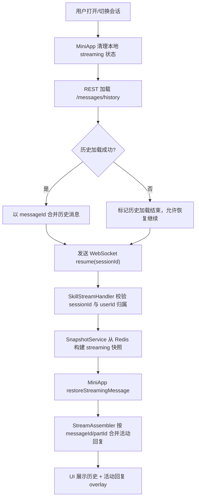
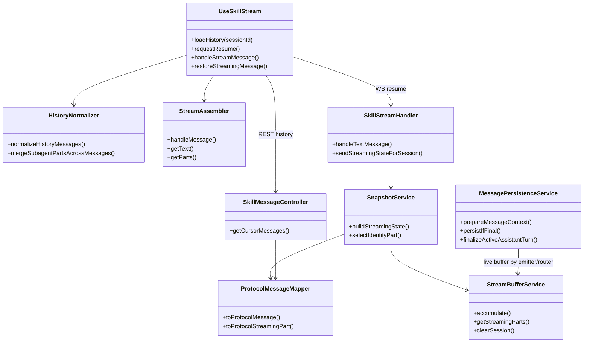
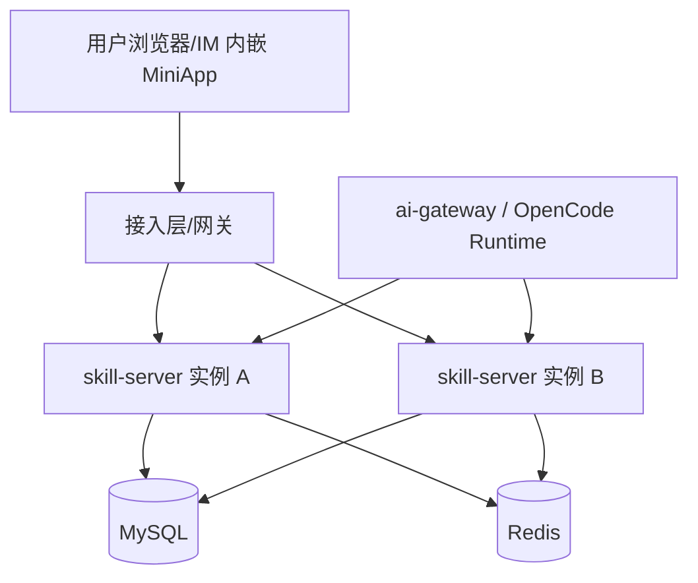
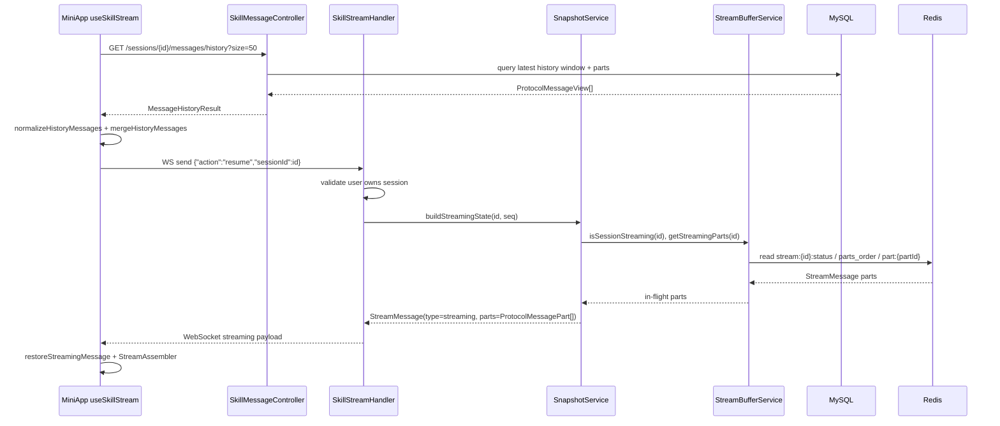
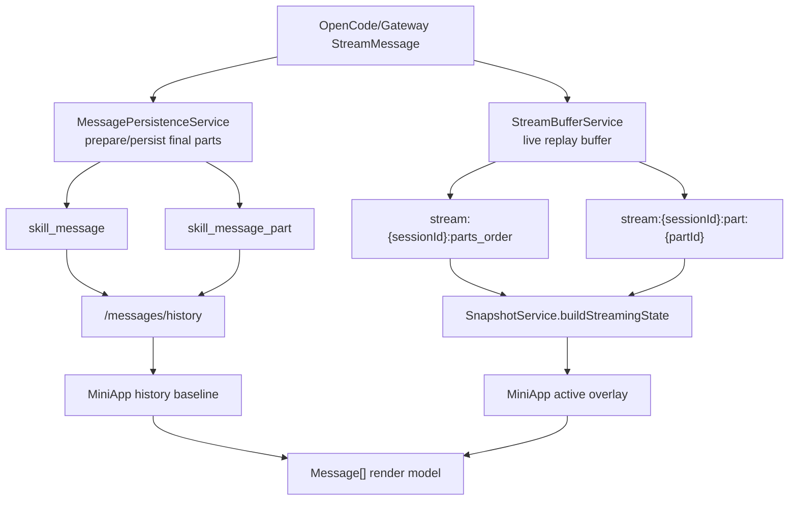
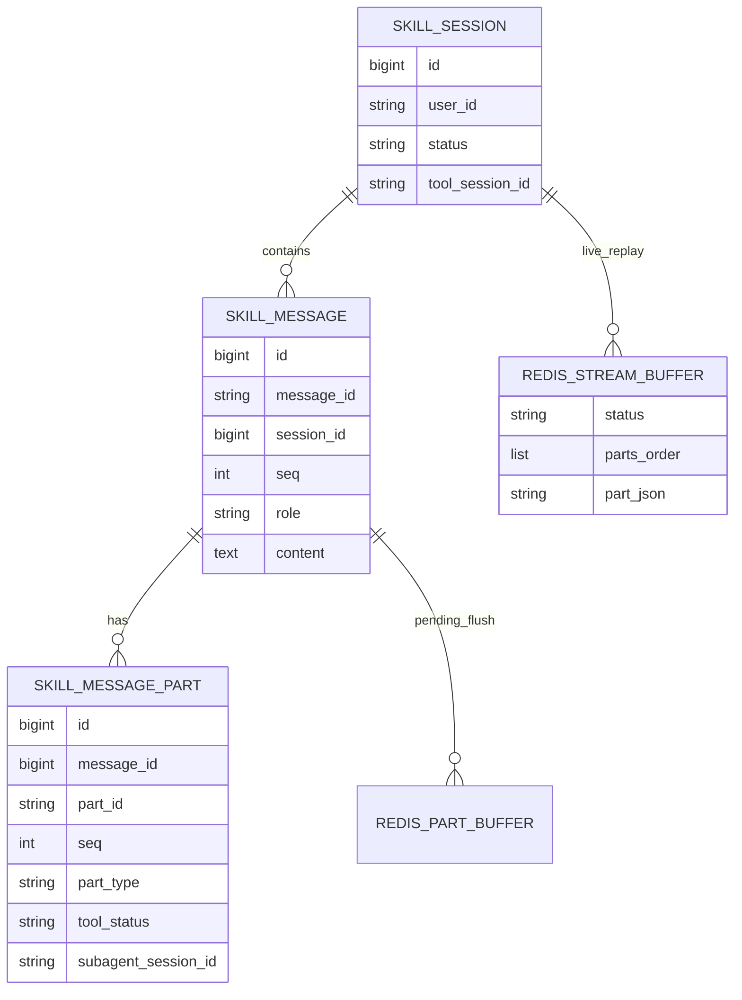
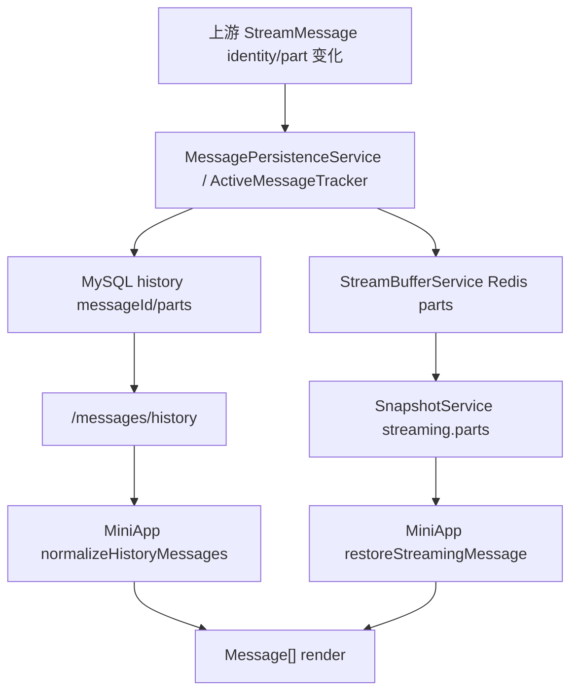
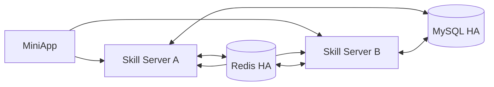

# MiniApp 与 Skill Server 快照恢复技术设计文档

> 当前文档描述截至 2026-05-26 代码库 `main` 分支的现状方案。本文档不引入新的运行时变更，用于沉淀 MiniApp 会话切换/重连时的历史加载与快照恢复设计。

## 一、需求概述（必填）

### 1.1 用户故事
- **As**（用户角色）：MiniApp 聊天用户、研发/测试人员、系统运维人员
- **I want**（功能描述）：在刷新页面、WebSocket 重连或切换会话后，MiniApp 能恢复已持久化历史消息，并叠加当前仍在生成中的回复快照
- **So that**（业务价值）：避免对话丢失、重复展示、工具/权限卡片状态错乱，保证长回复和工具调用场景下的会话连续性

### 1.2 业务功能逻辑说明

#### 1.2.1 业务场景描述

快照恢复覆盖三类主要场景：

1. 用户打开或切换到某个 MiniApp 会话。
2. 页面刷新、网络抖动、WebSocket 断线后重新连接。
3. 助手回复仍在生成中，且当前回复包含 text、thinking、tool、question、permission、file 或 subagent parts。

当前方案的职责边界是：

- **历史基线**：MiniApp 通过 `GET /api/skill/sessions/{sessionId}/messages/history` 从 Skill Server 读取 MySQL 中的持久化历史。
- **活动回复快照**：MiniApp 在历史加载完成后通过 WebSocket `resume` 请求 Skill Server 发送 `type=streaming` 的当前流式状态。
- **兼容快照**：旧 `type=snapshot` 消息仍保留兼容处理，但只合并进现有消息列表，不再覆盖历史接口结果。

#### 1.2.2 业务流程说明



**流程步骤说明：**

1. MiniApp 选中会话后重置本地 `messages`、`assemblersRef`、`activeMessageIdsRef`、pending queue。
2. MiniApp 调用 `api.getMessageHistory(sessionId, 50)` 读取最新历史窗口。
3. 历史返回后，`protocol/history.ts` 将后端 `ProtocolMessageView` 归一化为前端 `Message[]`。
4. MiniApp 将历史消息标记为 ready，并 flush 历史加载前排队的 WebSocket 消息。
5. MiniApp 发送 `{"action":"resume","sessionId":"..."}`。
6. Skill Server 校验 session 存在且属于当前 `userId`。
7. Skill Server 从 Redis live buffer 读取当前 in-flight parts，构造 `StreamMessage(type=streaming)`。
8. MiniApp 将 `streaming.parts` 归一化为实时 `StreamMessage`，按主会话和 subagent 分流恢复。
9. 主会话 parts 进入 `StreamAssembler`，按 `messageId` 合并为一条 assistant 消息。
10. subagent parts 合并为虚拟消息 `subtask-${subagentSessionId}`。
11. 若收到 `sessionStatus=idle` 且无 parts，MiniApp 终结本地 streaming 状态。

#### 1.2.3 业务规则

- MySQL 历史是 durable baseline；Redis `stream:*` 只保存当前活动回复，`session.status=idle/completed` 后清理。
- MiniApp 在历史加载完成或失败前，除 `agent.online/offline` 外，会暂存同会话 WebSocket 消息，避免流式快照先于历史落地造成分裂。
- `messageId` 是 assistant turn 的 canonical identity；`partId` 是 part identity；tool/permission 可分别用 `toolCallId`、`permissionId` 兜底去重。
- 旧 `snapshot.messages` 只做兼容 merge，不再作为主历史来源覆盖 `messages`。
- `streaming.parts` 使用协议层 part 形态：`text`、`thinking`、`tool`、`question`、`permission`、`file`。
- 权限快照中出现 `response` 或完成态 `status` 时，MiniApp 恢复为已处理的 permission reply。
- subagent 输出不另建 store，统一以 `subtask-${subagentSessionId}` 虚拟 assistant message 承载。

#### 1.2.4 预期结果

- **正常场景**：用户切换/刷新后先看到历史消息，再看到当前仍在生成的助手回复；工具、问题、权限、文件、subagent parts 不重复、不丢失、不拆成多条错误 assistant 消息。
- **异常场景**：历史接口失败时允许 WebSocket 恢复继续；非法/越权 resume 被 Skill Server 忽略；Redis 无活动 parts 时发送 idle 状态并结束前端 streaming。

#### 1.2.5 界面交互说明

本需求不新增界面。现有交互如下：

- 会话列表/会话详情：切换会话触发历史加载与 resume。
- 消息区：渲染 `MessagePart`，包括 `ThinkingBlock`、`ToolCard`、`QuestionCard`、`PermissionCard`、`SubtaskBlock`。
- 权限卡片：用户回复后本地立即置为已处理，历史/快照恢复时继续由 part 字段驱动状态。

#### 1.2.6 相关链接

- 需求/任务：`.trellis/tasks/05-21-miniapp-history-reply-snapshot/prd.md`
- 需求/任务：`.trellis/tasks/05-24-fix-snapshot-resume-ordering-with-tool-messages/prd.md`
- 本次文档任务：`.trellis/tasks/05-26-document-miniapp-and-skill-snapshot-restore-design/prd.md`

---

## 二、技术设计（必填）

### 2.1 功能实现设计

#### 2.1.1 逻辑视图



**核心类/模块说明：**

- `skill-miniapp/src/hooks/useSkillStream.ts`：MiniApp 历史加载、WebSocket 生命周期、streaming overlay 恢复、pending queue 与本地消息合并。
- `skill-miniapp/src/protocol/history.ts`：后端历史 payload 到前端 `Message/MessagePart` 的归一化，包含 subagent part 虚拟消息合并。
- `skill-miniapp/src/protocol/StreamAssembler.ts`：按 `partId` 维护多 part assistant 消息，支持 text/thinking/tool/question/permission/file 等类型。
- `skill-server/.../SkillMessageController.java`：提供 cursor 历史接口。
- `skill-server/.../SkillStreamHandler.java`：处理 `/ws/skill/stream` 连接、`resume`、用户级 Redis 订阅和 WebSocket 下发。
- `skill-server/.../SnapshotService.java`：构建旧 `snapshot` 和当前 `streaming` 状态，`streaming` 来自 Redis live buffer。
- `skill-server/.../StreamBufferService.java`：Redis live replay layer，保存当前 in-flight parts，idle/completed 后清理。
- `skill-server/.../MessagePersistenceService.java`：将终态 parts 与 assistant turn 写入 MySQL，并刷新 latest history cache。
- `skill-server/.../ProtocolMessageMapper.java`：内部模型到前端协议 DTO 的统一转换。

#### 2.1.2 进程视图

```mermaid
flowchart LR
    Browser["MiniApp Browser<br/>React + WebSocket"] -->|REST history| SS["skill-server<br/>Spring Boot"]
    Browser -->|WS /ws/skill/stream| SS
    SS -->|MyBatis| MySQL["MySQL<br/>skill_message / skill_message_part"]
    SS -->|StringRedisTemplate| Redis["Redis<br/>stream buffer / pubsub / cache"]
    Gateway["ai-gateway/OpenCode event source"] -->|tool_event/tool_done| SS
    SS -->|user-stream:{userId}| Redis
    Redis -->|pub/sub| SS
    SS -->|WebSocket push| Browser
```

**进程/组件说明：**

- `skill-miniapp`：浏览器内运行，负责 REST/WS 消费与 UI 状态。
- `skill-server`：后端进程，负责鉴权、历史查询、实时状态构建、Redis/MySQL 协调。
- `MySQL`：保存持久历史消息与结构化 parts。
- `Redis`：保存短 TTL live replay buffer、latest history cache、user-stream pub/sub 与跨实例 stream seq。
- `ai-gateway/OpenCode`：上游事件来源；本设计不改其协议，只把其事件转成 MiniApp 可恢复状态。

#### 2.1.3 开发视图

```text
项目结构：
├── skill-miniapp/
│   └── src/
│       ├── hooks/
│       │   └── useSkillStream.ts
│       ├── protocol/
│       │   ├── types.ts
│       │   ├── history.ts
│       │   └── StreamAssembler.ts
│       └── utils/
│           └── api.ts
├── skill-server/
│   └── src/main/
│       ├── java/com/opencode/cui/skill/
│       │   ├── controller/SkillMessageController.java
│       │   ├── model/
│       │   │   ├── StreamMessage.java
│       │   │   ├── ProtocolMessageView.java
│       │   │   ├── ProtocolMessagePart.java
│       │   │   └── MessageHistoryResult.java
│       │   ├── service/
│       │   │   ├── SkillMessageService.java
│       │   │   ├── MessageHistoryCacheService.java
│       │   │   ├── MessagePersistenceService.java
│       │   │   ├── ActiveMessageTracker.java
│       │   │   ├── StreamBufferService.java
│       │   │   ├── SnapshotService.java
│       │   │   └── ProtocolMessageMapper.java
│       │   └── ws/SkillStreamHandler.java
│       └── resources/db/migration/
└── docs/
    └── miniapp-skill-snapshot-restore-design.md
```

**代码组织说明：**

- 前端保持 `hooks` 管生命周期、`protocol` 管消息归一化/组装、`components` 只渲染归一化模型。
- 后端保持 Controller 只做入口校验，Service 管历史/快照/缓存/持久化，WS Handler 管连接生命周期。

#### 2.1.4 物理视图



物理部署上，MiniApp 连接任意 Skill Server 实例；跨实例实时下发依赖 Redis user-stream pub/sub，跨实例传输序号依赖 Redis INCR。历史数据由 MySQL 提供一致基线。

#### 2.1.5 时序图



**时序说明：**

- 历史接口先返回持久化结果，避免 WebSocket 快照与历史并发覆盖。
- `resume(sessionId)` 只恢复指定会话，避免切会话时恢复其它 active session。
- `streaming.parts` 在前端按 `messageId` 与 part identity 合并，不追加重复历史。

#### 2.1.6 数据流图



**数据流说明：**

- `SkillMessage`：一条会话消息，保存 role、content、messageId、seq 等。
- `SkillMessagePart`：一条消息下的结构化 part，保存 text/tool/question/permission/file/subagent 信息。
- `StreamMessage`：WebSocket 语义事件；进入 Redis live buffer 后供断线恢复。
- `ProtocolMessageView/ProtocolMessagePart`：前端消费的历史和 streaming parts 统一协议形态。

#### 2.1.7 异常处理机制

| 异常类型 | 异常场景 | 处理方式 | 错误码/消息 |
|---------|---------|---------|-----------|
| 参数错误 | history `size <= 0` 或超过上限 | Controller 返回 `ApiResponse.error` | `400 Size must be between 1 and ...` |
| 参数错误 | `sessionId` 非数字 | Controller 返回 `ApiResponse.error` 或 WS resume 忽略 | `400 Invalid session ID` / warn log |
| 权限错误 | resume 的 session 不属于当前 userId | WS 不发送快照并记录 warn | `Ignoring resume for unauthorized session` |
| 历史加载失败 | MiniApp REST history 请求失败 | 前端标记 history ready，flush pending stream，继续 resume | 前端不阻塞恢复 |
| Redis buffer 反序列化失败 | 某个 part JSON 读取失败 | 跳过该 part 并记录 warn | `Failed to deserialize streaming part` |
| 无活动流 | Redis 中无 parts 或 status 不 busy | 返回 `streaming` + `sessionStatus=idle`，前端 finalize | 无错误码 |
| WebSocket 发送失败 | socket 已关闭或发送 IOException | 注销订阅者并记录 error | `Failed to push message` |
| 持久化 flush 失败 | finalize 时 Redis part buffer 刷 MySQL 失败 | fail-closed，rollback Redis snapshot，恢复 active ref | error/warn log |

#### 2.1.8 配置变化

当前文档不引入配置变更。相关现有配置如下：

| 配置项 | 配置文件路径 | 原值 | 新值 | 说明 |
|-------|-------------|------|------|------|
| `skill.message-history.cache-ttl-seconds` | `skill-server/src/main/resources/application.yml` | `${SKILL_MESSAGE_HISTORY_CACHE_TTL_SECONDS:30}` | 不变 | latest history Redis cache TTL |
| `skill.message-history.warm-sizes` | 同上 | `${SKILL_MESSAGE_HISTORY_WARM_SIZES:50}` | 不变 | 异步预热的 history size |
| `skill.message-history.refresh.*` | 同上 | core=2/max=4/queue=200 | 不变 | history cache refresh executor |
| `spring.data.redis.*` | 同上 | 环境变量驱动 | 不变 | live buffer、pub/sub、cache 共享 Redis |
| `skill.websocket.allowed-origins` | 同上 | `${CORS_ORIGINS:*}` | 不变 | MiniApp WebSocket CORS |

**设计文档链接：**

- 不涉及外部云文档；当前文档即设计基线。

---

### 2.2 接口设计

#### 2.2.1 接口清单

| 接口名称 | 接口路径 | 请求方式 | 提供方 | 消费方 | 说明 |
|---------|---------|---------|-------|-------|------|
| Cursor 历史消息 | `/api/skill/sessions/{sessionId}/messages/history` | GET | skill-server | skill-miniapp | 读取 durable baseline |
| MiniApp 流式 WebSocket | `/ws/skill/stream` | WebSocket | skill-server | skill-miniapp | 实时事件与 resume 快照恢复 |
| WebSocket resume action | `/ws/skill/stream` payload | WS message | skill-miniapp | skill-server | 指定会话恢复当前 streaming overlay |

#### 2.2.2 接口详细定义

**接口1：Cursor 历史消息**

- **请求路径**：`/api/skill/sessions/{sessionId}/messages/history`
- **请求方式**：`GET`
- **请求参数**：

```json
{
  "sessionId": {
    "类型": "String/Long",
    "必填": "是",
    "说明": "Skill 会话 ID，路径参数",
    "示例": "42"
  },
  "size": {
    "类型": "Integer",
    "必填": "否",
    "说明": "返回窗口大小，默认 50，必须在 Controller 上限内",
    "示例": 50
  },
  "beforeSeq": {
    "类型": "Integer",
    "必填": "否",
    "说明": "游标；为空读取最新窗口，非空读取 seq 小于该值的历史窗口",
    "示例": 120
  }
}
```

- **响应参数**：

```json
{
  "code": {
    "类型": "Integer",
    "说明": "ApiResponse 业务码",
    "示例": 0
  },
  "data": {
    "类型": "MessageHistoryResult<ProtocolMessageView>",
    "说明": "历史窗口"
  },
  "data.content": {
    "类型": "ProtocolMessageView[]",
    "说明": "按 seq 升序排列的消息"
  },
  "data.hasMore": {
    "类型": "Boolean",
    "说明": "是否还有更早历史"
  },
  "data.nextBeforeSeq": {
    "类型": "Integer",
    "说明": "下一页 beforeSeq"
  }
}
```

- **错误码定义**：

| 错误码 | 错误描述 | 处理建议 |
|-------|---------|---------|
| 400 | `Invalid session ID` | 检查路径参数 |
| 400 | `Size must be between 1 and ...` | 调整 size |
| 访问控制异常 | 当前 userId 无 session 权限 | 重新登录或检查 session 归属 |

**接口2：WebSocket resume action**

- **请求路径**：`/ws/skill/stream`
- **请求方式**：`WebSocket message`
- **请求参数**：

```json
{
  "action": {
    "类型": "String",
    "必填": "是",
    "说明": "固定为 resume",
    "示例": "resume"
  },
  "sessionId": {
    "类型": "String",
    "必填": "否",
    "说明": "指定要恢复的会话；缺省时恢复当前用户所有 active sessions 的 streaming state",
    "示例": "42"
  }
}
```

- **响应参数**：

```json
{
  "type": {
    "类型": "String",
    "说明": "固定为 streaming",
    "示例": "streaming"
  },
  "seq": {
    "类型": "Long",
    "说明": "Redis INCR 生成的跨实例传输序号",
    "示例": 17
  },
  "welinkSessionId": {
    "类型": "String",
    "说明": "Skill sessionId 的协议字段",
    "示例": "42"
  },
  "sessionStatus": {
    "类型": "String",
    "说明": "busy 或 idle",
    "示例": "busy"
  },
  "messageId": {
    "类型": "String",
    "说明": "当前 assistant turn 的 canonical messageId",
    "示例": "opencode-msg-1"
  },
  "parts": {
    "类型": "ProtocolMessagePart[]",
    "说明": "当前 in-flight parts，类型为 text/thinking/tool/question/permission/file"
  }
}
```

- **错误码定义**：

| 错误码 | 错误描述 | 处理建议 |
|-------|---------|---------|
| 无显式错误响应 | 非法 sessionId / 缺失 session / 越权 session | Skill Server 记录 warn 并不发送恢复消息 |
| WebSocket close | 缺失 `userId` Cookie | MiniApp 需重新建立带 Cookie 的连接 |

**接口设计链接：**

- 不涉及 APIDesigner；以 `SkillMessageController`、`SkillStreamHandler` 当前代码为准。

---

### 2.3 数据设计

#### 2.3.1 概念模型



#### 2.3.2 逻辑模型

| 实体名称 | 属性列表 | 主键 | 外键 | 说明 |
|---------|---------|------|------|------|
| `SkillSession` | id, userId, toolSessionId, title, status, lastActiveAt | id | skillDefinitionId | 会话归属与状态 |
| `SkillMessage` | id, messageId, sessionId, seq, messageSeq, role, content, contentType, meta | id | sessionId | 持久化消息行，`messageId` 是协议层 ID |
| `SkillMessagePart` | id, messageId, sessionId, partId, seq, partType, content, tool*, file*, subagent* | id | messageId/sessionId | 结构化消息分片 |
| `StreamMessage` | type, seq, sessionId, welinkSessionId, messageId, partId, status, content, tool/permission/question/file info | 无 | sessionId | WebSocket 语义事件 DTO |
| `ProtocolMessageView` | id, welinkSessionId, seq, messageSeq, role, content, parts | id | welinkSessionId | 前端历史协议视图 |
| `ProtocolMessagePart` | partId, partSeq, type, content, tool/permission/question/file/subagent fields | partId | 无 | 历史与 streaming overlay 共用 part 视图 |

#### 2.3.3 物理模型

**表名：`skill_message`**

| 字段名 | 字段类型 | 长度 | 是否主键 | 是否外键 | 是否必填 | 默认值 | 索引 | 说明 |
|-------|---------|------|---------|---------|---------|-------|------|------|
| `id` | BIGINT | - | 是 | 否 | 是 | 自动/Snowflake | PK | DB 主键 |
| `message_id` | VARCHAR | 128 | 否 | 否 | 否 | NULL | `idx_message_id` | OpenCode/协议 messageId |
| `session_id` | BIGINT | - | 否 | 是 | 是 | - | `uk_skill_message_session_seq` | 会话 ID |
| `seq` | INT | - | 否 | 否 | 是 | - | `uk_skill_message_session_seq` | 会话内排序 |
| `role` | ENUM | - | 否 | 否 | 是 | - | - | USER/ASSISTANT/SYSTEM/TOOL |
| `content` | MEDIUMTEXT | - | 否 | 否 | 是 | - | - | 文本聚合内容 |
| `content_type` | ENUM | - | 否 | 否 | 否 | MARKDOWN | - | MARKDOWN/CODE/PLAIN |
| `meta` | JSON | - | 否 | 否 | 否 | NULL | - | 元数据 |
| `finished` | TINYINT | 1 | 否 | 否 | 是 | 0 | - | assistant turn 是否完成 |

**表名：`skill_message_part`**

| 字段名 | 字段类型 | 长度 | 是否主键 | 是否外键 | 是否必填 | 默认值 | 索引 | 说明 |
|-------|---------|------|---------|---------|---------|-------|------|------|
| `id` | BIGINT | - | 是 | 否 | 是 | 自动/Snowflake | PK | DB 主键 |
| `message_id` | BIGINT | - | 否 | 是 | 是 | - | `idx_message` | 关联 `skill_message.id` |
| `session_id` | BIGINT | - | 否 | 是 | 是 | - | `idx_session` | 会话 ID |
| `part_id` | VARCHAR | 128 | 否 | 否 | 是 | - | `idx_part_id(session_id,part_id)` | OpenCode part ID |
| `seq` | INT | - | 否 | 否 | 是 | 0 | - | 消息内 part 顺序 |
| `part_type` | VARCHAR | 30 | 否 | 否 | 是 | - | - | text/reasoning/tool/permission/file/step-finish |
| `content` | MEDIUMTEXT | - | 否 | 否 | 否 | NULL | - | 文本/错误/标题 |
| `tool_*` | VARCHAR/JSON/TEXT | - | 否 | 否 | 否 | NULL | - | tool/question/permission 字段复用 |
| `file_*` | VARCHAR/TEXT | - | 否 | 否 | 否 | NULL | - | 文件字段 |
| `subagent_session_id` | VARCHAR | 64 | 否 | 否 | 否 | NULL | `idx_subagent_session` | 子 agent 会话 |
| `subagent_name` | VARCHAR | 128 | 否 | 否 | 否 | NULL | - | 子 agent 名称 |

**索引设计：**

| 索引名称 | 索引类型 | 索引字段 | 说明 |
|---------|---------|---------|------|
| `uk_skill_message_session_seq` | 唯一联合 | `skill_message(session_id, seq)` | 会话内消息顺序唯一 |
| `idx_message_id` | 普通 | `skill_message(message_id)` | 按协议 messageId 查找 |
| `idx_part_id` | 唯一联合 | `skill_message_part(session_id, part_id)` | part 幂等 upsert |
| `idx_message` | 普通 | `skill_message_part(message_id)` | 批量读取消息 parts |
| `idx_subagent_session` | 普通 | `skill_message_part(session_id, subagent_session_id)` | subagent parts 查询/归组 |

#### 2.3.4 缓存设计

| 缓存Key | 缓存类型 | 过期时间 | 数据结构 | 使用场景 |
|---------|---------|---------|---------|---------|
| `stream:{sessionId}:status` | Redis | 1h | String JSON | 标识当前 session 是否 busy |
| `stream:{sessionId}:parts_order` | Redis | 1h | List | 记录 live replay parts 顺序 |
| `stream:{sessionId}:part:{partId}` | Redis | 1h | String JSON | 保存 in-flight `StreamMessage` part |
| `stream:{sessionId}:part:{partId}:registered` | Redis | 1h | String | 防止 part 重复入 parts_order |
| `skill:history:latest:{sessionId}:{size}` | Redis | 默认 30s | String JSON | latest history 短缓存 |
| `ss:part-buf:{messageDbId}` | Redis | 1h | List | finalize 前的 durable part flush buffer |
| `ss:part-seq:{messageDbId}` | Redis | 1h | String counter | message part seq 原子递增 |
| `ss:stream-seq:{sessionId}` | Redis | 由 broker 实现 | String counter | 跨实例 WebSocket 传输序号 |
| `user-stream:{userId}` | Redis Pub/Sub | 不适用 | Channel | 用户级 MiniApp 实时广播 |

#### 2.3.5 运营数据设计

| 数据项 | 数据来源 | 统计维度 | 统计周期 | 使用场景 |
|-------|---------|---------|---------|---------|
| history 接口耗时 | Controller `[ENTRY]/[EXIT]` 日志 | sessionId, size, beforeSeq | 实时/日 | 排查历史加载慢 |
| WebSocket outbound payload | `StreamEventLogHelper.outbound` | endpoint=ss.miniapp, type, sessionId | 实时 | 排查恢复 payload 是否正确 |
| Redis buffer 反序列化失败 | `StreamBufferService` warn 日志 | sessionId, partId | 实时 | 排查部分恢复丢失 |
| restore 越权/非法请求 | `SkillStreamHandler` warn 日志 | userId, sessionId | 实时 | 安全审计 |
| active ref restore 失败 | `ActiveMessageTracker` error 日志 | sessionId, dbId, protocolId | 实时 | 极端并发下 orphan buffer 风险监控 |

**数据设计链接：**

- 不涉及外部数据建模工具；以 Flyway migration 与 model/repository 当前代码为准。

---

### 2.4 集成设计

#### 2.4.1 内部微服务集成

| 服务名称 | 服务类型 | 集成方式 | 接口名称 | 调用方向 | 说明 |
|---------|---------|---------|---------|---------|------|
| skill-miniapp | 前端应用 | REST | Cursor 历史接口 | miniapp → skill-server | 加载 durable baseline |
| skill-miniapp | 前端应用 | WebSocket | `/ws/skill/stream` | miniapp ↔ skill-server | 实时流和 resume |
| Redis | 中间件 | Redis ops/pubsub | live buffer/user-stream/seq/cache | skill-server ↔ Redis | 快照恢复、跨实例广播、缓存 |
| MySQL | 数据库 | MyBatis | `skill_message`/`skill_message_part` | skill-server ↔ MySQL | 持久历史 |
| ai-gateway | 内部服务 | WebSocket/消息路由 | `tool_event`/`tool_done` 等 | ai-gateway → skill-server | 上游流式事件来源 |

#### 2.4.2 外部系统集成

| 系统名称 | 系统类型 | 集成方式 | 接口名称 | 认证方式 | 说明 |
|---------|---------|---------|---------|---------|------|
| OpenCode Runtime | 外部/运行时系统 | 经 ai-gateway 转发 | 流式事件 | 由 ai-gateway/skill-server 现有链路处理 | 产生 text/tool/question/permission/file 等事件 |
| IM 宿主环境 | 外部容器 | Cookie/嵌入页 | MiniApp 访问 | `userId` Cookie | 为 REST/WS 提供用户上下文 |

#### 2.4.3 周边依赖设计

| 依赖项 | 依赖类型 | 依赖版本 | 依赖方式 | 影响范围 | 说明 |
|-------|---------|---------|---------|---------|------|
| Spring Boot WebSocket | 框架 | Spring Boot 3.4 | 强依赖 | WS resume/实时流 | `TextWebSocketHandler` |
| Redis/Lettuce | 中间件 | 项目当前版本 | 强依赖 | live buffer/pubsub/seq/cache | Redis 故障会影响实时恢复，但历史仍可读 |
| MySQL/MyBatis | 数据层 | 项目当前版本 | 强依赖 | 历史加载 | 历史接口主数据源 |
| React/Vite/TypeScript | 前端框架 | React 18/Vite 5/TS 5 | 强依赖 | MiniApp UI 恢复 | 类型模型和 hooks 状态 |

---

### 2.5 依赖项及影响面分析

#### 2.5.1 直接依赖分析

| 被修改模块/接口 | 直接调用方 | 调用场景 | 影响评估 | 测试建议 |
|---------------|-----------|---------|---------|---------|
| `useSkillStream` | `SkillMain`/MiniApp 页面 | 历史加载、WS 恢复、消息合并 | 高 | typecheck/build，切会话、刷新、工具消息恢复 |
| `StreamAssembler` | `useSkillStream` | 多 part 组装 | 高 | text/thinking/tool/question/permission/file 组合 |
| `history.ts` | `useSkillStream` | 历史协议归一化 | 高 | 历史 payload 各 part 类型与 subagent |
| `SkillMessageController.getCursorMessages` | MiniApp REST | 历史读取 | 中 | size/beforeSeq/权限/分页 |
| `SkillStreamHandler` | MiniApp WebSocket | connect/resume/push | 高 | resume 指定会话、越权、断线重连 |
| `SnapshotService.buildStreamingState` | `SkillStreamHandler` | 构建 active overlay | 高 | upstream messageId 优先、idle/busy、parts 映射 |
| `StreamBufferService` | emitter/router/snapshot | live replay buffer | 高 | Redis key、TTL、clear、part order |
| `MessagePersistenceService` | gateway event route | durable history | 高 | tool_done/finalize、permission reply、history cache refresh |

#### 2.5.2 间接依赖分析（影响传播）



**影响传播说明：**

- `messageId` 变化 → 历史和 streaming overlay 可能无法合并 → MiniApp 出现重复 assistant block。
- `partId/toolCallId/permissionId` 缺失或漂移 → parts 去重失败 → 工具/权限卡片重复或状态回退。
- Redis idle 清理异常 → 刷新后仍看到旧 overlay 或 streaming 状态不结束。
- MySQL history cache 未刷新 → idle 后前端仍读到过期历史。

#### 2.5.3 运行时影响监控

| 监控项 | 监控指标 | 监控方式 | 告警阈值 | 处理策略 |
|-------|---------|---------|---------|---------|
| History 接口失败率 | 非 0 code/异常比例 | Controller 日志/API 监控 | 连续 5 分钟异常升高 | 检查 MySQL、权限、sessionId |
| Resume 越权/非法请求 | warn 日志次数 | 日志检索 | 异常突增 | 检查前端 session 状态和用户上下文 |
| Redis buffer 读失败 | deserialize warn | 日志检索 | 任意持续出现 | 检查 Redis value 兼容性和 StreamMessage schema |
| WebSocket 发送失败 | `Failed to push message` | 日志检索 | 持续升高 | 检查客户端连接、网络、实例负载 |
| Orphan buffer 风险 | `restoreIfAbsent lost the slot` | error 日志 | 任意出现 | 人工排查 Redis temp/live buffer 和事务 rollback |
| UI 重复消息 | 用户反馈/测试用例 | E2E/手工回归 | 任意复现 | 检查 canonical `messageId` 与 part identity |

#### 2.5.4 影响面汇总

**影响范围：**

- **产品内部服务依赖**：`skill-miniapp`、`skill-server`
- **上下游服务依赖**：`ai-gateway`、OpenCode Runtime 事件协议
- **外部服务依赖**：IM 宿主环境提供 Cookie 和嵌入入口
- **周边环境依赖**：MySQL、Redis、WebSocket 网络、日志平台

---

## 三、DFX设计（必填）

### 3.1 性能设计

#### 3.1.1 性能需求规格

| 性能指标 | 目标值 | 测试方法 | 说明 |
|---------|-------|---------|------|
| 首屏历史加载 | P95 < 500ms（建议目标） | 调用 history size=50 | 受 MySQL/Redis cache 影响 |
| Resume 快照构建 | P95 < 200ms（建议目标） | WS resume 后统计 streaming payload 延迟 | 主要读 Redis parts |
| WebSocket 传输序号 | 单 session 单调递增 | 多实例并发恢复测试 | Redis INCR 保证跨实例序号 |
| 历史窗口大小 | 默认 50 | REST 参数测试 | 避免一次性加载全量历史 |

#### 3.1.2 性能设计方案

**性能优化策略：**

- **数据库优化**：history 使用 `session_id + seq` 查询窗口，`skill_message_part` 按 messageIds 批量查询。
- **缓存策略**：`skill:history:latest:{sessionId}:{size}` 缓存最新历史窗口，默认 30 秒；写入/idle 后异步刷新。
- **代码优化**：MiniApp 只在历史 ready 后处理同会话流式事件，避免重复渲染/覆盖；server resume 指定 session 时只构建单会话状态。
- **架构优化**：Redis live buffer 避免重查 MySQL 当前流；user-stream pub/sub 支持多 SS 实例。

**性能测试计划：**

- 历史 50 条 + 100 parts：验证 REST 响应和前端归一化耗时。
- 正在生成长回复时刷新页面：验证 history 加载后 resume 不重复、不丢失。
- 多实例连接与发布：验证 `seq` 单调和 user-stream 到达。

---

### 3.2 高可用设计

#### 3.2.1 接入层高可用

- **负载均衡策略**：MiniApp 可连接任意 Skill Server 实例。
- **故障转移机制**：WebSocket 断开后 MiniApp 自动重连；重连后再发 resume。
- **健康检查机制**：沿用 Spring Boot/部署平台现有健康检查；WebSocket 连接失败由前端错误状态承接。

#### 3.2.2 应用层高可用

- **服务冗余策略**：Skill Server 多实例部署，用户级消息通过 Redis pub/sub fan-out。
- **故障恢复机制**：重连 resume 从 Redis live buffer 恢复活动回复；Redis 无 live state 时使用 MySQL 历史。
- **容灾策略**：当前代码层面无跨机房专项逻辑，依赖 MySQL/Redis 的平台级 HA。

#### 3.2.3 数据层高可用

- **数据库高可用**：依赖 MySQL 主备/集群；历史加载必须依赖 MySQL。
- **缓存高可用**：依赖 Redis HA；Redis 故障影响 live overlay、pub/sub、latest cache，但不影响已落库历史读取。
- **存储高可用**：消息正文与 parts 已持久化在 MySQL；Redis live buffer 为短期恢复层。

#### 3.2.4 高可用架构图



---

### 3.3 安全设计

#### 3.3.1 安全威胁分析

| 威胁类型 | 威胁场景 | 风险等级 | 影响范围 |
|---------|---------|---------|---------|
| 越权读取历史 | 用户伪造 sessionId 调 history | 高 | 会话历史泄露 |
| 越权 resume | 用户通过 WS 请求他人 sessionId | 高 | 实时内容泄露 |
| 重放/重复 action | 客户端多次发送 resume | 低 | 重复 payload，但前端按 identity 合并 |
| Redis 数据污染 | live buffer 中 part JSON 不兼容/损坏 | 中 | 活动回复恢复缺 part |
| 日志敏感信息 | stream payload 包含用户内容 | 中 | 日志访问面扩大 |

#### 3.3.2 安全技术设计

- **认证机制**：REST 和 WebSocket 均依赖现有 `userId` Cookie。
- **授权机制**：历史接口调用 `accessControlService.requireSessionAccess`；WS resume 反查 session 并校验 `skillSession.userId == cookie userId`。
- **数据加密**：传输层依赖部署环境 HTTPS/WSS；存储加密不在当前代码内实现。
- **输入校验**：history 校验 `sessionId`、`size`；WS resume 校验 sessionId 可解析、session 存在、归属正确。
- **敏感数据保护**：当前 stream outbound 日志按项目可观测规范记录实际下发 payload；生产需配合日志权限、保留周期和脱敏策略。
- **审计日志**：非法/越权 resume、history entry/exit、WebSocket send 结果均有日志。

#### 3.3.3 安全合规检查

- REST 不能绕过 session access control：已由 Controller 执行。
- WebSocket 不能仅凭 client sessionId 恢复：已由 `SkillStreamHandler.sendStreamingStateForSession` 做 owner 校验。
- 前端不得用旧 `snapshot.messages` 覆盖新历史结果：当前只 merge，降低跨会话污染风险。

---

### 3.4 兼容性设计

#### 3.4.1 中间件兼容性

| 中间件 | 当前版本 | 目标版本 | 兼容方案 | 测试建议 |
|-------|---------|---------|---------|---------|
| Redis | 项目当前 Lettuce/Spring Data Redis | 不变 | 使用高层 `StringRedisTemplate` 操作 live buffer；避免 raw 命令 | Redis key TTL、list 顺序、pub/sub |
| MySQL | 项目当前 MySQL | 不变 | Flyway 已建立 message/part 表与索引 | history cursor 和 part 批量查询 |
| WebSocket | Spring WebSocket | 不变 | `TextWebSocketHandler` 处理 action/push | reconnect/resume/unauthorized |

#### 3.4.2 周边集成兼容性

| 集成系统 | 当前接口版本 | 新接口版本 | 兼容方案 | 影响评估 |
|---------|-------------|-----------|---------|---------|
| MiniApp history REST | `/messages` + `/messages/history` 并存 | 不变 | 新流程使用 cursor history，旧分页接口保留 | 低 |
| MiniApp WS snapshot | `snapshot` + `streaming` 并存 | 不变 | `snapshot` 仅兼容 merge，`streaming` 是当前 active overlay | 中 |
| OpenCode event stream | 当前 `StreamMessage` 映射 | 不变 | 通过 translator/mapper 归一化到协议 part | 中 |

#### 3.4.3 数据兼容性

- **数据迁移方案**：不涉及新增迁移。
- **数据兼容处理**：历史消息缺少 `messageId` 时前端使用 `id`；server 在 active turn 中优先采纳真实 upstream `messageId`，避免 generated id 长期存在。
- **版本兼容策略**：旧 `snapshot.messages` 到达时仍处理；前端 normalizer 对缺失字段使用默认值。

#### 3.4.4 扩展性设计

- **业务扩展**：新增 part 类型时需同时扩展 `StreamMessage.Types`、`ProtocolMessagePart`、`ProtocolMessageMapper`、MiniApp `types.ts`、`StreamAssembler`、`history.ts` 和渲染组件。
- **技术扩展**：若未来需要恢复更长 live state，可扩展 Redis live buffer TTL 或引入更明确的 active-turn state machine；当前不建议把 Redis live buffer 变成历史源。

---

## 四、附录

### 4.1 相关文档链接

- 需求文档链接：`.trellis/tasks/05-21-miniapp-history-reply-snapshot/prd.md`
- 需求文档链接：`.trellis/tasks/05-24-fix-snapshot-resume-ordering-with-tool-messages/prd.md`
- 接口/实现参考：
  - `skill-miniapp/src/hooks/useSkillStream.ts`
  - `skill-miniapp/src/protocol/history.ts`
  - `skill-miniapp/src/protocol/StreamAssembler.ts`
  - `skill-miniapp/src/utils/api.ts`
  - `skill-server/src/main/java/com/opencode/cui/skill/controller/SkillMessageController.java`
  - `skill-server/src/main/java/com/opencode/cui/skill/ws/SkillStreamHandler.java`
  - `skill-server/src/main/java/com/opencode/cui/skill/service/SnapshotService.java`
  - `skill-server/src/main/java/com/opencode/cui/skill/service/StreamBufferService.java`
  - `skill-server/src/main/java/com/opencode/cui/skill/service/MessagePersistenceService.java`
  - `skill-server/src/main/java/com/opencode/cui/skill/service/ProtocolMessageMapper.java`

### 4.2 参考规范

- MiniApp frontend spec：`.trellis/spec/skill-miniapp/frontend/index.md`
- Skill Server backend spec：`.trellis/spec/skill-server/backend/index.md`
- Skill Server database guide：`.trellis/spec/skill-server/backend/database-guidelines.md`
- Skill Server logging guide：`.trellis/spec/skill-server/backend/logging-guidelines.md`

### 4.3 版本历史

| 版本 | 日期 | 修改人 | 修改内容 |
|------|------|--------|---------|
| v1.0 | 2026-05-26 | Llllviaaaa / Codex | 按 US 模板生成当前 MiniApp + Skill Server 快照恢复技术设计 |

---

**文档编写说明：**

- 本文档按 US 需求设计文档模板编写。
- 不涉及的外部云文档、APIDesigner、数据建模工具链接已标注为不涉及。
- 图表使用 Markdown Mermaid 表达，便于仓库内评审与维护。
