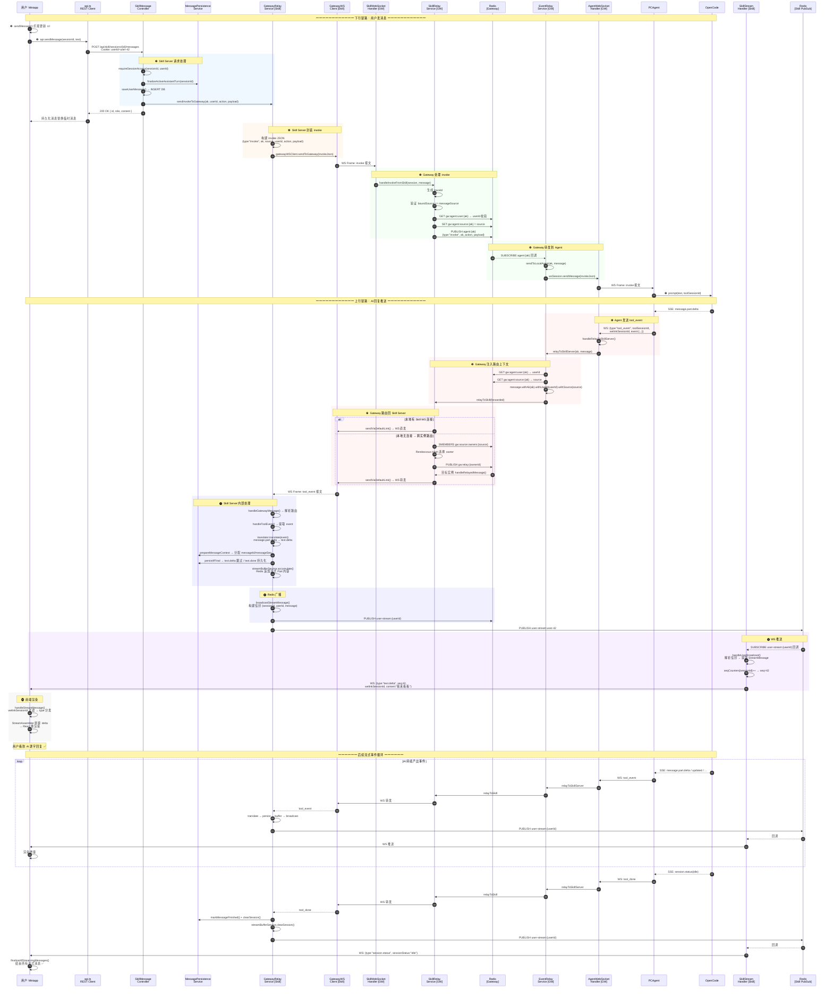

# 广播路由完整时序图

## 端到端时序图（下行 + 上行）

```mermaid
sequenceDiagram
    autonumber

    participant User as 用户 Miniapp
    participant API as api.ts<br/>REST Client
    participant Controller as SkillMessage<br/>Controller
    participant Persist as MessagePersistence<br/>Service
    participant RelayS as GatewayRelay<br/>Service [Skill]
    participant WSC as GatewayWS<br/>Client [Skill]
    participant SkillWH as SkillWebSocket<br/>Handler [GW]
    participant SkillRelay as SkillRelay<br/>Service [GW]
    participant RedisGW as Redis<br/>[Gateway]
    participant EventRelay as EventRelay<br/>Service [GW]
    participant AgentWH as AgentWebSocket<br/>Handler [GW]
    participant Agent as PCAgent
    participant OC as OpenCode

    Note over User,OC: ━━━━━━━━━━━━ 下行链路：用户发消息 ━━━━━━━━━━━━

    User->>User: ❶ sendMessage() 乐观更新 UI
    User->>API: ❷ api.sendMessage(sessionId, text)
    API->>Controller: POST /api/skill/sessions/{id}/messages<br/>Cookie: userId=user-42

    rect rgb(240, 248, 255)
        Note over Controller,Persist: ❸ Skill Server 请求处理
        Controller->>Controller: requireSessionAccess(sessionId, userId)
        Controller->>Persist: finalizeActiveAssistantTurn(sessionId)
        Controller->>Controller: saveUserMessage() → INSERT DB
        Controller->>RelayS: sendInvokeToGateway(ak, userId, action, payload)
    end

    Controller-->>API: 200 OK { id, role, content }
    API-->>User: 持久化消息替换临时消息

    rect rgb(255, 248, 240)
        Note over RelayS,WSC: ❹ Skill Server 封装 invoke
        RelayS->>RelayS: 构建 invoke JSON<br/>{type:"invoke", ak, source, userId, action, payload}
        RelayS->>WSC: gatewayWSClient.sendToGateway(invokeJson)
    end

    WSC->>SkillWH: WS Frame: invoke 报文

    rect rgb(245, 255, 245)
        Note over SkillWH,RedisGW: ❺ Gateway 处理 invoke
        SkillWH->>SkillRelay: handleInvokeFromSkill(session, message)
        SkillRelay->>SkillRelay: 生成 traceId
        SkillRelay->>SkillRelay: 验证 boundSource == messageSource
        SkillRelay->>RedisGW: GET gw:agent:user:{ak} → userId 校验
        SkillRelay->>RedisGW: SET gw:agent:source:{ak} = source
        SkillRelay->>RedisGW: PUBLISH agent:{ak}<br/>{type:"invoke", ak, action, payload}
    end

    rect rgb(245, 255, 245)
        Note over RedisGW,AgentWH: ❻ Gateway 转发到 Agent
        RedisGW-->>EventRelay: SUBSCRIBE agent:{ak} 回调
        EventRelay->>EventRelay: sendToLocalAgent(ak, message)
        EventRelay->>AgentWH: wsSession.sendMessage(invokeJson)
    end

    AgentWH->>Agent: WS Frame: invoke 报文
    Agent->>OC: ❼ prompt(text, toolSessionId)

    Note over User,OC: ━━━━━━━━━━━━ 上行链路：AI 回复推送 ━━━━━━━━━━━━

    OC-->>Agent: SSE: message.part.delta

    rect rgb(255, 245, 245)
        Note over Agent,AgentWH: ❽ Agent 发送 tool_event
        Agent->>AgentWH: WS: {type:"tool_event", toolSessionId,<br/>welinkSessionId, event:{...}}
        AgentWH->>AgentWH: handleRelayToSkillServer()
        AgentWH->>EventRelay: relayToSkillServer(ak, message)
    end

    rect rgb(255, 245, 245)
        Note over EventRelay,SkillRelay: ❾ Gateway 注入路由上下文
        EventRelay->>RedisGW: GET gw:agent:user:{ak} → userId
        EventRelay->>RedisGW: GET gw:agent:source:{ak} → source
        EventRelay->>EventRelay: message.withAk(ak).withUserId(userId).withSource(source)
        EventRelay->>SkillRelay: relayToSkill(forwarded)
    end

    rect rgb(255, 245, 245)
        Note over SkillRelay,WSC: ❿ Gateway 路由回 Skill Server
        alt 本地有 Skill WS 连接
            SkillRelay->>WSC: sendViaDefaultLink() → WS 直发
        else 本地无连接 → 跨实例路由
            SkillRelay->>RedisGW: SMEMBERS gw:source:owners:{source}
            SkillRelay->>SkillRelay: Rendezvous Hash 选择 owner
            SkillRelay->>RedisGW: PUBLISH gw:relay:{ownerId}
            RedisGW-->>SkillRelay: 目标实例 handleRelayedMessage()
            SkillRelay->>WSC: sendViaDefaultLink() → WS 转发
        end
    end

    WSC-->>RelayS: WS Frame: tool_event 报文

    rect rgb(240, 240, 255)
        Note over RelayS,Persist: ⓫ Skill Server 内部处理
        RelayS->>RelayS: handleGatewayMessage() → 解析路由
        RelayS->>RelayS: handleToolEvent() → 提取 event
        RelayS->>RelayS: translator.translate(event)<br/>message.part.delta → text.delta
        RelayS->>Persist: prepareMessageContext → 分配 messageId/messageSeq
        RelayS->>Persist: persistIfFinal → text.delta 跳过 / text.done 持久化
        RelayS->>RelayS: streamBufferService.accumulate()<br/>Redis 追加流式 Part 内容
    end

    rect rgb(240, 240, 255)
        Note over RelayS: ⓬ Redis 广播
        RelayS->>RelayS: broadcastStreamMessage()<br/>构建信封 {sessionId, userId, message}
        RelayS->>RedisGW: PUBLISH user-stream:{userId}
    end

    participant StreamH as SkillStream<br/>Handler [Skill]
    participant RedisSkill as Redis<br/>[Skill PubSub]

    RelayS->>RedisSkill: PUBLISH user-stream:user-42

    rect rgb(248, 240, 255)
        Note over RedisSkill,StreamH: ⓭ WS 推送
        RedisSkill-->>StreamH: SUBSCRIBE user-stream:{userId} 回调
        StreamH->>StreamH: handleUserBroadcast()<br/>解析信封 → 提取 StreamMessage
        StreamH->>StreamH: seqCounters[sessionId]++ → seq=42
        StreamH->>User: WS: {type:"text.delta", seq:42,<br/>welinkSessionId, content:"我来看看"}
    end

    rect rgb(248, 248, 248)
        Note over User: ⓮ 前端渲染
        User->>User: handleStreamMessage()<br/>welinkSessionId 过滤 → type 分发
        User->>User: StreamAssembler 拼接 delta<br/>→ React 重渲染
    end

    Note over User: 用户看到 AI 逐字回复 ✅

    Note over User,OC: ━━━━━━ 后续流式事件循环 ━━━━━━

    loop AI 持续产出事件
        OC-->>Agent: SSE: message.part.delta / updated / ...
        Agent->>AgentWH: WS: tool_event
        AgentWH->>EventRelay: relayToSkillServer
        EventRelay->>SkillRelay: relayToSkill
        SkillRelay->>WSC: WS 转发
        WSC-->>RelayS: tool_event
        RelayS->>RelayS: translate → persist → buffer → broadcast
        RelayS->>RedisSkill: PUBLISH user-stream:{userId}
        RedisSkill-->>StreamH: 回调
        StreamH->>User: WS 推送
        User->>User: 渲染增量
    end

    OC-->>Agent: SSE: session.status(idle)
    Agent->>AgentWH: WS: tool_done
    AgentWH->>EventRelay: relayToSkillServer
    EventRelay->>SkillRelay: relayToSkill
    SkillRelay->>WSC: WS 转发
    WSC-->>RelayS: tool_done
    RelayS->>Persist: markMessageFinished() + clearSession()
    RelayS->>RelayS: streamBufferService.clearSession()
    RelayS->>RedisSkill: PUBLISH user-stream:{userId}
    RedisSkill-->>StreamH: 回调
    StreamH->>User: WS: {type:"session.status", sessionStatus:"idle"}
    User->>User: finalizeAllStreamingMessages()<br/>结束所有流式消息 ✅
```
