# OpenCode CUI 绔埌绔崗璁叏鏅?

> 鐗堟湰锛?.1  
> 鏃ユ湡锛?026-03-08

---

## 绯荤粺鏋舵瀯

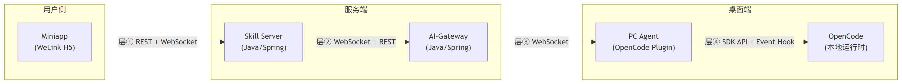

<details>
<summary>鏌ョ湅 Mermaid 婧愮爜</summary>

```mermaid
graph LR
    subgraph "鐢ㄦ埛渚?
        A["Miniapp<br/>(WeLink H5)"]
    end

    subgraph "鏈嶅姟绔?
        B["Skill Server<br/>(Java/Spring)"]
        C["AI-Gateway<br/>(Java/Spring)"]
    end

    subgraph "妗岄潰绔?
        D["PC Agent<br/>(OpenCode Plugin)"]
        E["OpenCode<br/>(鏈湴杩愯鏃?"]
    end

    A -- "灞傗憼 REST + WebSocket" --> B
    B -- "灞傗憽 WebSocket + REST" --> C
    C -- "灞傗憿 WebSocket" --> D
    D -- "灞傗懀 SDK API + Event Hook" --> E
```

</details>

---

## 鍥涘眰鍗忚鎬昏

| 灞? | 閾捐矾                      | 涓嬭锛堟寚浠ゆ柟鍚戯級 | 涓婅锛堜簨浠舵柟鍚戯級         | 璁よ瘉             |
| --- | ------------------------- | ---------------- | ------------------------ | ---------------- |
| 鈶?  | Miniapp 鈫?Skill Server    | 10 REST API      | 19 绉?StreamMessage (WS) | WeLink Cookie    |
| 鈶?  | Skill Server 鈫?AI-Gateway | 6 绉?invoke (WS) | 6 绉嶄簨浠?(WS) + 3 REST   | 鍐呴儴 Token       |
| 鈶?  | AI-Gateway 鈫?PC Agent     | 7 绉嶆秷鎭?(WS)    | 7 绉嶆秷鎭?(WS)            | AK/SK 瀛愬崗璁鍚?|
| 鈶?  | PC Agent 鈫?OpenCode       | 7 SDK 璋冪敤       | 17 绉嶄簨浠?+ 12 绉?Part   | 鏃狅紙鏈満杩涚▼闂达級 |

---

## 瀹屾暣娴佺▼鍥?

### 娴佺▼ 1锛氬垱寤轰細璇?

![娴佺▼ 1锛氬垱寤轰細璇漖(images/02-create-session.png)

<details>
<summary>鏌ョ湅 Mermaid 婧愮爜</summary>

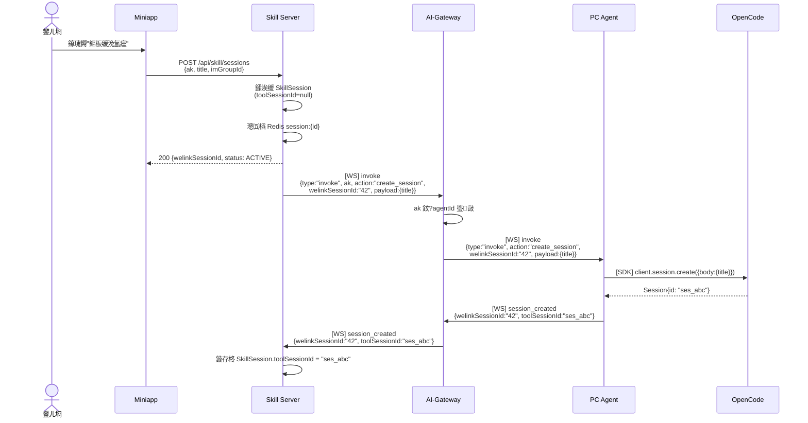

</details>

---

### 娴佺▼ 2锛氬彂閫佹秷鎭紙鍚?AI 娴佸紡鍥炲锛?

![娴佺▼ 2锛氬彂閫佹秷鎭紙鍚?AI 娴佸紡鍥炲锛塢(images/03-send-message.png)

<details>
<summary>鏌ョ湅 Mermaid 婧愮爜</summary>

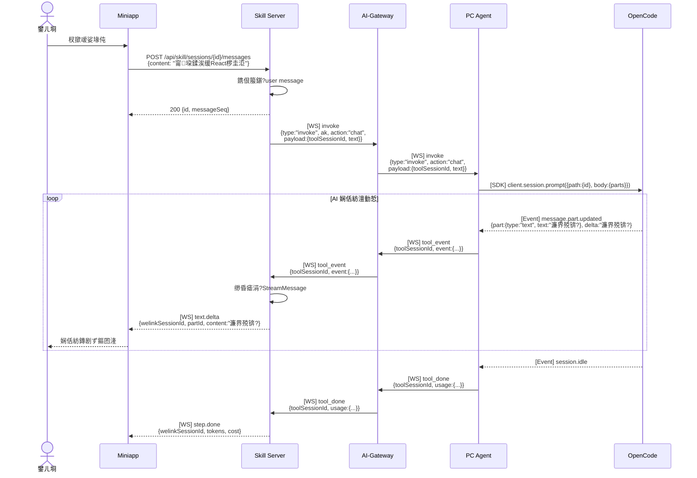

</details>

---

### 娴佺▼ 3锛欰I 鎻愰棶锛坬uestion tool锛? 鐢ㄦ埛鍥炵瓟

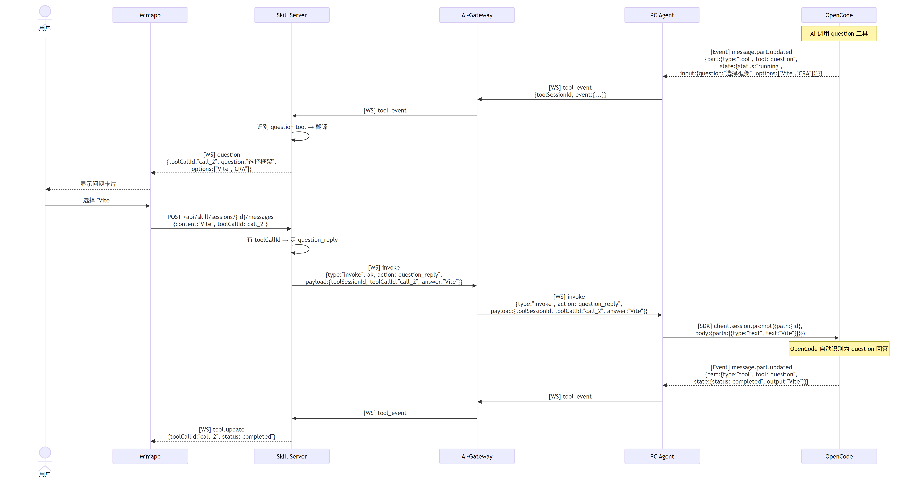

<details>
<summary>鏌ョ湅 Mermaid 婧愮爜</summary>

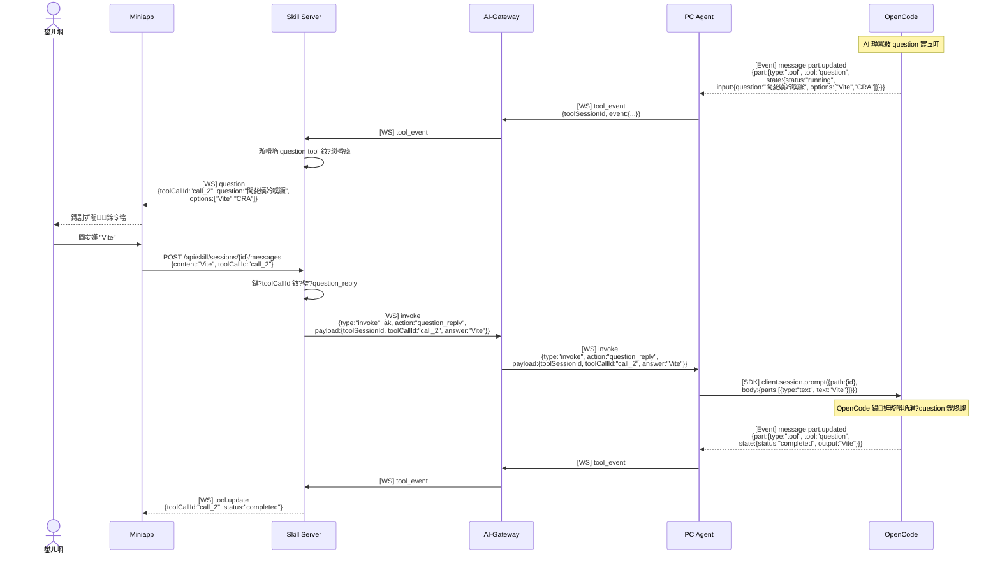

</details>

---

### 娴佺▼ 4锛氭潈闄愯姹?+ 鐢ㄦ埛鎵瑰噯

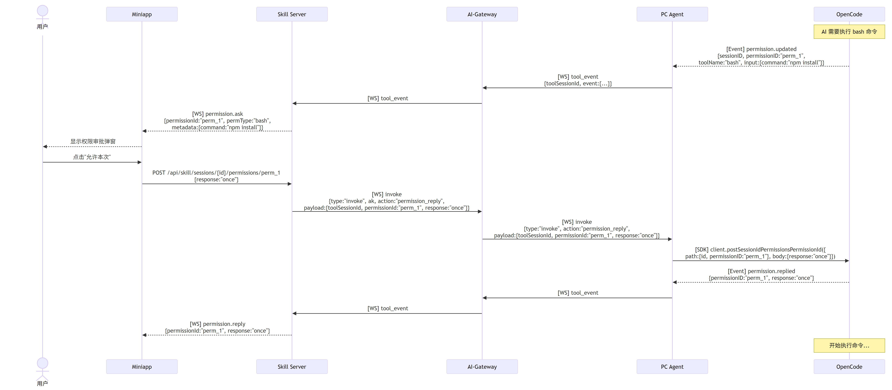

<details>
<summary>鏌ョ湅 Mermaid 婧愮爜</summary>

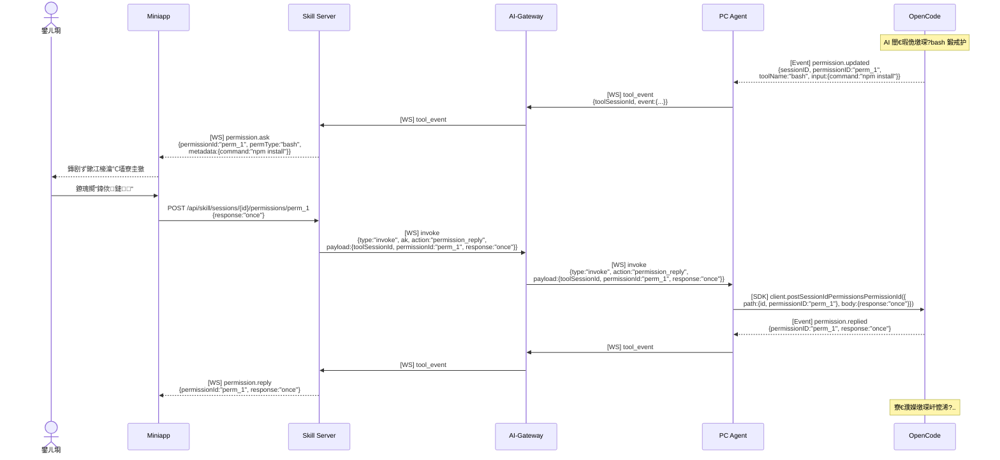

</details>

---

### 娴佺▼ 5锛氫腑姝㈡墽琛?

![娴佺▼ 5锛氫腑姝㈡墽琛宂(images/06-abort-execution.png)

<details>
<summary>鏌ョ湅 Mermaid 婧愮爜</summary>

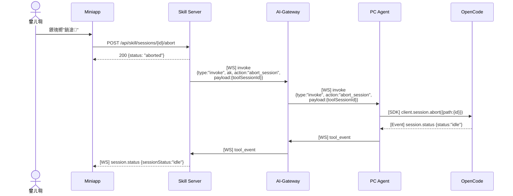

</details>

---

### 娴佺▼ 6锛氬叧闂細璇?

![娴佺▼ 6锛氬叧闂細璇漖(images/07-close-session.png)

<details>
<summary>鏌ョ湅 Mermaid 婧愮爜</summary>

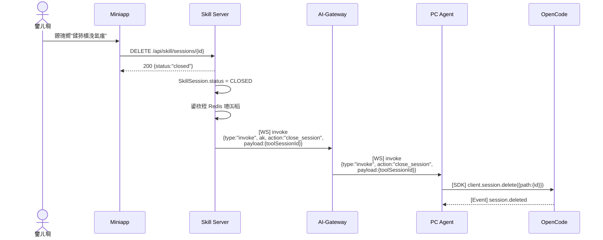

</details>

---

### 娴佺▼ 7锛欰gent 涓婄嚎/涓嬬嚎

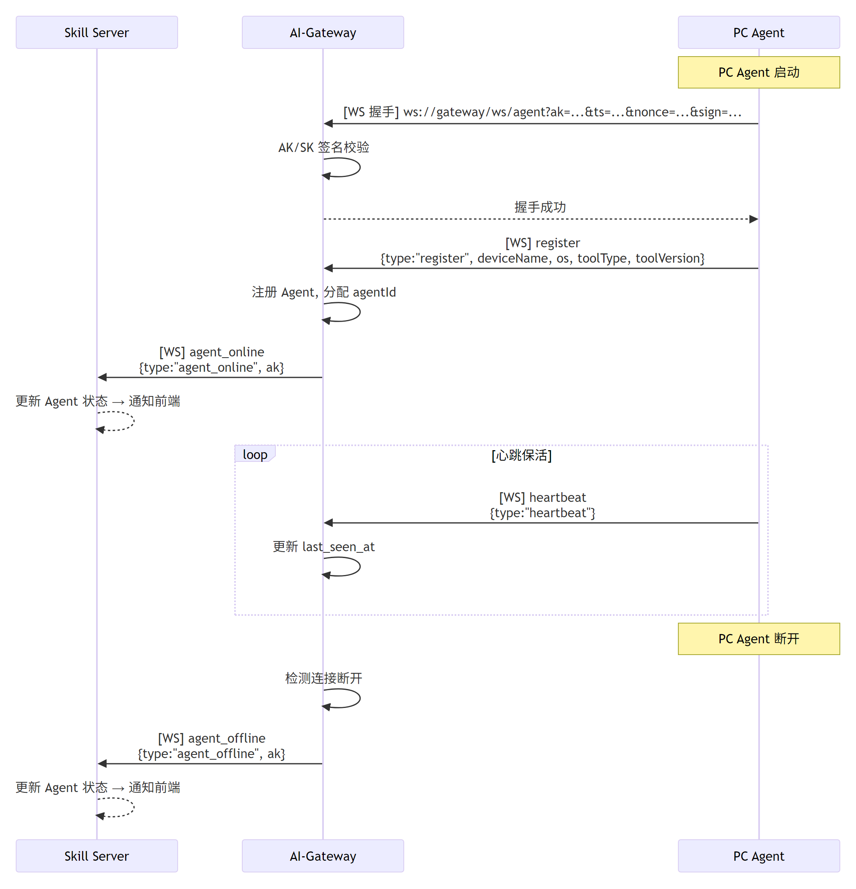

<details>
<summary>鏌ョ湅 Mermaid 婧愮爜</summary>

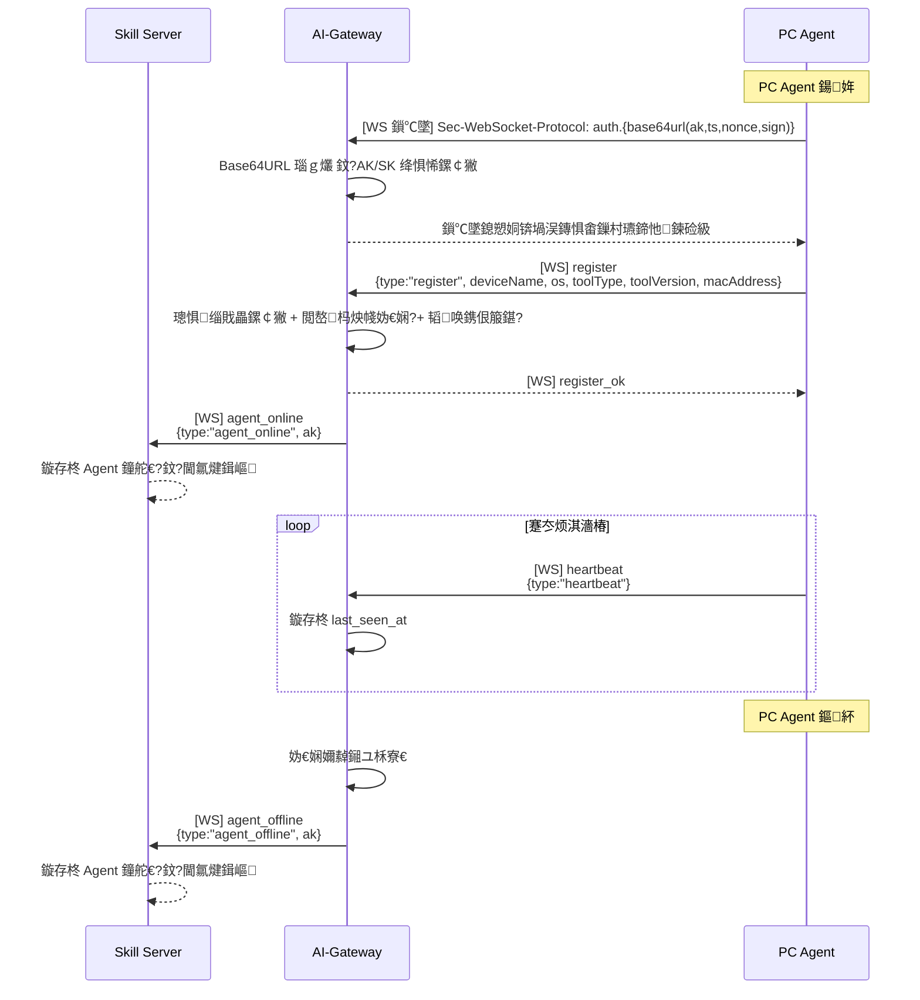

</details>

---

### 娴佺▼ 8锛氬仴搴锋鏌?

![娴佺▼ 8锛氬仴搴锋鏌(images/09-health-check.png)

<details>
<summary>鏌ョ湅 Mermaid 婧愮爜</summary>

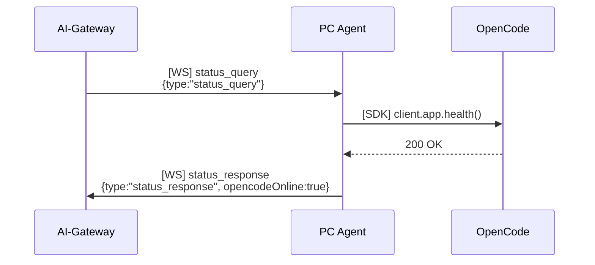

</details>

---

## 鍚勫眰鍗忚娑堟伅鏄犲皠

### 涓嬭鏄犲皠锛堟寚浠ゆ柟鍚戯細鐢ㄦ埛 鈫?AI锛?

| 鐢ㄦ埛鎿嶄綔 | 灞傗憼 Miniapp                                      | 灞傗憽 Skill鈫扜W              | 灞傗憿 GW鈫扐gent              | 灞傗懀 Agent鈫扥penCode                       |
| -------- | ------------------------------------------------ | ------------------------- | ------------------------- | ---------------------------------------- |
| 鍒涘缓浼氳瘽 | `POST /sessions`                                 | `invoke.create_session`   | `invoke.create_session`   | `session.create()`                       |
| 鍙戞秷鎭?  | `POST /sessions/{id}/messages`                   | `invoke.chat`             | `invoke.chat`             | `session.prompt()`                       |
| 鍥炵瓟鎻愰棶 | `POST /sessions/{id}/messages`<br/>(+toolCallId) | `invoke.question_reply`   | `invoke.question_reply`   | `session.prompt()`                       |
| 鏉冮檺鎵瑰噯 | `POST /sessions/{id}/permissions/{permId}`       | `invoke.permission_reply` | `invoke.permission_reply` | `postSessionIdPermissionsPermissionId()` |
| 涓     | `POST /sessions/{id}/abort`                      | `invoke.abort_session`    | `invoke.abort_session`    | `session.abort()`                        |
| 鍏抽棴浼氳瘽 | `DELETE /sessions/{id}`                          | `invoke.close_session`    | `invoke.close_session`    | `session.delete()`                       |
| 杞彂鍒癐M | `POST /sessions/{id}/send-to-im`                 | 鈥?                        | 鈥?                        | 鈥?                                       |
| 鏌gent  | `GET /agents`                                    | REST `GET /agents`        | 鈥?                        | 鈥?                                       |
| 鍋ュ悍妫€鏌?| 鈥?                                               | REST `GET /agents/status` | `status_query`            | `app.health()`                           |

### 涓婅鏄犲皠锛堜簨浠舵柟鍚戯細AI 鈫?鐢ㄦ埛锛?

| OpenCode 浜嬩欢 | 灞傗懀 Event                                          | 灞傗憿 Agent鈫扜W | 灞傗憽 GW鈫扴kill    | 灞傗憼 StreamMessage                  |
| ------------- | -------------------------------------------------- | ------------ | --------------- | ---------------------------------- |
| 鏂囨湰鐢熸垚      | `message.part.updated`<br/>(part.type=text)        | `tool_event` | `tool_event`    | `text.delta` / `text.done`         |
| 鎬濈淮閾?       | `message.part.updated`<br/>(part.type=reasoning)   | `tool_event` | `tool_event`    | `thinking.delta` / `thinking.done` |
| 宸ュ叿璋冪敤      | `message.part.updated`<br/>(part.type=tool)        | `tool_event` | `tool_event`    | `tool.update`                      |
| AI 鎻愰棶       | `message.part.updated`<br/>(tool=question)         | `tool_event` | `tool_event`    | `question`                         |
| 鏉冮檺璇锋眰      | `permission.updated`                               | `tool_event` | `tool_event`    | `permission.ask`                   |
| 鏉冮檺鍝嶅簲      | `permission.replied`                               | `tool_event` | `tool_event`    | `permission.reply`                 |
| 浼氳瘽鐘舵€?     | `session.status`                                   | `tool_event` | `tool_event`    | `session.status`                   |
| 鏍囬鏇存柊      | `session.updated`                                  | `tool_event` | `tool_event`    | `session.title`                    |
| 鎺ㄧ悊寮€濮?     | `message.part.updated`<br/>(part.type=step-start)  | `tool_event` | `tool_event`    | `step.start`                       |
| 鎺ㄧ悊缁撴潫      | `message.part.updated`<br/>(part.type=step-finish) | `tool_event` | `tool_event`    | `step.done`                        |
| 浼氳瘽閿欒      | `session.error`                                    | `tool_event` | `tool_error`    | `session.error`                    |
| 鎵ц瀹屾垚      | `session.idle`                                     | `tool_done`  | `tool_done`     | `step.done`                        |
| Agent 涓婄嚎    | 鈥?                                                 | `register`   | `agent_online`  | `agent.online`                     |
| Agent 涓嬬嚎    | 鈥?                                                 | 杩炴帴鏂紑     | `agent_offline` | `agent.offline`                    |

---

## ID 娴佽浆鍏ㄦ櫙

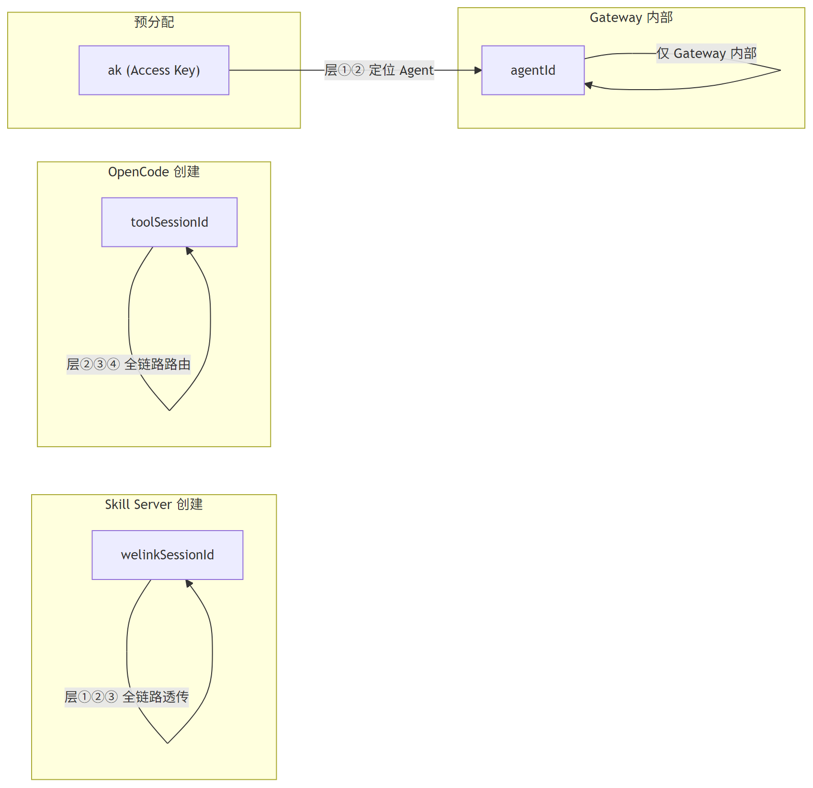

<details>
<summary>鏌ョ湅 Mermaid 婧愮爜</summary>

```mermaid
graph LR
    subgraph "Skill Server 鍒涘缓"
        WID["welinkSessionId"]
    end

    subgraph "OpenCode 鍒涘缓"
        TID["toolSessionId"]
    end

    subgraph "棰勫垎閰?
        AK["ak (Access Key)"]
    end

    subgraph "Gateway 鍐呴儴"
        AID["agentId"]
    end

    WID -->|"灞傗憼鈶♀憿 鍏ㄩ摼璺€忎紶"| WID
    TID -->|"灞傗憽鈶⑩懀 鍏ㄩ摼璺矾鐢?| TID
    AK -->|"灞傗憼鈶?瀹氫綅 Agent"| AID
    AID -->|"浠?Gateway 鍐呴儴"| AID
```

</details>

| ID                | 鍒涘缓鑰?      | 鎰熺煡鑼冨洿                         | 鐢ㄩ€?                        |
| ----------------- | ------------ | -------------------------------- | ---------------------------- |
| `welinkSessionId` | Skill Server | 鍏ㄩ摼璺紙Skill鈫扜W鈫扐gent鈫掑洖浼狅級    | 灞傗憼 浼氳瘽鏍囪瘑锛屽叾浠栧眰鍘熸牱閫忎紶 |
| `toolSessionId`   | OpenCode SDK | Agent鈫扜W鈫扴kill锛堝洖浼狅級           | 灞傗憽鈶⑩懀 浼氳瘽璺敱               |
| `ak`              | 棰勫垎閰?      | Miniapp / Skill Server / Gateway | 瀹氫綅 Agent 杩炴帴              |
| `agentId`         | Gateway      | 浠?Gateway 鍐呴儴                  | 鍐呴儴璺敱锛屽澶栦笉鏆撮湶         |

