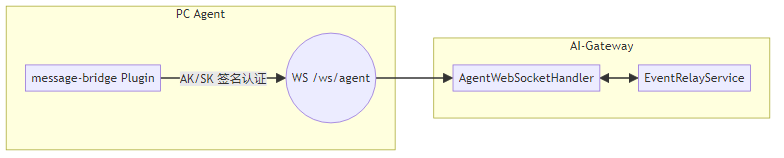
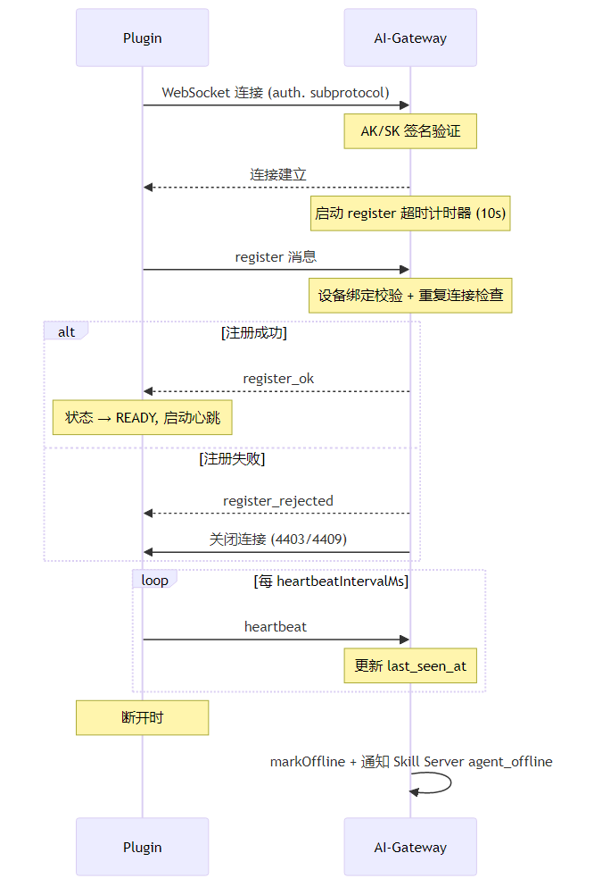
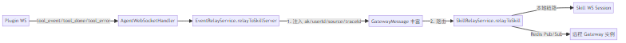
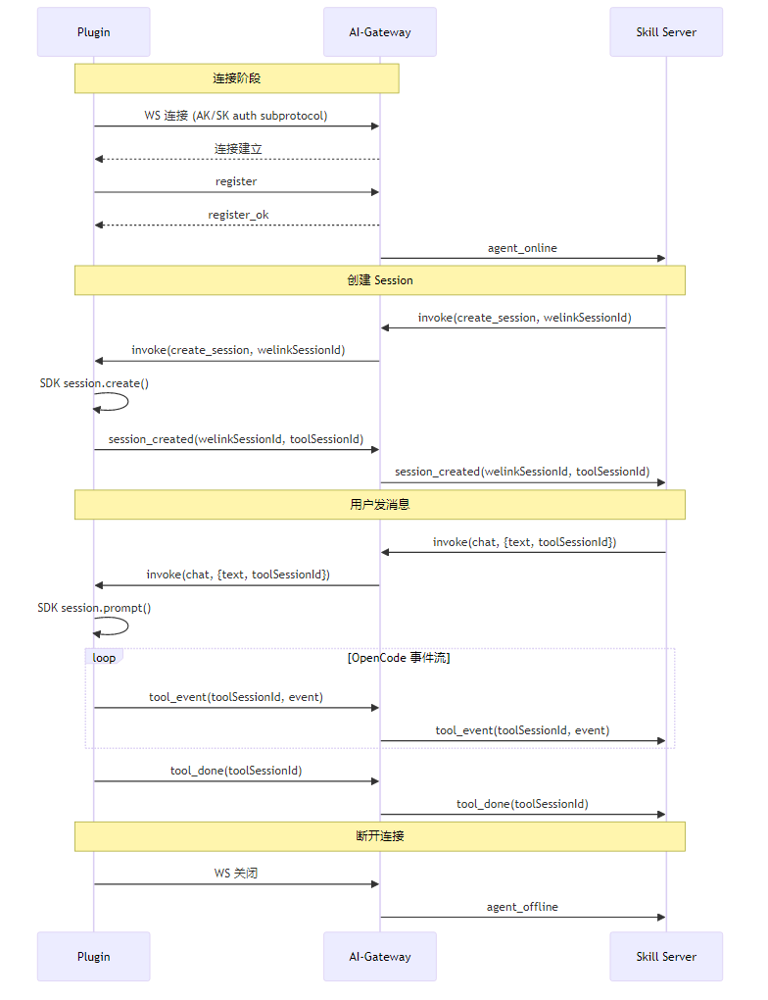

# Layer③ 协议：AI-Gateway ↔ Plugin (message-bridge)

> 本文档基于代码实现逐项核对，确保协议描述与实际行为一致。

## 概述

| 方向 | 传输方式 | 端点 |
|---|---|---|
| Plugin → Gateway | WebSocket（register / heartbeat / upstream 消息） | `ws://{gateway}/ws/agent` |
| Gateway → Plugin | WebSocket（invoke / status_query 消息） | 同上连接 |
| Gateway → Skill Server | 透传中继 | 内部 WS（`/ws/skill`）见 layer2 |

**角色定义**：
- **Plugin（message-bridge）**：运行在 PC 端的 OpenCode 插件，TypeScript 实现
- **AI-Gateway**：Java 中间层，负责认证、路由、多实例协调



---

## 一、WebSocket 连接

### 1.1 连接端点

```
ws://{gateway-host}:{port}/ws/agent
```

| 配置项 | 位置 | 说明 |
|---|---|---|
| `gateway.url` | Plugin 配置文件 `~/.opencode/bridge.jsonc` | Gateway WS 地址 |
| `/ws/agent` 路由 | Gateway `GatewayConfig.java` | WebSocket Handler 映射 |
| 最大帧大小 | `gateway.websocket.max-text-message-buffer-size-bytes` | 默认 1MB |

**代码**：
- Plugin 端：[GatewayConnection.ts L208-L211](file:///D:/02_Lab/Projects/sandbox/opencode-CUI/plugins/message-bridge/src/connection/GatewayConnection.ts#L208-L211)
- Gateway 端：[GatewayConfig.java L31-L33](file:///D:/02_Lab/Projects/sandbox/opencode-CUI/ai-gateway/src/main/java/com/opencode/cui/gateway/config/GatewayConfig.java#L31-L33)

---

### 1.2 认证机制：AK/SK HMAC-SHA256 签名

#### 认证流程

1. Plugin 从配置读取 `ak`（Access Key）和 `sk`（Secret Key）
2. 计算签名：`HMAC-SHA256(SK, "{AK}{timestamp}{nonce}")` → Base64 编码
3. 生成认证载荷 JSON → Base64url 编码 → 嵌入 WebSocket 子协议头
4. Gateway 解码验证签名、时间窗、Nonce 防重放

#### Plugin 端：签名生成

```typescript
// AkSkAuth.ts
const ts = Math.floor(Date.now() / 1000).toString();  // Unix 秒
const nonce = randomUUID();
const sign = createHmac('sha256', secretKey)
  .update(`${accessKey}${ts}${nonce}`)
  .digest('base64');
```

**生成的 `AkSkAuthPayload`**：

```json
{
  "ak": "my-access-key",
  "ts": "1710316800",
  "nonce": "550e8400-e29b-41d4-a716-446655440000",
  "sign": "kE3x5Q8rF2..."
}
```

| 字段 | 类型 | 必填 | 说明 |
|---|---|---|---|
| `ak` | string | ✅ | Access Key |
| `ts` | string | ✅ | Unix 时间戳（秒），字符串格式 |
| `nonce` | string | ✅ | UUID v4 随机字符串，防重放 |
| `sign` | string | ✅ | Base64 编码的 HMAC-SHA256 签名 |

**代码**：[AkSkAuth.ts L29-L44](file:///D:/02_Lab/Projects/sandbox/opencode-CUI/plugins/message-bridge/src/connection/AkSkAuth.ts#L29-L44)

#### WebSocket 子协议传输

载荷通过 `Sec-WebSocket-Protocol` 头传递，格式为 `auth.` + Base64url 编码：

```
Sec-WebSocket-Protocol: auth.eyJhayI6Im15LWFjY2Vzcy1rZXkiLCJ0cyI6IjE3MTAzMTY4MDAiLCJub25jZSI6IjU1MGU4NDAwLWUyOWItNDFkNC1hNzE2LTQ0NjY1NTQ0MDAwMCIsInNpZ24iOiJrRTN4NVE4ckYyLi4uIn0
```

> 使用 Base64url（RFC 4648 §5）而非 标准 Base64，因为 WebSocket 子协议 token 不允许包含 `+`、`/`、`=`。

**代码**：[GatewayConnection.ts#buildAuthSubprotocol L119-L121](file:///D:/02_Lab/Projects/sandbox/opencode-CUI/plugins/message-bridge/src/connection/GatewayConnection.ts#L119-L121)

#### Gateway 端：签名验证

| 步骤 | 说明 | 失败处理 |
|---|---|---|
| 1. 提取子协议 | 从 `Sec-WebSocket-Protocol` 头找 `auth.` 前缀 | 拒绝握手 |
| 2. Base64url 解码 | URL-safe Base64 解码为 JSON | 拒绝握手 |
| 3. 时间窗验证 | `|now - ts| <= 300s`（±5 分钟） | 拒绝握手 |
| 4. Nonce 防重放 | Redis `SET NX` + 5min TTL | 拒绝握手 |
| 5. AK 查库 | `ak_sk_credential` 表查 `ACTIVE` 记录 | 拒绝握手 |
| 6. 签名比对 | `HMAC-SHA256(SK, AK+ts+nonce)` 常量时间比较 | 拒绝握手 |
| 7. 返回 userId | 认证成功，userId 存入 session 属性 | — |

**配置**：

| 参数 | 配置项 | 默认值 |
|---|---|---|
| 时间窗容差 | `gateway.auth.timestamp-tolerance-seconds` | `300` (5min) |
| Nonce TTL | `gateway.auth.nonce-ttl-seconds` | `300` (5min) |

**代码**：
- 握手拦截：[AgentWebSocketHandler.java#beforeHandshake L104-L171](file:///D:/02_Lab/Projects/sandbox/opencode-CUI/ai-gateway/src/main/java/com/opencode/cui/gateway/ws/AgentWebSocketHandler.java#L104-L171)
- 签名验证：[AkSkAuthService.java#verify L57-L118](file:///D:/02_Lab/Projects/sandbox/opencode-CUI/ai-gateway/src/main/java/com/opencode/cui/gateway/service/AkSkAuthService.java#L57-L118)

---

### 1.3 连接生命周期



#### 连接状态机（Plugin 端）

| 状态 | 说明 |
|---|---|
| `DISCONNECTED` | 未连接 |
| `CONNECTING` | 正在建立 WS 连接 |
| `CONNECTED` | WS 已打开，尚未 register |
| `READY` | 收到 `register_ok`，可收发业务消息 |

#### 重连策略

| 参数 | 配置项 | 默认值 | 说明 |
|---|---|---|---|
| 基础延迟 | `gateway.reconnect.baseMs` | `1000` | 首次重连延迟（ms） |
| 最大延迟 | `gateway.reconnect.maxMs` | `30000` | 最大重连延迟（ms） |
| 指数退避 | `gateway.reconnect.exponential` | `true` | `delay = min(base × 2^(n-1), max)` |

**不重连条件**：
- 手动断开（`manuallyDisconnected = true`）
- `AbortSignal` 已中断
- Gateway 返回拒绝关闭码（`4403` / `4408` / `4409`）

| 关闭码 | 常量 | 含义 |
|---|---|---|
| `4403` | `CLOSE_BINDING_FAILED` | 设备绑定校验失败 |
| `4408` | `CLOSE_REGISTER_TIMEOUT` | 注册超时（未在 N 秒内发送 register） |
| `4409` | `CLOSE_DUPLICATE` | 重复连接被拒 |

**代码**：[GatewayConnection.ts#attemptReconnect L389-L428](file:///D:/02_Lab/Projects/sandbox/opencode-CUI/plugins/message-bridge/src/connection/GatewayConnection.ts#L389-L428)

---

## 二、上行协议（Plugin → Gateway）

Plugin 通过 WS 发送的所有消息类型如下：

| 消息类型 | 用途 | 注册后才允许 |
|---|---|---|
| `register` | 设备注册 | ❌（首条消息） |
| `heartbeat` | 心跳保活 | ✅ |
| `tool_event` | OpenCode 事件流转发 | ✅ |
| `tool_done` | 工具执行完成信号 | ✅ |
| `tool_error` | 工具/会话错误 | ✅ |
| `session_created` | OpenCode 会话创建结果 | ✅ |
| `status_response` | OpenCode 健康状态响应 | ✅ |

---

### Upstream-1：`register` — 设备注册

连接建立后 Plugin 必须在 **`registerTimeoutSeconds`**（默认 10s）内发送此消息，否则被服务端强制关闭（`4408`）。

```json
{
  "type": "register",
  "deviceName": "My-MacBook-Pro",
  "macAddress": "AA:BB:CC:DD:EE:FF",
  "os": "darwin",
  "toolType": "opencode",
  "toolVersion": "0.3.0"
}
```

| 字段 | 类型 | 必填 | 说明 |
|---|---|---|---|
| `type` | string | ✅ | 固定 `"register"` |
| `deviceName` | string | ✅ | 设备名称（`os.hostname()`） |
| `macAddress` | string | ✅ | MAC 地址（用于设备绑定校验） |
| `os` | string | ✅ | 操作系统（`os.platform()`，如 `win32`, `darwin`, `linux`） |
| `toolType` | string | ✅ | 工具类型（配置 `gateway.channel`，默认 `"opencode"`） |
| `toolVersion` | string | ✅ | 工具版本号 |

**Gateway 处理**（`handleRegister`）：

| 步骤 | 说明 | 失败响应 |
|---|---|---|
| 1. 设备绑定校验 | `DeviceBindingService.validate(ak, macAddress, toolType)` | `register_rejected` + `4403` |
| 2. 重复连接检查 | `EventRelayService.hasAgentSession(ak)` | `register_rejected` + `4409` |
| 3. DB 注册 | `AgentRegistryService.register(...)` | — |
| 4. 发送 `register_ok` | → Plugin | — |
| 5. 通知 Skill Server | 发送 `agent_online` | — |

**代码**：
- Plugin 端发送：[BridgeRuntime.ts L160-L168](file:///D:/02_Lab/Projects/sandbox/opencode-CUI/plugins/message-bridge/src/runtime/BridgeRuntime.ts#L160-L168)
- Gateway 端处理：[AgentWebSocketHandler.java#handleRegister L271-L326](file:///D:/02_Lab/Projects/sandbox/opencode-CUI/ai-gateway/src/main/java/com/opencode/cui/gateway/ws/AgentWebSocketHandler.java#L271-L326)

---

### Upstream-2：`heartbeat` — 心跳保活

```json
{
  "type": "heartbeat",
  "timestamp": "2024-03-13T06:00:00.000Z"
}
```

| 字段 | 类型 | 必填 | 说明 |
|---|---|---|---|
| `type` | string | ✅ | 固定 `"heartbeat"` |
| `timestamp` | string | ❌ | ISO 8601 时间戳（Plugin 端携带，Gateway 端不校验） |

**发送间隔**：`heartbeatIntervalMs`（默认 30s）

**Gateway 处理**：`AgentRegistryService.heartbeat(agentId)` → 更新 DB `last_seen_at`

**代码**：
- Plugin 端：[GatewayConnection.ts#setupHeartbeat L363-L380](file:///D:/02_Lab/Projects/sandbox/opencode-CUI/plugins/message-bridge/src/connection/GatewayConnection.ts#L363-L380)
- Gateway 端：[AgentWebSocketHandler.java#handleHeartbeat L328-L336](file:///D:/02_Lab/Projects/sandbox/opencode-CUI/ai-gateway/src/main/java/com/opencode/cui/gateway/ws/AgentWebSocketHandler.java#L328-L336)

---

### Upstream-3：`tool_event` — OpenCode 事件流转发

Plugin 监听 OpenCode SDK 事件，过滤后封装为 `tool_event` 上报。

```json
{
  "type": "tool_event",
  "toolSessionId": "opencode-session-abc",
  "event": {
    "type": "message.part.updated",
    "properties": {
      "sessionID": "opencode-session-abc",
      "messageID": "msg-001",
      "part": { "id": "part-001", "type": "text", "text": "Hello" },
      "delta": "Hello"
    }
  }
}
```

| 字段 | 类型 | 必填 | 说明 |
|---|---|---|---|
| `type` | string | ✅ | 固定 `"tool_event"` |
| `toolSessionId` | string | ✅ | OpenCode session ID |
| `event` | object | ✅ | **OpenCode 原始事件对象**（透传，Gateway 不解析） |

**支持的 OpenCode 事件类型**（`upstream-events.ts`）：

| 事件类型 | 来源 SDK | 说明 |
|---|---|---|
| `message.updated` | `@opencode-ai/sdk` | 消息元数据更新 |
| `message.part.updated` | `@opencode-ai/sdk` | 消息 Part 更新（文本/推理/工具/文件） |
| `message.part.delta` | `@opencode-ai/sdk/v2` | 增量文本流 |
| `message.part.removed` | `@opencode-ai/sdk` | Part 被移除 |
| `session.status` | `@opencode-ai/sdk` | 会话状态变更 |
| `session.idle` | `@opencode-ai/sdk` | 会话进入空闲 |
| `session.updated` | `@opencode-ai/sdk` | 会话信息更新（如标题） |
| `session.error` | `@opencode-ai/sdk` | 会话级错误 |
| `permission.updated` | `@opencode-ai/sdk` | 权限状态变更 |
| `permission.asked` | `@opencode-ai/sdk/v2` | 权限申请 |
| `question.asked` | `@opencode-ai/sdk/v2` | 交互式提问 |

**事件过滤**：Plugin 通过 `EventFilter` 根据配置 `events.allowlist` 过滤，未在白名单的事件被丢弃。

**Gateway 处理**：`handleRelayToSkillServer` → `EventRelayService.relayToSkillServer` → 透传给 Skill Server。

**代码**：
- Plugin 端发送：[BridgeRuntime.ts#handleEvent L224-L284](file:///D:/02_Lab/Projects/sandbox/opencode-CUI/plugins/message-bridge/src/runtime/BridgeRuntime.ts#L224-L284)
- Plugin 端事件定义：[upstream-events.ts](file:///D:/02_Lab/Projects/sandbox/opencode-CUI/plugins/message-bridge/src/contracts/upstream-events.ts)
- Gateway 端中继：[AgentWebSocketHandler.java#handleRelayToSkillServer L338-L351](file:///D:/02_Lab/Projects/sandbox/opencode-CUI/ai-gateway/src/main/java/com/opencode/cui/gateway/ws/AgentWebSocketHandler.java#L338-L351)

---

### Upstream-4：`tool_done` — 工具执行完成

```json
{
  "type": "tool_done",
  "toolSessionId": "opencode-session-abc",
  "welinkSessionId": "1234567890123456",
  "usage": null
}
```

| 字段 | 类型 | 必填 | 说明 |
|---|---|---|---|
| `type` | string | ✅ | 固定 `"tool_done"` |
| `toolSessionId` | string | ✅ | OpenCode session ID |
| `welinkSessionId` | string | ❌ | Welink session ID（如有） |
| `usage` | object | ❌ | Token 使用统计（预留字段） |

**触发时机**（`ToolDoneCompat` 逻辑）：
- `session.idle` 事件后（由 `ToolDoneCompat.handleSessionIdle` 决定是否发送）
- Invoke 操作（chat 等）完成后（由 `ToolDoneCompat.handleInvokeCompleted` 决定）

**Gateway 处理**：透传给 Skill Server。

**代码**：
- Plugin 端：[BridgeRuntime.ts#sendToolDone L704-L741](file:///D:/02_Lab/Projects/sandbox/opencode-CUI/plugins/message-bridge/src/runtime/BridgeRuntime.ts#L704-L741)
- 消息定义：[transport-messages.ts L48-L53](file:///D:/02_Lab/Projects/sandbox/opencode-CUI/plugins/message-bridge/src/contracts/transport-messages.ts#L48-L53)

---

### Upstream-5：`tool_error` — 工具/会话错误

```json
{
  "type": "tool_error",
  "welinkSessionId": "1234567890123456",
  "toolSessionId": "opencode-session-abc",
  "error": "session not found: opencode-session-abc",
  "reason": "session_not_found"
}
```

| 字段 | 类型 | 必填 | 说明 |
|---|---|---|---|
| `type` | string | ✅ | 固定 `"tool_error"` |
| `welinkSessionId` | string | ❌ | Welink session ID |
| `toolSessionId` | string | ❌ | OpenCode session ID |
| `error` | string | ✅ | 错误描述文本 |
| `reason` | string | ❌ | 结构化错误原因代码 |

**`reason` 自动映射规则**（`getToolErrorReason`）：

当 `errorMessage` 包含以下文本时（大小写不敏感），自动设置 `reason = "session_not_found"`：

| 匹配文本 | 说明 |
|---|---|
| `"not found"` | 通用未找到 |
| `"404"` | HTTP 404 |
| `"session_not_found"` | 明确 session 无效 |
| `"unexpected eof"` | 连接异常中断 |
| `"json parse error"` | 协议解析失败 |

**Gateway 处理**：透传给 Skill Server。

**代码**：
- Plugin 端：[BridgeRuntime.ts#sendToolError L648-L683](file:///D:/02_Lab/Projects/sandbox/opencode-CUI/plugins/message-bridge/src/runtime/BridgeRuntime.ts#L648-L683)、[getToolErrorReason L685-L702](file:///D:/02_Lab/Projects/sandbox/opencode-CUI/plugins/message-bridge/src/runtime/BridgeRuntime.ts#L685-L702)
- 消息定义：[transport-messages.ts L55-L61](file:///D:/02_Lab/Projects/sandbox/opencode-CUI/plugins/message-bridge/src/contracts/transport-messages.ts#L55-L61)

---

### Upstream-6：`session_created` — OpenCode 会话创建结果

```json
{
  "type": "session_created",
  "welinkSessionId": "1234567890123456",
  "toolSessionId": "opencode-session-abc",
  "session": {
    "sessionId": "opencode-session-abc",
    "session": { ... }
  }
}
```

| 字段 | 类型 | 必填 | 说明 |
|---|---|---|---|
| `type` | string | ✅ | 固定 `"session_created"` |
| `welinkSessionId` | string | ❌ | Welink session ID（来自 invoke 携带） |
| `toolSessionId` | string | ❌ | OpenCode 分配的新 session ID |
| `session` | object | ❌ | 创建结果数据（含 `sessionId` 和可选的 session 详情） |

**触发时机**：Plugin 收到 `create_session` invoke → 调用 `OpenCode SDK session.create()` → 提取 `sessionId` → 发送此消息。

**sessionId 提取优先级**：
1. `response.sessionId`
2. `response.id`
3. `response.data.sessionId`
4. `response.data.id`

**Gateway 处理**：透传给 Skill Server。

**代码**：
- Plugin 端：[BridgeRuntime.ts L437-L449](file:///D:/02_Lab/Projects/sandbox/opencode-CUI/plugins/message-bridge/src/runtime/BridgeRuntime.ts#L437-L449)
- CreateSessionAction：[CreateSessionAction.ts L39-L63](file:///D:/02_Lab/Projects/sandbox/opencode-CUI/plugins/message-bridge/src/action/CreateSessionAction.ts#L39-L63)

---

### Upstream-7：`status_response` — OpenCode 健康状态响应

```json
{
  "type": "status_response",
  "opencodeOnline": true
}
```

| 字段 | 类型 | 必填 | 说明 |
|---|---|---|---|
| `type` | string | ✅ | 固定 `"status_response"` |
| `opencodeOnline` | boolean | ✅ | OpenCode 进程是否在线 |

**触发时机**：收到 `status_query` 后，Plugin 调用 `OpenCode SDK /global/health` 检查，返回此响应。

**Gateway 处理**：`handleStatusResponse` → 缓存到 `opencodeStatusCache`，满足挂起的 `CompletableFuture`。

**代码**：
- Plugin 端：[BridgeRuntime.ts L344-L378](file:///D:/02_Lab/Projects/sandbox/opencode-CUI/plugins/message-bridge/src/runtime/BridgeRuntime.ts#L344-L378)
- Gateway 端：[AgentWebSocketHandler.java#handleStatusResponse L353-L362](file:///D:/02_Lab/Projects/sandbox/opencode-CUI/ai-gateway/src/main/java/com/opencode/cui/gateway/ws/AgentWebSocketHandler.java#L353-L362)

---

## 三、下行协议（Gateway → Plugin）

Gateway 通过同一 WS 连接向 Plugin 推送的消息类型：

| 消息类型 | 用途 |
|---|---|
| `register_ok` | 注册成功确认 |
| `register_rejected` | 注册被拒 |
| `invoke` | Skill Server 操作指令 |
| `status_query` | OpenCode 健康检查探测 |

---

### Downstream-1：`register_ok` — 注册成功

```json
{
  "type": "register_ok"
}
```

| 字段 | 类型 | 必填 | 说明 |
|---|---|---|---|
| `type` | string | ✅ | 固定 `"register_ok"` |

**Plugin 处理**：状态机 → `READY`，启动心跳定时器，允许发送业务消息。

**代码**：
- Gateway 发送：[GatewayMessage.java#registerOk L94-L98](file:///D:/02_Lab/Projects/sandbox/opencode-CUI/ai-gateway/src/main/java/com/opencode/cui/gateway/model/GatewayMessage.java#L94-L98)
- Plugin 处理：[GatewayConnection.ts#handleControlMessage L488-L507](file:///D:/02_Lab/Projects/sandbox/opencode-CUI/plugins/message-bridge/src/connection/GatewayConnection.ts#L488-L507)

---

### Downstream-2：`register_rejected` — 注册被拒

```json
{
  "type": "register_rejected",
  "reason": "duplicate_connection"
}
```

| 字段 | 类型 | 必填 | 说明 |
|---|---|---|---|
| `type` | string | ✅ | 固定 `"register_rejected"` |
| `reason` | string | ❌ | 拒绝原因 |

**`reason` 取值**：

| reason | 关闭码 | 说明 |
|---|---|---|
| `device_binding_failed` | `4403` | 设备绑定校验失败 |
| `duplicate_connection` | `4409` | 该 AK 已有活跃连接 |
| `register_timeout` | `4408` | 注册超时（Gateway 主动关闭） |

**Plugin 处理**：设置 `manuallyDisconnected = true`，关闭连接，**不再重连**。

**代码**：[GatewayMessage.java#registerRejected L100-L105](file:///D:/02_Lab/Projects/sandbox/opencode-CUI/ai-gateway/src/main/java/com/opencode/cui/gateway/model/GatewayMessage.java#L100-L105)

---

### Downstream-3：`invoke` — 操作指令

Skill Server → Gateway → Plugin 的操作指令。Gateway 收到来自 Skill 的 invoke 后，通过 Redis Pub/Sub 转发到 Plugin 对应的 WS 连接。

```json
{
  "type": "invoke",
  "welinkSessionId": "1234567890123456",
  "action": "chat",
  "payload": {
    "toolSessionId": "opencode-session-abc",
    "text": "帮我分析这段代码"
  }
}
```

> 注意：Gateway 在转发给 Plugin 前会调用 `withoutRoutingContext()` 剥离 `userId` 和 `source` 字段。

| 字段 | 类型 | 必填 | 说明 |
|---|---|---|---|
| `type` | string | ✅ | 固定 `"invoke"` |
| `welinkSessionId` | string | ❌ | Welink session ID |
| `action` | string | ✅ | 操作类型（见下方 Action 列表） |
| `payload` | object | ✅ | 操作载荷（按 action 不同而异） |

#### Action 列表与 Payload 定义

**Action-A：`create_session`**

```json
{
  "type": "invoke",
  "welinkSessionId": "1234567890123456",
  "action": "create_session",
  "payload": {
    "sessionId": "optional-hint-id",
    "metadata": {}
  }
}
```

| Payload 字段 | 类型 | 必填 | 说明 |
|---|---|---|---|
| `sessionId` | string | ❌ | Hint session ID（OpenCode 不保证使用） |
| `metadata` | object | ❌ | 额外元数据 |

**Plugin 处理**：调用 `OpenCode SDK client.session.create()` → 成功回报 `session_created`，失败回报 `tool_error`。

---

**Action-B：`chat`**

```json
{
  "type": "invoke",
  "action": "chat",
  "payload": {
    "toolSessionId": "opencode-session-abc",
    "text": "帮我分析代码"
  }
}
```

| Payload 字段 | 类型 | 必填 | 说明 |
|---|---|---|---|
| `toolSessionId` | string | ✅ | OpenCode session ID |
| `text` | string | ✅ | 用户消息文本 |

**Plugin 处理**：调用 `client.session.prompt({ path: { id: toolSessionId }, body: { parts: [{ type: 'text', text }] } })`。

---

**Action-C：`question_reply`**

```json
{
  "type": "invoke",
  "action": "question_reply",
  "payload": {
    "toolSessionId": "opencode-session-abc",
    "answer": "是的",
    "toolCallId": "call_abc123"
  }
}
```

| Payload 字段 | 类型 | 必填 | 说明 |
|---|---|---|---|
| `toolSessionId` | string | ✅ | OpenCode session ID |
| `answer` | string | ✅ | 用户回答文本 |
| `toolCallId` | string | ❌ | 对应的工具调用 ID |

---

**Action-D：`permission_reply`**

```json
{
  "type": "invoke",
  "action": "permission_reply",
  "payload": {
    "permissionId": "perm_xyz789",
    "toolSessionId": "opencode-session-abc",
    "response": "once"
  }
}
```

| Payload 字段 | 类型 | 必填 | 合法值 |
|---|---|---|---|
| `permissionId` | string | ✅ | 权限请求 ID |
| `toolSessionId` | string | ✅ | OpenCode session ID |
| `response` | string | ✅ | `once` / `always` / `reject` |

**Plugin 处理**：调用 `client.postSessionIdPermissionsPermissionId()`。

---

**Action-E：`close_session`**

```json
{
  "type": "invoke",
  "action": "close_session",
  "payload": {
    "toolSessionId": "opencode-session-abc"
  }
}
```

| Payload 字段 | 类型 | 必填 | 说明 |
|---|---|---|---|
| `toolSessionId` | string | ✅ | 要关闭的 OpenCode session ID |

**Plugin 处理**：调用 `client.session.delete({ path: { id: toolSessionId } })`。

---

**Action-F：`abort_session`**

```json
{
  "type": "invoke",
  "action": "abort_session",
  "payload": {
    "toolSessionId": "opencode-session-abc"
  }
}
```

| Payload 字段 | 类型 | 必填 | 说明 |
|---|---|---|---|
| `toolSessionId` | string | ✅ | 要中止的 OpenCode session ID |

**Plugin 处理**：调用 `client.session.abort({ path: { id: toolSessionId } })`。

---

**Action 路由总表**：

| Action | 描述 | OpenCode SDK 方法 | 成功响应 |
|---|---|---|---|
| `create_session` | 创建 OpenCode 会话 | `session.create()` | `session_created` |
| `chat` | 发送用户消息 | `session.prompt()` | 无（事件流通过 `tool_event` 推送） |
| `question_reply` | 回复交互式提问 | `_client.post()` | 无 |
| `permission_reply` | 回复权限请求 | `postSessionIdPermissionsPermissionId()` | 无 |
| `close_session` | 关闭会话 | `session.delete()` | 无 |
| `abort_session` | 中止会话 | `session.abort()` | 无 |

**错误处理**（所有 Action 统一）：Action 执行失败 → Plugin 发送 `tool_error` 上报。

**代码**：
- 消息标准化：[DownstreamMessageNormalizer.ts](file:///D:/02_Lab/Projects/sandbox/opencode-CUI/plugins/message-bridge/src/protocol/downstream/DownstreamMessageNormalizer.ts)
- 路由分发：[BridgeRuntime.ts#handleDownstreamMessage L306-L504](file:///D:/02_Lab/Projects/sandbox/opencode-CUI/plugins/message-bridge/src/runtime/BridgeRuntime.ts#L306-L504)
- Action 注册：[ActionRegistry.ts](file:///D:/02_Lab/Projects/sandbox/opencode-CUI/plugins/message-bridge/src/action/ActionRegistry.ts)

---

### Downstream-4：`status_query` — 健康检查探测

```json
{
  "type": "status_query"
}
```

| 字段 | 类型 | 必填 | 说明 |
|---|---|---|---|
| `type` | string | ✅ | 固定 `"status_query"` |

**Plugin 处理**：调用 `StatusQueryAction` → 访问 `OpenCode SDK GET /global/health` → 返回 `status_response`。

**触发场景**（Gateway 端）：
1. REST API `GET /api/gateway/agents/status?ak=...` 被调用时
2. 定时全量探测 `EventRelayService.sendStatusQueryToAll()`

**代码**：
- Gateway 发送：[EventRelayService.java#sendStatusQuery L150-L156](file:///D:/02_Lab/Projects/sandbox/opencode-CUI/ai-gateway/src/main/java/com/opencode/cui/gateway/service/EventRelayService.java#L150-L156)
- Plugin 处理：[BridgeRuntime.ts L344-L378](file:///D:/02_Lab/Projects/sandbox/opencode-CUI/plugins/message-bridge/src/runtime/BridgeRuntime.ts#L344-L378)

---

## 四、Gateway 中继机制

Gateway 在 Plugin 和 Skill Server 之间扮演**透明中继**角色，核心行为：

### 4.1 上行中继（Plugin → Skill Server）



**消息丰富（`relayToSkillServer`）**：

| 注入字段 | 来源 | 说明 |
|---|---|---|
| `ak` | `sessionAkMap.get(wsSessionId)` | Agent 标识 |
| `userId` | `redisMessageBroker.getAgentUser(ak)` | 关联用户 |
| `source` | `redisMessageBroker.getAgentSource(ak)` 或消息自带 | 上游服务标识 |
| `traceId` | `UUID.randomUUID()` （若无） | 链路追踪 ID |

**多实例路由**（`SkillRelayService.relayToSkill`）：
1. 优先本地默认链路 → 直接发送
2. 本地无链路 → Redis 查 `sourceOwner` → Rendezvous Hash 选择目标实例
3. 目标实例是远程 → `redisMessageBroker.publishToRelay(ownerId, message)`

---

### 4.2 下行中继（Skill Server → Plugin）


**invoke 验证链**：

| 步骤 | 检查项 | 失败处理 |
|---|---|---|
| 1 | `message.source` 非空 | 返回 `source_not_allowed` 错误 |
| 2 | `boundSource == messageSource` | 返回 `source_mismatch` 错误 |
| 3 | `message.ak` 非空 | 丢弃消息 |
| 4 | `message.userId` 非空 | 丢弃消息 |
| 5 | `message.userId == expectedUserId` | 丢弃消息 |

**安全剥离**：转发到 Plugin 前调用 `withoutRoutingContext()` 剥离 `userId` 和 `source` 字段。

**代码**：[SkillRelayService.java#handleInvokeFromSkill L113-L155](file:///D:/02_Lab/Projects/sandbox/opencode-CUI/ai-gateway/src/main/java/com/opencode/cui/gateway/service/SkillRelayService.java#L113-L155)

---

## 五、连接断开处理

### 5.1 Plugin 断开

| 步骤 | 操作 | 代码 |
|---|---|---|
| 1 | 从 `sessionAkMap` 移除映射 | `AgentWebSocketHandler.afterConnectionClosed` |
| 2 | DB 标记 `OFFLINE` | `AgentRegistryService.markOffline(agentId)` |
| 3 | 清理 EventRelay 缓存 | `EventRelayService.removeAgentSession(ak)` |
| 4 | 通知 Skill Server | 发送 `agent_offline` 消息 |

**`removeAgentSession` 清理内容**（`EventRelayService`）：
- 移除 WS session
- `opencodeStatusCache.put(ak, false)`
- 完成挂起的 `statusQuery Future`
- Redis 清理：`removeAgentUser`、`removeAgentSource`、`unsubscribeFromAgent`

**代码**：[AgentWebSocketHandler.java#afterConnectionClosed L237-L260](file:///D:/02_Lab/Projects/sandbox/opencode-CUI/ai-gateway/src/main/java/com/opencode/cui/gateway/ws/AgentWebSocketHandler.java#L237-L260)

---

## 六、完整消息流时序


