# SS + GW 架构设计文档

> 范围：`skill-server`（SS，业务后端）+ `ai-gateway`（GW，Agent 网关）
> 基线：commit `82bd982` + 当前工作区未提交修改
> 说明：所有结论来自源码实读，不引用历史文档。

---

# 技术设计

## 【功能实现设计】

### 一、这两个服务在做什么

一句话：**用户发一句话给"助理"，最终要落到模型上把答案流回来**。SS 管业务和数据，GW 管 Agent / 云端模型的接入。

不同助理走不同路径：

| 助理类型（`AssistantInfo.assistantScope`） | 走哪条路 | 谁在出力 |
|---|---|---|
| **personal**（个人助理） | SS → GW → **PCAgent** (`/ws/agent`) | 用户 PC 上跑的 OpenCode Agent |
| **business**（业务助理） | SS → GW → **云端 SSE/WS/Webhook** | 业务方部署在云上的服务 |

**判定逻辑**（`AssistantScopeDispatcher.java:57-69`）：
1. `AssistantInfo` 拿不到 → 默认 personal。
2. `assistantScope != "business"` → 按字段值选策略。
3. `assistantScope == "business"` → 再问 `BusinessWhitelistService.allowsCloud(businessTag)`，白名单不允许 → 降级 personal。

业务助理**完全绕过 PCAgent**：GW 收到 `assistantScope="business"` 的 INVOKE 后，由 `BusinessInvokeRouteStrategy` 直接交给 `CloudAgentService`，不走 Agent WS，也不进 `AgentRegistryService` 的 session map（`SkillRelayService.java:688-735`）。

接入域有 3 个，对应代码里的 `business_session_domain` 取值：

| domain | 入口 | 出口 |
|---|---|---|
| `miniapp` | `/ws/skill/stream`（Cookie 鉴权） | `MiniappDeliveryStrategy` 推回同一条 WS |
| `im` | `POST /api/inbound/messages`（Bearer） | `ImRestDeliveryStrategy` 调 IM 平台 REST |
| 其它（如 meeting/doc） | `/ws/external/stream`（子协议 token） | `ExternalWsDeliveryStrategy` 推到注册过的外部 WS 实例 |

域和 scope 是两个正交维度：小程序里也能聊业务助理，IM 里也能聊个人助理。

### 二、整体长什么样（4+1 — 场景视图）

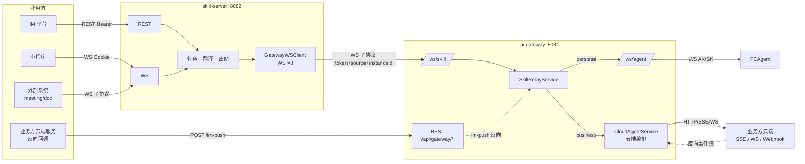

### 三、4+1 — 逻辑视图（组件图，按 SS / GW 分块）

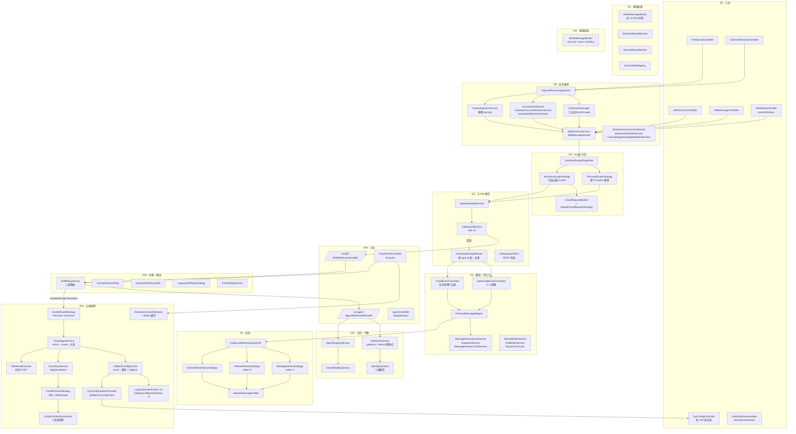

### 四、4+1 — 进程视图（关键时序）

#### 4.1 个人助理：小程序发一条消息

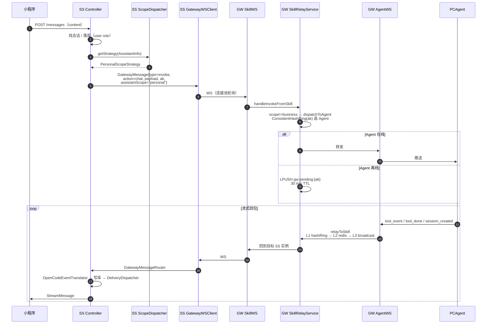

#### 4.2 业务助理：云端 SSE 调用全链路（**重点**）

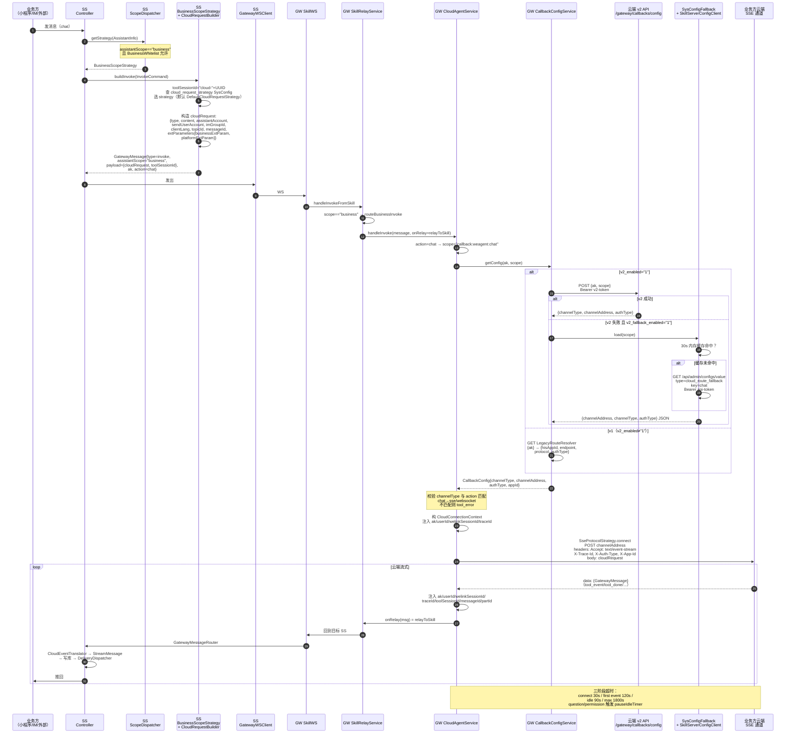

#### 4.3 业务助理：question_reply / permission_reply（webhook 路径）

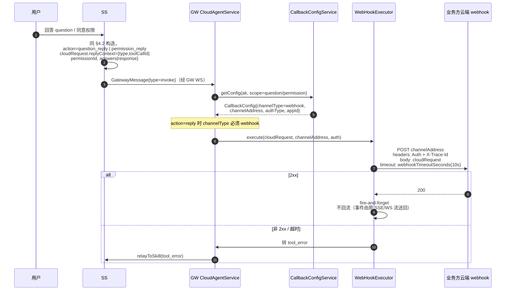

#### 4.4 IM 群聊里 @ 助理

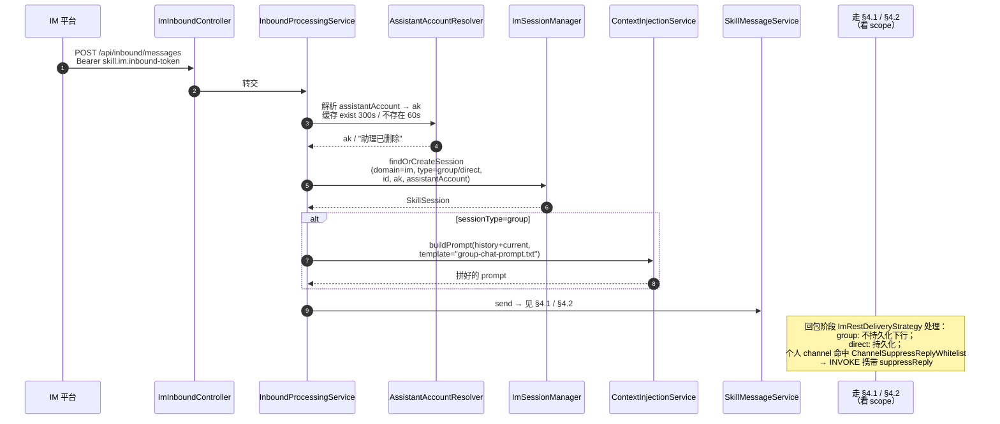

#### 4.5 PCAgent 注册（个人助理在线条件）

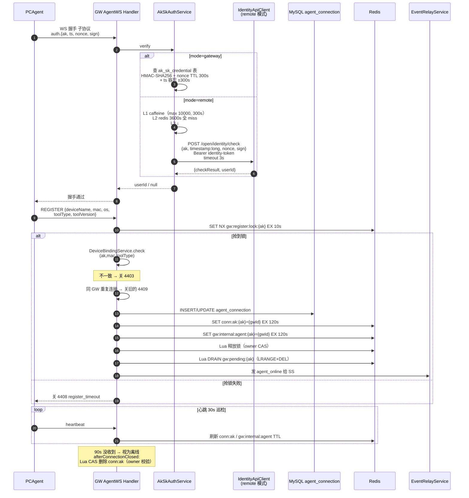

#### 4.6 toolSession 失效自愈

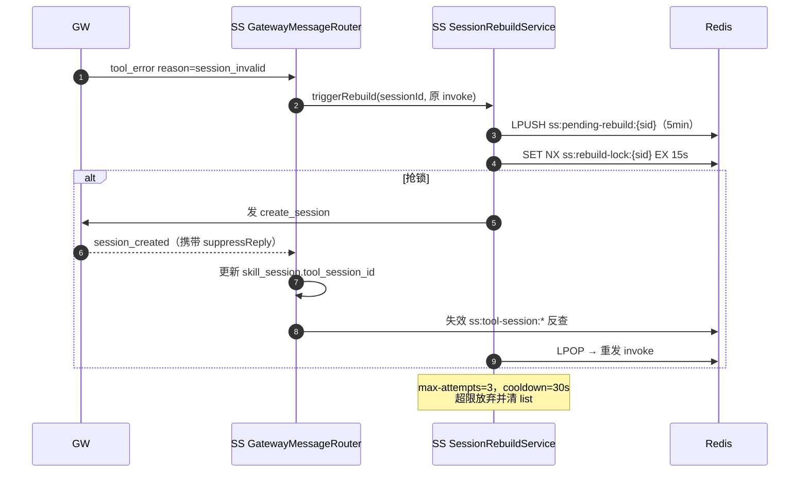

#### 4.7 业务方反向回调（im_push）

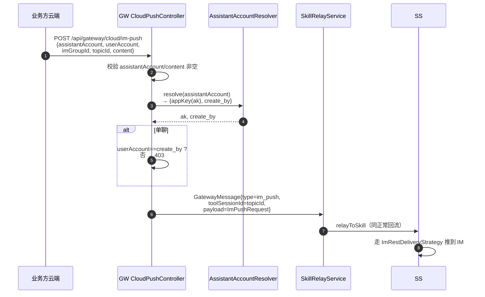

### 五、4+1 — 开发视图（代码组织）

```
opencode-CUI/
├── skill-server/
│   └── src/main/java/com/opencode/cui/skill/
│       ├── controller/         6 个 REST controller
│       ├── ws/                 SkillStreamHandler / ExternalStreamHandler / GatewayWSClient
│       ├── service/
│       │   ├── delivery/       Miniapp / ImRest / ExternalWs 三策略 + Emitter
│       │   ├── cloud/          业务助理云端请求构造（CloudRequestBuilder/Strategy/Context）
│       │   ├── scope/          Personal / Business 助手分流（Dispatcher/Strategy ×2）
│       │   └── *.java          会话/消息/翻译/持久化/Redis/重建
│       ├── model/              StreamMessage / GatewayMessage 副本 / 各 DTO
│       ├── repository/         5 个 MyBatis Mapper
│       ├── config/             Spring Config + 拦截器
│       └── logging/            MDC + 脱敏
│   └── src/main/resources/
│       ├── application.yml
│       ├── templates/group-chat-prompt.txt
│       └── db/migration/       Flyway V1–V11
├── ai-gateway/
│   └── src/main/java/com/opencode/cui/gateway/
│       ├── controller/         AgentController + CloudPushController
│       ├── ws/                 AgentWS + SkillWS + AsyncSessionSender
│       ├── service/
│       │   ├── cloud/          云端 5 件套（InvokeRoute × Auth × Protocol × Lifecycle × Webhook）
│       │   └── *.java          认证/注册/中继/路由/sys_config 兜底/资源解析
│       ├── model/              AgentConnection / GatewayMessage / RelayMessage / ImPushRequest
│       ├── repository/         2 个 Mapper
│       └── config/             含 CloudTimeoutProperties
│   └── src/main/resources/
│       ├── application.yml
│       └── db/migration/       Flyway V1–V5
```

### 六、4+1 — 物理视图

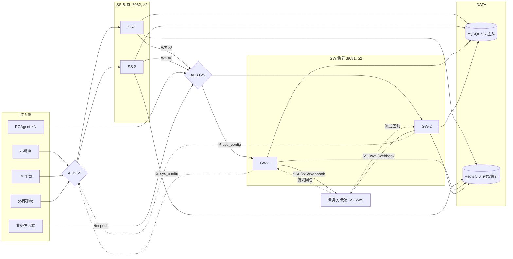

特点：
- SS、GW 全部无状态。
- SS 不需要"知道"具体连到哪个 GW Pod；ALB 自然分散，GW 内部三层路由保证消息找得到目标 SS。
- 多 SS 实例靠 Redis pub/sub `user-stream:{userId}` 把回包送到持有 WS 的那个实例。

### 七、数据流图

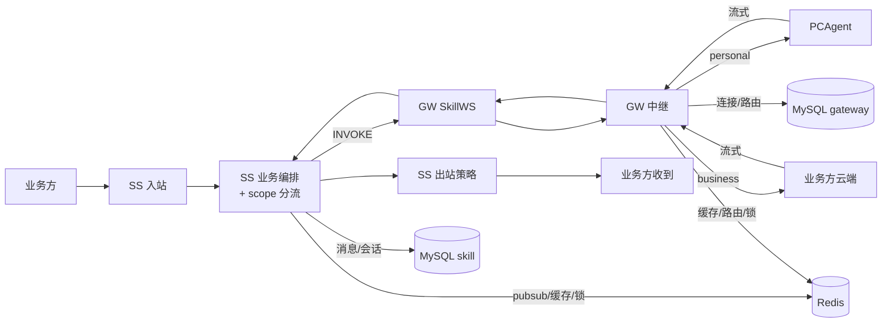

### 八、异常处理（按场景）

| 场景 | 处理 | 在哪 |
|---|---|---|
| SS 连 GW 时内部 token 不对 | 不重连，直接放弃 | `GatewayWSClient.java:351-365` |
| Agent 拿假 AK/SK 来连 | 1008 关闭 | `AkSkAuthService` + `AgentWebSocketHandler.java:131-203` |
| 设备绑定不一致 | 4403 关 | `AgentWebSocketHandler.java:73-77` |
| 同一 AK 重复连 | 关旧的 4409 | 同上 |
| 注册超时（10s 内没拿到锁） | 4408 关 | 同上 |
| 个人助理 invoke 时 Agent 离线 | LPUSH `gw:pending:{ak}` 30 min；上线后 Lua 原子取出 | `RedisMessageBroker.java:106-153` |
| 业务助理 callback 配置查不到 | 回 `tool_error reason=callback_config_missing` | `CloudAgentService.java:72-136` |
| 业务助理 channelType 与 action 不匹配 | tool_error（chat 必须 sse/websocket；reply 必须 webhook） | `:105-115` |
| 业务助理 webhook 非 2xx | tool_error，不重试 | `WebHookExecutor` |
| 业务助理 SSE/WS 首事件超时 | tool_error，关闭连接 | `CloudConnectionLifecycle` 三阶段定时器 |
| toolSession 失效 | SessionRebuild：暂存→抢锁→create_session→重发 | `SessionRebuildService.java:31-` |
| Redis pub/sub 半死 | PUBSUB NUMSUB 探活，0 就重启监听容器 | `RedisMessageBroker.java:177-291` |
| 来源不允许 / 不匹配 | `ProtocolException` + 协议错误回包 | `SkillRelayService.java:1080-1088` |
| 云端 v2 接口挂 | `v2_fallback_enabled=1` 时走 SysConfigFallbackProvider | `CallbackConfigService.java:125-156` |
| 助理被删 / 离线 | `AssistantOfflineMessageProvider` 兜底文案 | `AssistantOfflineMessageProvider.java:12-25` |
| 跨 GW 广播被打爆 | per-source 10 QPS 滑窗 | `SkillRelayService.java:117-123, 527-545` |
| GW 崩溃重启 | 启动清自己的 source-conn 残留 | `RedisMessageBroker.java:637-659` |

---

## 【接口设计】

> APIDesigner 工程链接：**< 待补充 >**

### 1. 业务方 → SS（REST）

#### 1.1 `POST /api/skill/sessions` — 创建会话
- 鉴权：Cookie `userId` 必填
- 请求体（`CreateSessionRequest`）
  | 字段 | 类型 | 必填 | 说明 |
  |---|---|---|---|
  | ak | String | 否 | 助理 ak |
  | title | String | 否 | 会话标题 |
  | businessSessionDomain | String | 否 | 默认 `miniapp` |
  | businessSessionType | String | 否 | `group`/`direct` |
  | businessSessionId | String | 否 | 业务侧会话 id |
  | assistantAccount | String | 否 | 助理账号；business scope 时必填 |
- 响应：`ApiResponse<SkillSession>`；错误：400 / 410（助理已删）

#### 1.2 `POST /api/skill/sessions/{sid}/messages` — 发消息
- 请求体（`SendMessageRequest`）
  | 字段 | 类型 | 必填 | 说明 |
  |---|---|---|---|
  | content | String | 是 | 文本内容 |
  | toolCallId | String | 否 | 有则视为 question_reply |
  | subagentSessionId | String | 否 | 子任务会话 id |
  | businessExtParam | JsonNode | 否 | 业务自定义参数，透传到 cloudRequest |
- 响应：`ApiResponse<ProtocolMessageView>`

#### 1.3 `POST /api/skill/sessions/{sid}/abort` — 中止
- 无 body；响应：`{status:"aborted", welinkSessionId}`

#### 1.4 `POST /api/skill/sessions/{sid}/permissions/{permId}` — 权限回包
- 请求体（`PermissionReplyRequest`）
  | 字段 | 类型 | 必填 | 说明 |
  |---|---|---|---|
  | response | String | 是 | `once` / `always` / `reject` |
  | subagentSessionId | String | 否 | |
  | businessExtParam | JsonNode | 否 | |

#### 1.5 `POST /api/skill/sessions/{sid}/send-to-im` — 转 IM
- 请求体（`SendToImRequest`）
  | 字段 | 类型 | 必填 | 说明 |
  |---|---|---|---|
  | content | String | 是 | |
  | chatId | String | 否 | 缺省取 session.businessSessionId |

#### 1.6 `POST /api/inbound/messages` — IM 入站
- 鉴权：`Authorization: Bearer ${skill.im.inbound-token}`
- 请求体（`ImMessageRequest` record）
  | 字段 | 类型 | 必填 | 说明 |
  |---|---|---|---|
  | businessDomain | String | 是 | 必须 `im` |
  | sessionType | String | 是 | `group` / `direct` |
  | sessionId | String | 是 | IM 侧会话 id |
  | assistantAccount | String | 是 | 数字分身账号 |
  | senderUserAccount | String | 否 | 发送人账号 |
  | content | String | 是 | 文本 |
  | msgType | String | 否 | 默认 `text`，目前仅接受 text |
  | imageUrl | String | 否 | image 类型（**当前会被拒**） |
  | chatHistory | List<ChatMessage> | 否 | 群聊上下文 |
  | businessExtParam | JsonNode | 否 | 业务自定义参数 |
- `ChatMessage`：`{senderAccount, senderName, content, timestamp:long}`

#### 1.7 `POST /api/external/invoke` — 外部入站
- 鉴权：external token
- 请求体（`ExternalInvokeRequest`）—— 信封 + payload 双层
  | 信封字段 | 类型 | 必填 |
  |---|---|---|
  | action | String | 是；`chat` / `question_reply` / `permission_reply` / `rebuild` |
  | businessDomain | String | 是 |
  | sessionType | String | 是；`group` / `direct` |
  | sessionId | String | 是 |
  | assistantAccount | String | 是 |
  | senderUserAccount | String | 是 |
  | businessExtParam | JsonNode | 否 |
  | payload | JsonNode | 见下 |
- `payload`（按 action）
  - `chat`：`{content, msgType, imageUrl, chatHistory}`
  - `question_reply`：`{content, toolCallId, subagentSessionId}`
  - `permission_reply`：`{permissionId, response, subagentSessionId}`，response ∈ `once`/`always`/`reject`
  - `rebuild`：无 payload
- 响应：`ApiResponse<{businessSessionId, welinkSessionId}>`

#### 1.8 `/api/admin/configs` 系列（**给 GW 反向读**）
| 方法 | 路径 | 鉴权 | 用途 |
|---|---|---|---|
| GET | `/api/admin/configs?type=` | Bearer api-token | 列表 |
| GET | `/api/admin/configs/value?type=&key=` | 同上 | **GW 跨服务读 sys_config 唯一入口**，响应 `{configValue:String|null}` |
| POST | `/api/admin/configs` | 同上 | 新增 |
| PUT | `/api/admin/configs/{id}` | 同上 | 更新 |
| DELETE | `/api/admin/configs/{id}` | 同上 | 删除 |

### 2. 业务方 → SS（WebSocket）

#### 2.1 `/ws/skill/stream` — 小程序流式
- 握手：Cookie `userId=` 必填，无子协议
- 客户端→服务端
  | action | 含义 |
  |---|---|
  | `resume` | 重发 snapshot + 当前流式状态 |
  | `ping` | 心跳 |
- 服务端→客户端：`StreamMessage` JSON（见 §6）

#### 2.2 `/ws/external/stream` — 外部流式
- 握手：`Sec-WebSocket-Protocol: auth.{base64url(JSON{token, source, instanceId})}`，token = `skill.im.inbound-token`，三字段必填
- 客户端：`{"action":"ping"}` → 服务端 `{"action":"pong"}`
- 服务端：从 Redis `stream:{source}` 取消息按 source 路由推送，跨实例靠 `ss:external-relay:{instanceId}`

### 3. SS ↔ GW（内部）

#### 3.1 `/ws/skill` 双向消息
- 握手：`Sec-WebSocket-Protocol: auth.{base64url(JSON{token, source, instanceId})}`
  - `token`：`skill.gateway.internal-token` / `gateway.skill-server.internal-token`
  - `source`：必填，源服务标识
  - `instanceId`：可选；带就走 V2 mesh 路由，不带走 Legacy
- 双向消息：`GatewayMessage` JSON
- SS → GW 接受：`invoke`、`route_confirm`、`route_reject`
- GW → SS 推送：所有上行事件

#### 3.2 GW REST `/api/gateway/*`
| 路径 | 方法 | Body | 用途 |
|---|---|---|---|
| `/api/gateway/agents?ak=&userId=` | GET | — | List<AgentSummaryResponse> |
| `/api/gateway/agents/status?ak=` | GET | — | `{ak, status, opencodeOnline, wsActive}` |
| `/api/gateway/invoke` | POST | `GatewayMessage` | 按 ak 路由下发，响应 `{success, message}` |
| `/api/gateway/agents/{id}/invoke` | POST | `GatewayMessage` | 按 DB id 路由 |
| `/api/gateway/agents/{id}/status` | GET | — | 单 Agent 状态 |
| `/api/gateway/cloud/im-push` | POST | `ImPushRequest` | 业务方反向回调（**外部调用**） |

鉴权：`Bearer gateway.skill-server.internal-token`（`im-push` 自有校验）

#### 3.3 `ImPushRequest`（im-push 反向）
| 字段 | 类型 | 必填 | 说明 |
|---|---|---|---|
| assistantAccount | String | 是 | 助理账号 |
| userAccount | String | 否 | 接收人；单聊必须等于 assistant 的 create_by，不一致 403 |
| imGroupId | String | 否 | 群聊 id |
| topicId | String | 是 | 作为 toolSessionId 路由 |
| content | String | 是 | 推送文本 |

### 4. GW ↔ Agent

#### 4.1 `/ws/agent` 握手
- 子协议：`auth.{base64url(JSON{ak, ts, nonce, sign})}`
  - `ak`：Agent Access Key（**路由主键**）
  - `ts`：客户端时间戳（毫秒），用于 ±300s 时间窗
  - `nonce`：随机串，存 `auth:nonce:{nonce}` Redis 300s
  - `sign`：HMAC-SHA256；mode=remote 时由 IdentityApiClient 远端校验
- 关闭码：1008 验签 / 4403 设备绑定 / 4408 注册超时 / 4409 重复连接

#### 4.2 `GatewayMessage` 16 种 type 字段矩阵

| type | 必填字段（除公共字段外） | 含义 |
|---|---|---|
| `register` | deviceName, macAddress, os, toolType, toolVersion | Agent 注册 |
| `register_ok` | — | 注册成功 |
| `register_rejected` | reason | 注册被拒 |
| `heartbeat` | — | 心跳 |
| `invoke` | ak, welinkSessionId, action, payload, userId, source；可选 suppressReply, assistantScope, traceId | SS→GW 下发 |
| `tool_event` | toolSessionId, event(JsonNode)；可选 subagentSessionId, subagentName | 流式事件 |
| `tool_done` | toolSessionId, usage(JsonNode) | 完成 |
| `tool_error` | toolSessionId, error；可选 reason（如 `callback_config_missing`） | 错误 |
| `session_created` | welinkSessionId, toolSessionId | Agent/云端 session 已建 |
| `agent_online` | ak, toolType, toolVersion | Agent 上线 |
| `agent_offline` | ak | Agent 下线 |
| `status_query` | — | SS 查 Agent 在线 |
| `status_response` | opencodeOnline (Boolean) | 回 |
| `permission_request` | toolSessionId, event | 权限请求 |
| `route_confirm` | toolSessionId, welinkSessionId, source | 路由确认 |
| `route_reject` | toolSessionId, source | 路由拒绝 |
| `im_push` | toolSessionId(=topicId), payload(=ImPushRequest) | 业务方反向推 |

公共字段：`type, ak, welinkSessionId, userId, source, traceId, agentId, sequenceNumber, gatewayInstanceId`（路由用，下行前 `withoutRoutingContext()` 剥离）。

`invoke` 的 `payload` 因 scope 而异：
- **personal**：透传 OpenCode 原生命令（chat / question_reply / permission_reply / abort 等）
- **business**：`{cloudRequest:{...}, toolSessionId:"cloud-{uuid}"}`，cloudRequest 字段：
  | 字段 | 类型 | 说明 |
  |---|---|---|
  | type | String | 默认 `text`（与 SkillMessage.contentType 对齐） |
  | content | String | 文本 |
  | assistantAccount | String | **必填**，缺则 IllegalArgumentException |
  | sendUserAccount | String | **必填** |
  | imGroupId | String | 群聊 id |
  | clientLang | String | 默认 `zh` |
  | clientType | String | 客户端类型 |
  | topicId | String | = toolSessionId |
  | messageId | String | 业务侧消息 id |
  | extParameters | Object | `{businessExtParam, platformExtParam}` |
  | replyContext | Object | QR/PR 时追加 `{type, toolCallId|permissionId, answers|response}` |

### 5. SS / GW → 外部（出口）

#### 5.1 SS → IM 平台
| 项 | 值 |
|---|---|
| URL | `${skill.im.api-url}/messages/send` |
| Method | POST |
| Headers | Content-Type: application/json |
| Body | `{chatId, content, msgType:"text"}` |

#### 5.2 GW → assistant 解析（im-push 用）
| 项 | 值 |
|---|---|
| URL | `${gateway.assistant-resolve.api-url}?partnerAccount={assistantAccount}` |
| Method | GET |
| Headers | `Authorization: Bearer ${gateway.assistant-resolve.bearer-token}` |
| Resp | `{data:{appKey, create_by}}` |
| 缓存 | Redis `gw:assistant:resolve:{account}` TTL 300s |

#### 5.3 GW → Cloud Route v1（旧）
| 项 | 值 |
|---|---|
| URL | `${gateway.cloud-route.api-url}` |
| Method | **GET-with-body** |
| Headers | `Authorization: Bearer ${gateway.cloud-route.bearer-token}` |
| Body | `{"ak":"..."}` |
| 仅支持 scope | `callback:weagent:chat`（reply 不支持） |
| Resp | `{code:"200", data:{hisAppId, endpoint, protocol("1"=webhook/"2"=sse/"3"=websocket), authType("1"=soa/"2"=apig)}}` |

#### 5.4 GW → Cloud Route v2（新）
| 项 | 值 |
|---|---|
| URL | `${gateway.cloud-route.v2-api-url}` |
| Method | POST |
| Headers | `Authorization: Bearer ${gateway.cloud-route.v2-bearer-token}` |
| Body | `{"ak":"...","scope":"callback:weagent:{chat|question_reply|permission_reply}"}` |
| Resp | `{code:"200", data:{channelType:int(1=webhook/2=sse/3=websocket), channelAddress, authType:int(0=none/1=soa/2=apig)}}` |
| `appId` | 始终 null |
| 缓存 | Redis `gw:cloud:route:v2:{ak}:{scope}` TTL 300s |

#### 5.5 GW → IdentityApiClient（remote 鉴权）
| 项 | 值 |
|---|---|
| URL | `${gateway.auth.identity-api.base-url}/appstore/wecodeapi/open/identity/check` |
| Method | POST |
| Headers | `Authorization: Bearer ${gateway.auth.identity-api.bearer-token}` |
| Body | `{ak, timestamp:long, nonce, sign}` |
| Resp | `{code, data:{checkResult:bool, userId}}` |
| 超时 | 3s |

#### 5.6 GW → SS（SkillServerConfigClient）
| 项 | 值 |
|---|---|
| URL | `${gateway.skill-server.api-base}/api/admin/configs/value?type=&key=` |
| Method | GET |
| Headers | `Authorization: Bearer ${gateway.skill-server.api-token}` |
| Resp | `{data:{configValue:String|null}}` |
| 超时 | 连 2s / 读 3s |

#### 5.7 GW → 云端 SSE
| 项 | 值 |
|---|---|
| URL | `channelAddress`（来自 callback 配置） |
| Method | POST |
| Headers | `Content-Type: application/json`、`Accept: text/event-stream`、`X-Trace-Id`、`X-Request-Id`；按 authType：`X-Auth-Type` + `X-App-Id`（appId 非空才写） |
| Body | cloudRequest JSON（见 §4.2 invoke business payload） |
| 流格式 | 每行 `data:{json}`，反序列化为 `GatewayMessage` |

#### 5.8 GW → 云端 WebSocket
| 项 | 值 |
|---|---|
| 握手 URL | `channelAddress` |
| Headers | `X-Trace-Id`、`X-App-Id`（非空时）、Auth 头 |
| 建联后 | 立即 `sendText(cloudRequest JSON)` |
| 心跳 | `pingIntervalSeconds`（默认 30s） |

#### 5.9 GW → 云端 Webhook（仅 reply）
| 项 | 值 |
|---|---|
| URL | `channelAddress` |
| Method | POST |
| Headers | `Content-Type: application/json`、`X-Trace-Id`、Auth 头 |
| Body | cloudRequest JSON（含 replyContext） |
| 超时 | `webhookTimeoutSeconds`（默认 10s） |
| 失败 | 不重试，回 tool_error |

### 6. SS → 业务方流式协议（StreamMessage）

实际有 **26 种 type**（不是 19，源自 `StreamMessage.java:197-233`）：

| 分类 | type 常量 | 关键字段（除公共） |
|---|---|---|
| 文本 | `text.delta` / `text.done` | messageId, partId, role, content |
| 思考 | `thinking.delta` / `thinking.done` | 同上 |
| 计划 | `planning.delta` / `planning.done`（云端扩展） | 同上 |
| 工具 | `tool.update` | tool: `{toolName, toolCallId, input, output, status}`, title |
| 提问 | `question` | question: `{header, question, options, multiSelect, questions, extParam}` |
| 文件 | `file` | file: `{fileName, fileUrl, fileMime}` |
| 步骤 | `step.start` / `step.done` | usage: `{tokens:Map, cost, reason}` |
| 会话 | `session.status` / `session.title` / `session.error` | sessionStatus / title / error |
| 权限 | `permission.ask` | permission: `{permissionId, permType, metadata}`, status, title |
|  | `permission.reply` | permission: `{permissionId, response}`, role=assistant |
| Agent | `agent.online` / `agent.offline` | （仅 type） |
| 错误 | `error` | error |
| 用户回显 | `message.user` | messageId, messageSeq, role=user, content |
| 重连快照 | `snapshot` | messages, parts |
|  | `streaming` | sessionStatus |
| 云端扩展 | `searching` | keywords:List<String> |
|  | `search_result` | searchResults:List<{index,title,source}> |
|  | `reference` | references:List<{index,title,source,url,content}> |
|  | `ask_more` | askMoreQuestions:List<String> |

公共字段：`type, seq, sessionId(@JsonIgnore), welinkSessionId, emittedAt, raw, messageId, messageSeq, role, sourceMessageId, partId, partSeq, content, status, title, error, sessionStatus, messages, parts, subagentSessionId, subagentName`。

> 各 type 实际填充位置：个人助理走 `OpenCodeEventTranslator.java`；业务助理 / 云端走 `CloudEventTranslator.java`。两者均在工作区改动列表内。

---

## 【数据设计】

### 1. 持久化（MySQL，Flyway 实读）

#### SS（V1–V11）

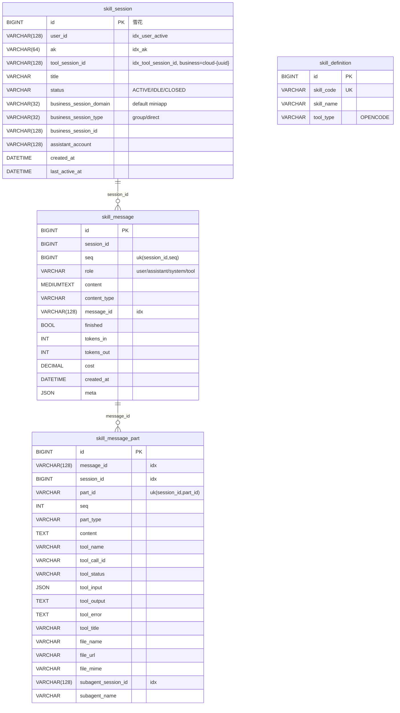

`sys_config(id PK, config_type, config_key, config_value VARCHAR(512), description, status, sort_order, uk_type_key)`

**关键 sys_config 用法清单**：

| config_type | config_key | 用途 | 读取方 |
|---|---|---|---|
| `cloud_route` | `v2_enabled` | v1/v2 主开关，"1"=v2 | GW `CallbackConfigService` |
| `cloud_route` | `v2_fallback_enabled` | v2 失败是否降级到 fallback，"1"=ON | GW `CallbackConfigService` |
| `cloud_route` | `business_whitelist_enabled` | 业务助理白名单总开关，"1"=启用 | SS `BusinessWhitelistService` |
| `cloud_route_fallback` | `chat` / `question` / `permission` | v2 兜底配置，value=JSON `{channelAddress,channelType,authType}` | GW `SysConfigFallbackProvider` |
| `business_cloud_whitelist` | `{businessTag}` | 白名单成员 | SS（缓存 `ss:config:set:business_cloud_whitelist`） |
| `cloud_request_strategy` | `{appId/businessTag}` | 选择 cloudRequest 构造策略 | SS `CloudRequestBuilder` |
| `assistant_offline` | `message` | 助理离线兜底文案 | SS `AssistantOfflineMessageProvider` |

迁移要点：
- V1：建初始三张表
- V2：消息分 part（`skill_message_part`）
- V3：`agent_id`→`ak`，`im_chat_id`→`im_group_id`
- V4：`user_id` 全部 BIGINT→VARCHAR(128)
- V5：所有 PK 改雪花
- V6：加业务三元组 `business_session_*` + `assistant_account`，DROP `im_group_id`，ENUM→VARCHAR
- V7：`skill_message` 加唯一键 (session_id, seq)
- V8：`skill_message_part` 加 subagent_*
- V9：`skill_session.tool_session_id` 加索引
- V10：建 `sys_config` 表 + seed `cloud_request_strategy.uniassistant=default`
- V11：seed `cloud_route.business_whitelist_enabled=0`

> `skill-server/src/main/resources/db/queries/` 当前是未追踪的空目录（git `??`），暂无 SQL 文件。

#### GW（V1–V5）

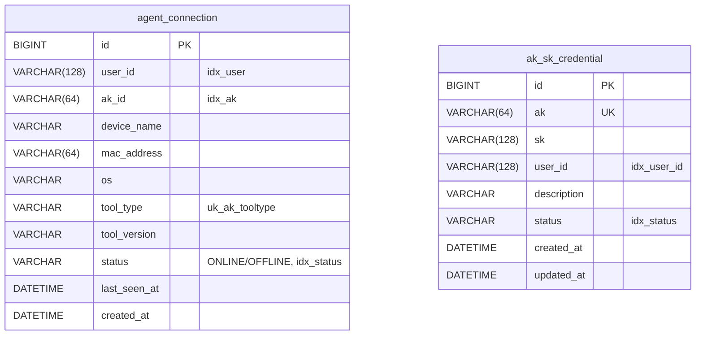

### 2. 缓存（Redis，全部来自代码）

| Key / Channel | 用途 | TTL | 出处 |
|---|---|---|---|
| `agent:{agentId}` ch | 推到特定 agent | — | SS RMB:50 |
| `user-stream:{userId}` ch | 用户级跨实例 fanout | — | SS RMB:55 |
| `ss:relay:{instanceId}` ch | SS 实例间 relay（带自愈） | — | SS RMB:295 |
| `ss:tool-session:{toolSessionId}` | toolSession→sessionId 反查 | 24h | SS RMB:358 |
| `ss:stream-seq:{welinkSessionId}` | 跨实例消息序号 INCR | — | SS RMB:386 |
| `ss:external-relay:{instanceId}` ch | 外部 WS 跨实例 | — | ExternalStreamHandler |
| `invoke-source:{sessionId}` | 来源标记 | `${skill.delivery.invoke-source-ttl-seconds:300}` | SS RMB:403 |
| `external-ws:registry:{domain}` HASH | 外部 WS 实例注册 | 30s（10s 心跳） | SS RMB:434 |
| `ss:config:set:business_cloud_whitelist` | 业务助理白名单缓存 | `cacheTtlMinutes` | BusinessWhitelistService |
| `ss:pending-rebuild:{sid}` List | 待回放消息 | 5 min | SessionRebuildService:34 |
| `ss:rebuild-counter:{sid}` | 重建次数 | — | :36 |
| `ss:rebuild-lock:{sid}` | 重建分布式锁 | 15s | :40 |
| `conn:ak:{ak}` | AK→GW 实例（外部） | 120s | GW Handler:319 |
| `gw:internal:agent:{ak}` | AK→GW 实例（内部） | 120s | GW RMB:60 |
| `gw:source-conn:{srcType}:{srcId}` HASH | source 连接注册 | 2h | GW RMB:429 |
| `gw:route:{toolSessionId}` / `gw:route:w:{welinkSessionId}` | sessionRoute L2 | 30 min | GW RMB:701 |
| `gw:agent:user:{ak}` | AK→userId | — | GW RMB:65 |
| `gw:pending:{ak}` List | 离线 invoke 缓存 | 30 min | GW RMB:99 |
| `gw:relay:{instanceId}` ch | V2 GW↔GW 中继 | — | GW RMB:68 |
| `gw:legacy-relay:{instanceId}` ch | Legacy 中继 | — | GW RMB:71 |
| `gw:register:lock:{ak}` | 注册并发锁 | 10s | Handler:319 |
| `gw:cloud:route:v1\|v2:{ak}:{scope}` | callback 配置缓存 | 300s | CallbackConfigService |
| `gw:assistant:resolve:{account}` | assistant 解析缓存 | 300s | AssistantAccountResolver |
| `auth:nonce:{nonce}` | 防重放 | 300s | application.yml:78 |

**本地缓存（Caffeine）**：
- SS：`AssistantInfoService` 300s；`AssistantAccountResolverService` exists 300s / not-exists 60s；`AssistantIdResolverService` 30 min；`MessageHistoryCacheService` 30s + warm=50；`SysConfigService` 5 min。
- GW：identity-cache L1=300s/max=10000；`SysConfigFallbackProvider` 与 `CallbackConfigService` 配置开关共用 in-memory TTL（`gateway.cloud-route.sysconfig-cache-ttl-ms`，默认 300000ms）；`UpstreamRoutingTable`。

### 3. 运营数据
- 应用日志：JSON 行，含 `traceId/ak/userId/sessionId/businessDomain/welinkSessionId` MDC（`MdcRequestInterceptor`、`MdcConstants`）。GW logging 包带 `SensitiveDataMasker`。
- 业务度量：当前未集成 Micrometer，建议补；落地清单见 DFX 监控章节。

---

## 【集成设计】

| 集成对象 | 方向 | 协议 | 关键依赖 |
|---|---|---|---|
| 小程序 | SS↔小程序 | WS + REST | `/ws/skill/stream` Cookie；`/api/skill/*` |
| IM 平台 | SS↔IM | REST 双向 | 入站 `/api/inbound/messages` Bearer；出站 `${skill.im.api-url}` + `${skill.im.token}` |
| 外部系统（meeting/doc 等） | SS↔外部 | WS | `/ws/external/stream`；外部实例信息存 `external-ws:registry:{domain}` |
| OpenCode PCAgent | GW↔Agent | WS（AK/SK HMAC） | nonce 防重放；mode=gateway/remote |
| 助理服务（数字分身） | SS→第三方 | REST | `${skill.assistant.resolve-url}` + `${skill.assistant-info.api-url}` |
| 助理解析（GW im-push 用） | GW→第三方 | REST | `${gateway.assistant-resolve.api-url}` |
| 身份服务（remote 鉴权） | GW→第三方 | REST | `IdentityApiClient` |
| 云端业务助理 v1 路由 | GW→第三方 | REST GET-with-body | `${gateway.cloud-route.api-url}` |
| 云端业务助理 v2 路由 | GW→第三方 | REST POST | `${gateway.cloud-route.v2-api-url}` |
| 云端业务助理流式 | GW→Cloud | SSE / WS / Webhook | channelAddress 来自 callback 配置 |
| 业务方反向回调 | 业务方→GW | REST POST | `/api/gateway/cloud/im-push` |
| MySQL | SS+GW | JDBC + Flyway | 各自 schema |
| Redis | SS+GW | Lettuce | pub/sub + Lua + 缓存 |
| Sys 配置共享 | GW→SS | REST | `SkillServerConfigClient` Bearer |

---

## 【依赖项及影响面分析】

### 1. 直接依赖
- **SS** 依赖：GW WS / REST、MySQL skill schema、Redis、第三方 assistant API、IM 平台。
- **GW** 依赖：SS sys_config 接口、PCAgent、MySQL gateway schema、Redis、IdentityApi（remote）、第三方 assistant 解析、云端业务助理（route + 流式）。

### 2. 间接影响（改谁会牵动什么）

```
改 StreamMessage 字段
  → OpenCodeEventTranslator + CloudEventTranslator 都要填新字段
  → ProtocolMessageMapper（snapshot 一致）
  → 三个 DeliveryStrategy（输出格式）
  → 小程序 / 外部前端

改 GatewayMessageRouter
  → MessagePersistenceService（落库）
  → DeliveryDispatcher 三策略全受影响
  → 跨实例 user-stream / ss:relay 广播

改 GW SkillRelayService 三层路由
  → 全量 Agent + 业务助理上行可达性
  → ConsistentHashRing 节点变化会让同 sourceType 内的 sessionId 路由变更，
     必须保证同一 toolSession 内事件顺序在 hashRing 中稳定

改 CloudAgentService / CallbackConfigService
  → 全部业务助理 chat / question_reply / permission_reply 路径
  → fallback 链断裂可能导致大面积 tool_error

改 BusinessScopeStrategy.buildInvoke / DefaultCloudRequestStrategy
  → 全部业务助理 cloudRequest 协议
  → 跨业务方需对齐发布

改任一 Redis Key 命名 → 跨实例发现 / 路由 / 锁全部受影响（HIGH）
改 internal-token / api-token → SS↔GW 全链路 + GW→SS REST 同时挂掉（CRITICAL）
```

### 3. 改之前必须做（来自项目 CLAUDE.md）
- 改任一类的方法/字段前先 `gitnexus_impact({target, direction:"upstream"})`；HIGH/CRITICAL 风险须告知评审。
- 重命名走 `gitnexus_rename`，不要全局 find-replace。
- 高敏感面：`GatewayMessage.Type`、`GatewayWSClient.sendToGateway`、`SkillRelayService.handleInvokeFromSkill / relayToSkill`、`RedisMessageBroker.*`、`AgentWebSocketHandler.handleRegister`、`SessionRebuildService.triggerRebuild`、`OutboundDeliveryDispatcher.dispatch`、`CloudAgentService.handleInvoke`、`CallbackConfigService.getConfig`、`BusinessScopeStrategy.buildInvoke`。

### 4. 上线后看什么（监控关键字）
- **个人路径**：`gw:register:lock` 等待时长、4403/4408/4409 关闭码计数、`gw:pending` 队列长度
- **业务路径**：`callback_config_missing` 计数、v2→fallback 切换次数、`gw:cloud:route:*` 缓存命中率、SSE/WS first-event 超时、Webhook 非 2xx
- **路由**：L1/L2/L3 命中比例、broadcast rate-limit drop、`source_not_allowed/source_mismatch`
- **pub/sub**：`physicalSubscriberCount=0` 自愈次数
- **重建**：`ss:pending-rebuild` 队列长度、超 max-attempts=3 的会话
- **业务接入**：IM 入站 4xx/5xx、`AssistantOfflineMessageProvider` 触发率、im-push 403 比例

> Grafana 看板：**< 待补充 >**

---

# DFX 设计

## 【性能设计】

| 指标 | 现状 / 配置 | 出处 |
|---|---|---|
| SS↔GW WS 连接数 | 每个 SS 实例 8 条到 GW（可调） | `skill.gateway.connection-count:8` |
| Agent 心跳 | 30s 巡检；90s 视为离线 | `gateway.agent.heartbeat-*` |
| SS↔GW 重连 | 1s 起，指数退避到 30s | `GatewayWSClient.java:67-71, 235-237` |
| GW source-conn 心跳 | 10s 刷一次 ts | `gateway.skill-relay.owner-heartbeat-interval-seconds:10` |
| GW route L2 缓存 | 30 min | `session-route-ttl-seconds:1800` |
| GW pending 队列 | 30 min | `SkillRelayService.PENDING_TTL` |
| nonce 缓存 | 5 min | `gateway.auth.nonce-ttl-seconds:300` |
| identity-cache | L1=300s / 1 万条；L2=3600s | `gateway.auth.identity-cache.*` |
| **云端连接 3 阶段超时** | connect=30s / first event=120s / idle=90s / max=1800s | `CloudTimeoutProperties` |
| 云端 webhook 超时 | 10s，无重试 | 同上 |
| 云端 callback 配置缓存 | 300s（Redis）+ 30s（GW 进程内开关） | `CallbackConfigService` |
| 云端 fallback 缓存 | 30s（进程内） | `SysConfigFallbackProvider` |
| 历史缓存 | 30s + 预热 50 条 | `skill.message-history.*` |
| 助理存在性缓存 | 存在 300s / 不存在 60s | `skill.assistant.status-cache-ttl-*` |
| 跨实例消息序号 | Redis INCR `ss:stream-seq:*` | `RedisMessageBroker.java:386-399` |
| 跨 GW 广播限流 | 每个 source 10 QPS 滑窗 | `SkillRelayService.java:117-123` |

目标 SLO（建议）：
- IM/External 入站 P99 ≤ 300ms（不含 LLM）
- GW 注册 P99 ≤ 150ms
- 业务助理 callback 解析 P99 ≤ 100ms（命中缓存）/ ≤ 800ms（透传 v2）
- SS 单实例 WS 并发 ≥ 10k

> 压测报告：**< 待补充 >**

---

## 【高可用设计】

**接入层**
- ALB 前置；WS 走 IP-hash 或 sticky 保持长连。

**应用层**
- SS、GW 全部无状态、可水平扩。
- GW 三层路由（hashRing → Redis → 广播）容忍单 GW 失效；source-conn 30s TTL 自动收敛。
- Agent 注册有并发锁（`gw:register:lock` SETNX 10s + Lua 安全释放）。
- `conn:ak` / `gw:internal:agent` 用 Lua CAS 删除（owner 校验），防止 Agent 快速迁移到别的 GW 时旧 GW 误删新绑定。
- 注册成功后 Lua 原子 DRAIN pending。
- `ss:relay` pub/sub 半死自愈。
- toolSession 失效自愈：max-attempts=3，cooldown=30s。
- **业务助理云端**：v2 失败自动降级到 SysConfigFallback；callback 配置 Redis 缓存兜底；3 阶段超时防卡死。
- **业务方白名单**：开关默认关闭（V11 seed=0），即使配错 sys_config 也不会卡住流程。
- GW 启动清残留 source-conn；SS 关闭把自己 ACTIVE 路由置 CLOSED。
- 跨 SS 实例：`user-stream:{userId}` + `ss:relay:{instanceId}`，单 SS 重启不丢推送目标。

**数据层**
- MySQL 主从。Flyway 仅追加。
- Redis 哨兵或集群。所有关键 Key 都有 TTL 兜底。

**降级链**
- 个人助理：Agent 离线 → pending 30 min → 上线 DRAIN
- 业务助理：v2 → v2_fallback（SysConfig 静态） → tool_error 报给业务方
- AkSk remote：L1 → L2 → L3 IdentityApi
- 助理离线：sys_config `assistant_offline.message` 兜底文案

SLO 目标：可用性 ≥ 99.9%，MTTR ≤ 15 分钟。

---

## 【安全设计】

| 维度 | 怎么做 |
|---|---|
| Agent 鉴权 | AK/SK HMAC-SHA256；mode=gateway 查表，mode=remote 调身份服务（带三级缓存） |
| 防重放 | `auth:nonce:{nonce}` Redis 300s + 时间窗 ±300s |
| SS↔GW 内部信道 | WS 子协议同时校验 token、source、instanceId |
| GW→SS REST | Bearer api-token |
| IM 入站 | Bearer `skill.im.inbound-token`（`ImTokenAuthInterceptor`） |
| 业务方 im-push | 必填 assistantAccount + content，单聊校验 userAccount==create_by；不一致 403 |
| 业务助理白名单 | `business_cloud_whitelist` 表 + 总开关 `cloud_route.business_whitelist_enabled` |
| 个人渠道抑制下发 | `ChannelSuppressReplyWhitelistService` + INVOKE 携带 `suppressReply` |
| 会话归属 | `SessionAccessControlService` 校验 user↔session 关系 |
| 云端调用注入 | SSE/WS/Webhook 头自动写 `X-Trace-Id`、按 authType 写 `X-Auth-Type`+`X-App-Id` |
| 日志脱敏 | `SensitiveDataMasker`（GW logging 包） |
| 关闭码语义化 | 4403 设备绑定 / 4408 注册超时 / 4409 重复连接 / 1008 验签失败 |

待补：sk 当前 V2 seed 是明文，生产应在落库前做 KMS 或 AES 加密；ak 可见、sk 不直接读取，仅参与 HMAC 计算。

威胁建模（STRIDE 速记）：
- 假冒：HMAC + 内部 token + IM Bearer + im-push userAccount 校验
- 篡改：生产强制 wss / https
- DoS：注册锁 + per-source 广播限流 + 心跳超时即断 + 云端 3 阶段超时
- 越权：access control + 业务白名单 + im-push 单聊归属校验
- 凭证泄露：sk 加密落地（待补）

---

## 【兼容性设计】

**协议**
- GW 同时支持 V2 mesh 路由和 Legacy owner-relay。SS 子协议带不带 `instanceId` 决定走哪条（`gateway.legacy-relay.enabled=true`）。
- `GatewayMessage.Type` 16 种通过常量声明。新增类型走"先入位、后启用"两步。
- `StreamMessage` 新增字段（keywords / searchResults / references / askMoreQuestions / subagent_*）默认为空，老前端不解析也不会出错。
- IM 出站 `ImRestDeliveryStrategy` 当前只识别 4 种 status（TEXT_DONE / ERROR / PERMISSION_ASK / QUESTION，且仅 running/pending），新 status 必须显式扩展，否则会被丢弃。
- **云端 v1/v2 协议并存**：`v2_enabled` 开关决定走哪条；v1 仅支持 chat scope，reply 必须升级到 v2。

**数据**
- Flyway 仅追加（V1–V11 / V1–V5）。ENUM → VARCHAR 已在 V6 完成。
- 业务三元组 + assistant_account 在 V6 落地。新业务域只需扩展 `business_session_domain` 取值（如 `meeting`/`doc`），不动 schema。

**配置**
- v1↔v2 切换：`sys_config: cloud_route.v2_enabled` 开关。
- v2 失败兜底开关：`cloud_route.v2_fallback_enabled`。
- 业务助理白名单总开关：`cloud_route.business_whitelist_enabled`（默认 0=不限）。
- AkSk 双模式（gateway / remote）通过 `gateway.auth.mode` 切换，运行期可切。
- internal-token / api-token 需双服务同步发布，顺序：双写支持新旧 → 切换流量 → 移除旧。

**周边**
- 接入新业务域只需三步：① 实现 `OutboundDeliveryStrategy` + `supports(SkillSession)`；② 仿照 `ImSessionManager` 写 findOrCreate；③ 加入站 controller。**不动 DB Schema、不动 GW**。
- 接入新云端协议（gRPC / HTTP3）：扩展 `cloud/CloudProtocolStrategy`，不影响 V2 路由层。
- 接入新业务助理 cloudRequest 字段：扩展 `cloud/CloudRequestStrategy`，按 `cloud_request_strategy` SysConfig key 选择。

---

> 文档版本：基于 commit `82bd982` + 工作区未提交修改
> 维护人：**< 待补充 >**
> 最后更新：2026-05-08
